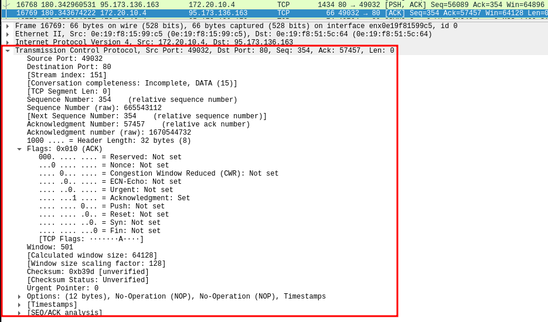

# 01.02. Сетевые модели TCP/IP и OSI - Лебедев Д.С.

### Задание 1 (Ethernet).
> 1. Выберите несколько пакетов из захваченного трафика;
> 2. Откройте уровень Ethernet;
> 3. Определите по MAC-адресу нескольких производителей сетевого оборудования.  
> *Приведите ответ в свободной форме.*

*Ответ:*  
  
В моем случае быстро определить производителя оборудования в силу специфики соединения (точка доступа на Apple Iphone через USB соединение), но принцип ясен.
Например, на рабочей станции:
- Destination: Micro-St_4e:b4:59 (d8:bb:c1:4e:b4:59)
- Source: Cisco_02:4b:ff (1c:6a:7a:02:4b:ff)

### Задание 2 (IP).
> 1. Выберите несколько пакетов из захваченного трафика;
> 2. Откройте уровень IP;
> 3. Какие флаги протокола IP вам удалось обнаружить?  
> *Приведите ответ в свободной форме.*

*Ответ:*  
  

На скриншоте видны следующие флаги протокола IP: Do not Fragment (DF), означающий, что данный пакет не фрагментируется. 
Данное поле имеет размер три бита, содержит флаги контроля над фрагментацией.

### Задание 3 (TCP, UDP).
> 1. Выберите несколько UDP (DNS или мессенджеры) и TCP (http) пакетов из захваченного трафика;
> 2. Откройте уровень TCPUDP;
> 3. Сравните пакеты TCP и UDP между собой. В чём отличия?  
> *Приведите ответ в свободной форме.*

*Ответ:*  
  

  

В силу специфики, TCP содержит гораздо больше информации по сравнению с UDP. Это обусловлено гарантированной доставкой пакетов данным протоколом, процессом "трехстороннего рукопожатия", дуплексным режимом работы и т.д. На скриншоте видно, что пакет TCP содержит флаг ACK, который отправил серверу хост на порт 80.
Протокол UDP вследствие отсутствия гарантированной доставки, обладает более высокой скоростью работы.

### Задание 4 (HTTP).
> 1. Перейдите на сайт **kremlin.ru**;
> 2. Выберите любой http-поток (через меню, открывающееся по нажатию правой кнопки мыши - следовать - поток HTTP);
> 3. Какой поток у вас открылся на самом деле (посмотрите в строке ввода фильтров)? Почему?  
> *Приведите ответ в свободной форме.*

*Ответ:*  
  

Открывается поток TCP, т.к. пакеты HTTP инкапсулированы в него.