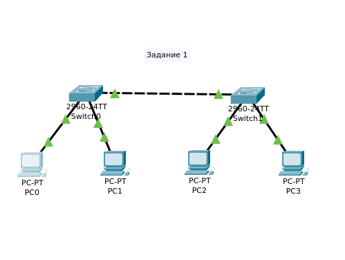
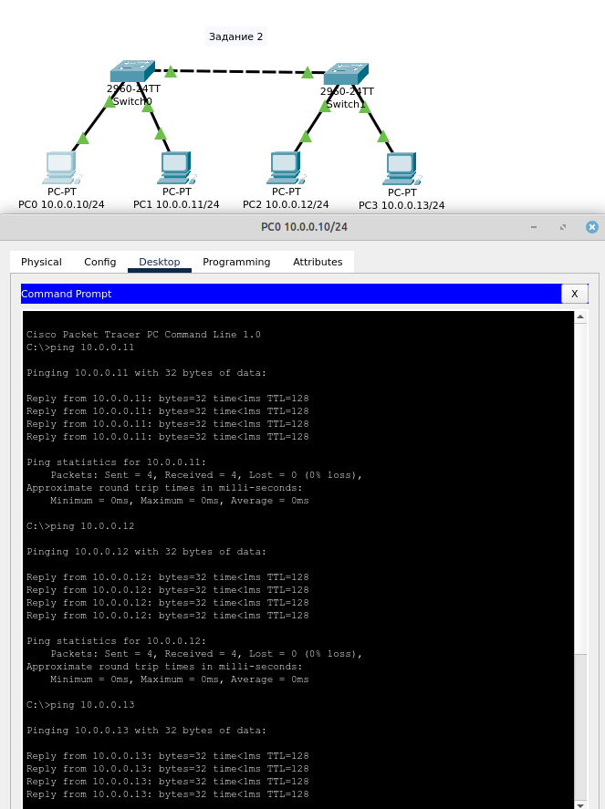
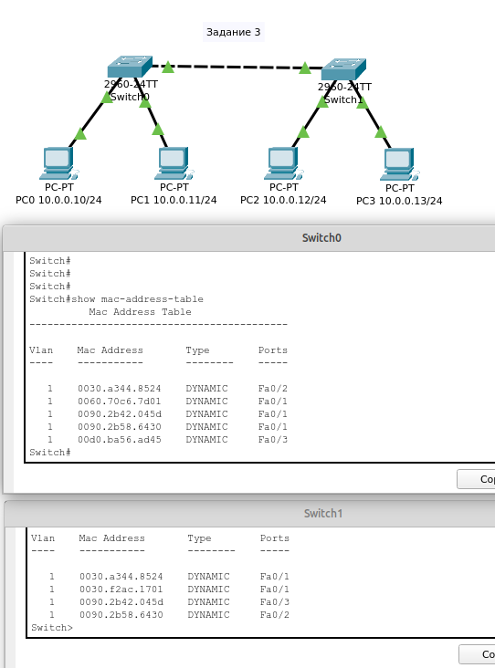
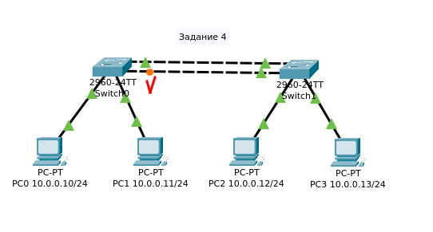

# 01.04. Функции, возможности и характеристики сетевых устройств - Лебедев Д.С.
### Задание 1.
> В программе Cisco Packet Tracer составьте сеть, состоящую из двух коммутаторов, к каждому из которых подключено по два компьютера.  
> *Приведите ответ в виде снимка экрана.*

*Ответ:*  

### Задание 2.
> Настройте адреса компьютеров из подсети 10.0.0.* и маской 255.255.255.0  
> Проверьте связь с помощью ping.  
> *Приведите ответ в виде снимка экрана удачной работы утилиты ping.*

*Ответ:*  

### Задание 3.
> Перейдите на коммутатор и выполните команду show mac-address-table  
> *Приведите ответ в виде снимка экрана.*

*Ответ:*  

### Задача 4*
> Соедините коммутаторы дополнительным проводом. Что произойдет в этом случае?  
> *Приведите ответ в свободной форме.*

*Ответ:*  
Таким способом создаётся петля коммутации - состояние в сети, при котором происходит бесконечная пересылка фреймов между коммутаторами, подключенными в один и тот же сегмент сети.  
Начинает работать протокол STP, блокирует один порт коммутатора и устраняет петлю.  
