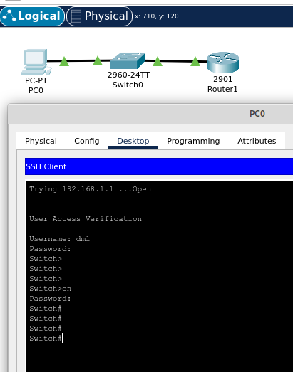
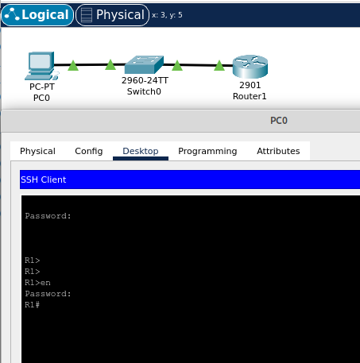

# 01.05. Подключение к оборудованию, базовая настройка - Лебедев Д.С.
### Задание 1.
> Опишите возможные типы соединения с сетевыми устройствами: маршрутизаторы, коммутаторы, концентраторы.  
> *Приведите тип подключения и опишите их характеристики.*

*Ответ:*  
Концентратор (хаб) работает на первом уровне модели OSI, ретранслируя входящий сигнал с одного из портов в сигнал на все остальные, и не подразумевает управления. Возможно наличие перемычек или джамперов для выбора скорости передачи вручную.
Способы подключения к сетевым устройствам могут быть локальными или удаленными.  
- Локальное подключение используется при невозможности удаленного, при первоначальной настройке или устранении неисправности. Характерная особенность - использование специально выделенного интерфейса для управления (консольный порт, AUX). Возможно локальное подключение через стандартные порты подключения по сети (Ethernet).
- Удаленное подключение является предпочтительным. В таких случаях взаимодействие с устройством происходит через интерфейс командной строки (CLI) по протоколам telnet, ssh; либо при помощи графического web-интерфейса (GUI/NMS) протоколами http, https. Встречал управление системами unix при помощи x11.
### Задание 2.
> Опишите отличия в подключении к устройствам для их настройки через порты AUX, Console?  
> *Приведите ответ в свободной форме.*

*Ответ:*  
- Консольное подключение используется для управления устройством напрямую. Требует настройки подключения (скорость, стопбиты, контроль четности) и использования терминальных программ типа гипертерминала, putty и т.д. Такое подключение удобно при необходимости собрать логи загрузки устройства (например, unix сервера). При взаимодействии используется CLI, либо псевдо GUI, как, например, при настройке hdsl модемов watson.
- AUX соединение используется для управления устройством при помощи dial-up модема. Может использоваться в качестве консольного порта при прямом подключении к компьютеру, выполняющему программу эмуляции терминала. Так же может использоваться при недоступности консольного порта.
### Задание 3.
> Опишите плюсы и минусы подключения к устройствам для работы с ними по протоколам Telnet, ssh, http, https. Какие методы безопасности могут быть предусмотрены для усиления защиты?  
> *Приведите ответ в свободной форме.*

*Ответ:*  
Преимущества и недостатки таких подключений определяются возможностями этих протоколов. Telnet, ssh чаще применяются в режиме работы CLI, хотя поверх ssh иногда передают другой трафик. Http, https используют для работы с веб-интерфейсами устройств.  
Другое отличие - защищенность протоколов ssh, https шифрованием. В telnet и http данные передаются открыто.  
Для усиления защиты можно, например, поменять порт подключения на нестандартный. Так же целесообразно использовать для управления устройствами выделенную и защищенную сеть. Для подключения предпочтительно использовать заранее настроенных пользователей с нормальными паролями, установить секрет на привелегированный режим.
## Задание 4. Лабораторная работа "Подключение и базовая настройка сетевого оборудования"
> Выполните задание по шагам:  
> 1. В Cisco Packet Tracer создайте логическую топологию, состоящую из:
> - компьютера для управления,
> - коммутатора,
> - маршрутизатора.
> 2. Подключите устройства последовательно.
> 3. Настройте устройства для сетевого взаимодействия.
> 4. Проверьте доступность компьютера и маршрутизатора при помощи ICMP запросов.
> 5. На коммутаторе настройте протокол Telnet. Проверьте, что удаленное подключение возможно и работает успешно. Пароль должен быть зашифрован!
> 6. На маршрутизаторе настройте протокол SSH. Проверьте, что удаленное подключение возможно и работает успешно. Пароль должен быть зашифрован!  
> *Приложите настроенные логины и пароли к решению, приведите ответ в виде pkt-файла*

*Ответ:*  
1. Команды настройки коммутатора
```bash
Switch>en
Switch#conf t
Enter configuration commands, one per line. End with CNTL/Z.
Switch(config)#interface vlan 1
Switch(config-if)#ip address 192.168.1.1 255.255.255.0
Switch(config-if)#no shutdown
Switch(config-if)#
%LINK-5-CHANGED: Interface Vlan1, changed state to up
Switch#wr
Building configuration...
[OK]

Switch#conf t
Enter configuration commands, one per line. End with CNTL/Z.
Switch(config)#username dml secret lebedev
Switch(config)#line vty 0 15
Switch(config-line)#login local
Switch(config-line)#exit
Switch(config)#enable secret cisco
Switch(config)#exit
Switch#
%SYS-5-CONFIG_I: Configured from console by console
Switch#wr
Building configuration...
[OK]
```

2. Лог настройки маршрутизатора
```bash
Router>en
Router#conf t
Enter configuration commands, one per line. End with CNTL/Z.
Router(config)#interface gig0/0
Router(config-if)#ip address 192.168.1.2 255.255.255.0
Router(config-if)#no shutdown
Router(config-if)#
%LINK-5-CHANGED: Interface GigabitEthernet0/0, changed state to up
%LINEPROTO-5-UPDOWN: Line protocol on Interface GigabitEthernet0/0, changed state to up
Router(config-if)#exit
Router(config)#exit
Router#
%SYS-5-CONFIG_I: Configured from console by console
Router#wr
Building configuration...
[OK]
Router#

Router#conf t
Enter configuration commands, one per line. End with CNTL/Z.
Router(config)#hostname R1
R1(config)#username dml secret lebedev
R1(config)#line vty 0 15
R1(config-line)#login local
R1(config-line)#exit
R1(config)#enable secret cisco
R1(config)#ip domain-name domain.com
R1(config)#crypto key generate rsa
The name for the keys will be: R1.domain.com
Choose the size of the key modulus in the range of 360 to 4096 for your
General Purpose Keys. Choosing a key modulus greater than 512 may take
a few minutes.

How many bits in the modulus [512]: 768
% Generating 768 bit RSA keys, keys will be non-exportable...[OK]
R1(config)#exit
R1#
R1#wr
Building configuration...
[OK]
R1#
```

  

  

[PKT файл](../02.RUTSW/_attachments/01.05-04-00.pkt)
