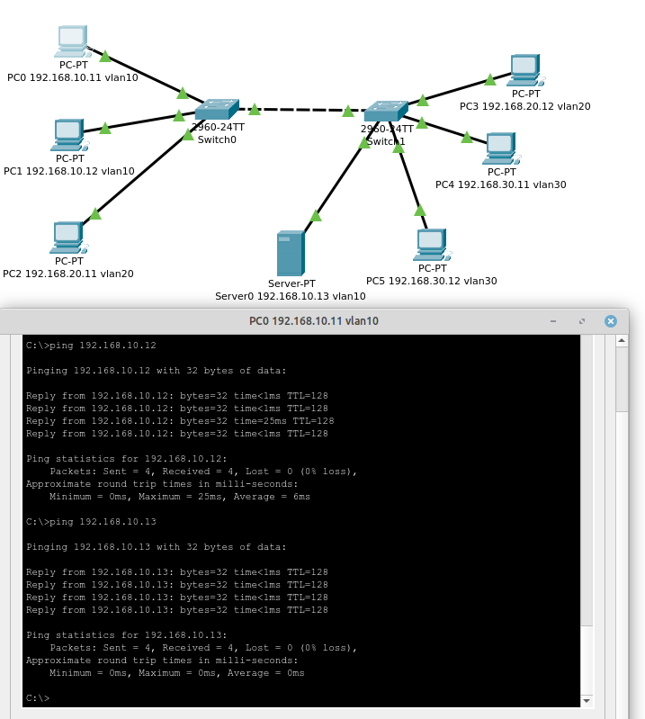
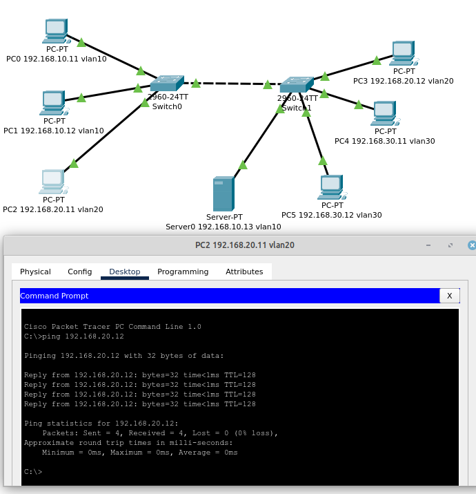
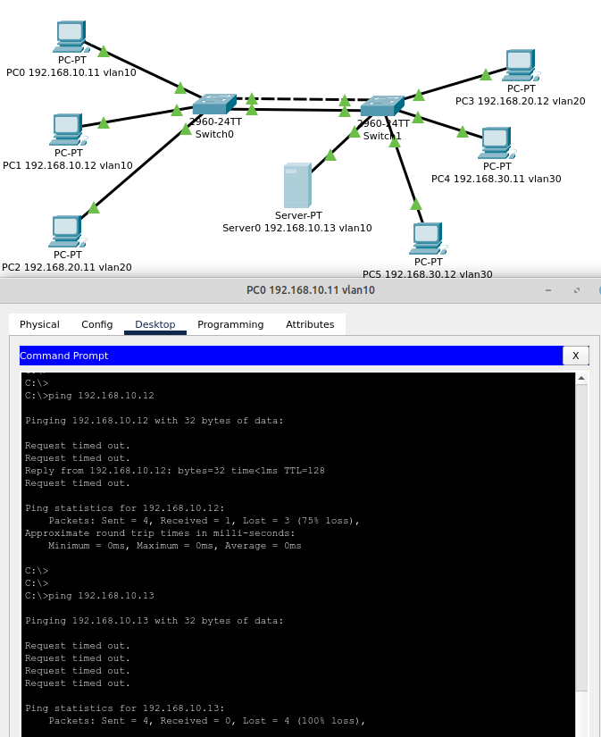

# 02.01. Принципы коммутации. VLAN - Лебедев Д.С.
### Задание 1.
> В программе Cisco PacketTracer составьте сеть из двух коммутаторов и компьютеров.  
> Создайте три VLAN так, чтобы:  
> - в каждой из них находилось минимум два компьютера;
> - хотя бы одна VLAN была на разных коммутаторах.  
> Проверьте связь между хостами командой ping.  
> *Приведите ответ в виде pkt-файла.*

*Ответ:*  
1. Настройка коммутатора sw0
```bash
Switch>en
Switch#conf t
Switch(config)#hostname sw0
sw0(config)#interface fa0/1
sw0(config-if)#switchport mode trunk
sw0(config-if)#exit
sw0(config)#exit

--- настройка vlan ---
sw0#conf t
sw0(config)#vlan 10
sw0(config-vlan)#name vlan10
sw0(config-vlan)#exit
sw0(config)#vlan 20
sw0(config-vlan)#name vlan20
sw0(config-vlan)#exit

sw0(config)#interface range fa0/2 - 3
sw0(config-if-range)#switchport mode access
sw0(config-if-range)#switchport access vlan 10
sw0(config-if-range)#exit

sw0(config)#interface fa0/4
sw0(config-if)#switchport mode access
sw0(config-if)#switchport access vlan 20
sw0(config-if)#exit
sw0(config)#exit
sw0#wr

--- show vlan ---
sw0#show vlan
VLAN Name Status Ports
---- -------------------------------- --------- -------------------------------
1 default active Fa0/5, Fa0/6, Fa0/7, Fa0/8
Fa0/9, Fa0/10, Fa0/11, Fa0/12
Fa0/13, Fa0/14, Fa0/15, Fa0/16
Fa0/17, Fa0/18, Fa0/19, Fa0/20
Fa0/21, Fa0/22, Fa0/23, Fa0/24
Gig0/1, Gig0/2
10 vlan10 active Fa0/2, Fa0/3
20 vlan20 active Fa0/4
...
```

2. Настройка коммутатора sw1
```bash
Switch>en
Switch#conf t
Switch(config)#hostname sw1
sw1(config)#interface fa0/1
sw1(config-if)#switchport mode trunk
sw1(config-if)#exit
sw1(config)#exit

--- настройка vlan ---
sw1#conf t
sw1(config)#vlan 10
sw1(config-vlan)#name vlan10
sw1(config-vlan)#exit
sw1(config)#vlan 20
sw1(config-vlan)#name vlan20
sw1(config-vlan)#exit
sw1(config)#vlan 30
sw1(config-vlan)#name vlan30
sw1(config-vlan)#exit

sw1(config)#interface fa0/5
sw1(config-if)#switchport mode access
sw1(config-if)#switchport access vlan 10
sw1(config-if)#exit

sw1(config)#interface fa0/2
sw1(config-if)#switchport mode access
sw1(config-if)#switchport access vlan 20
sw1(config-if)#exit

sw1(config)#interface range fa0/3 - 4
sw1(config-if-range)#switchport mode access
sw1(config-if-range)#switchport access vlan 30
sw1(config-if-range)#exit
sw1(config)#exit
sw1#wr

--- show vlan ---
sw1#show vlan

VLAN Name Status Ports
---- -------------------------------- --------- -------------------------------
1 default active Fa0/6, Fa0/7, Fa0/8, Fa0/9
Fa0/10, Fa0/11, Fa0/12, Fa0/13
Fa0/14, Fa0/15, Fa0/16, Fa0/17
Fa0/18, Fa0/19, Fa0/20, Fa0/21
Fa0/22, Fa0/23, Fa0/24, Gig0/1
Gig0/2
10 vlan10 active Fa0/5
20 vlan20 active Fa0/2
30 vlan30 active Fa0/3, Fa0/4
...
```

  

  

[Файл .pkt](_attachments/02.01-01-01.pkt)
### Задание 2*.
> 1. Настройте на каждом коммутаторе по одному дополнительному порту в Vlan 10 (см. примечание) и введите команду no spanning-tree vlan 10.
> 2. Соедините эти два порта с помощью дополнительного кабеля.
> 3. Проверьте связь с помощью ping внутри этой VLAN в коммутаторе и в соседних VLAN.  
> 
> Примечание: если в первой части ДЗ вы не использовали vlan 10, то можете взять любой существующий номер, но в итоге у вас должно получиться два trunk в которых разрешен один и тот же vlan.  
> 
> Вопрос: есть ли разница? Если да, то в чём?  
> *Приведите ответ в свободной форме.*

*Ответ:*  
Этими действиями искусственно создана петля коммутации для vlan 10, при этом на порту отключена работа протокола STP. Этот протокол должен блокировать избыточный порт и препятствовать образованию таких петель.  
В итоге получается широковещательный шторм, блокируется работа сети. Коммутаторы загружены тем, что шлют друг другу один и тот же кадр.  
В моем случае в пределах одного коммутатора пршел один всего один пакет, к хосту на другом коммутаторе достучаться не получилось вовсе.  
Пинги в других vlan'ах хоть и проходят, но с большим временем ответа из-за загрузки коммутаторов.  

  


Лог команд настройки коммутаторов
```sh
-- sw0 ---
sw0>en
sw0#conf t
sw0(config)#interface fa0/24
sw0(config-if)#switchport mode trunk
sw0(config-if)#switchport access vlan 10
sw0(config-if)#exit
sw0(config)#no spanning-tree vlan 10
sw0(config)#exit
sw0#wr

--- ws1 --
sw1>en
sw1#conf t
sw1(config)#interface fa0/24
sw1(config-if)#switchport mode trunk
sw1(config-if)#switchport access vlan 10
sw1(config-if)#exit
sw1(config)#no spanning-tree vlan 10
sw1(config)#exit
sw1#wr
```

[Файл .pkt](_attachments/02.01-02-01.pkt)
