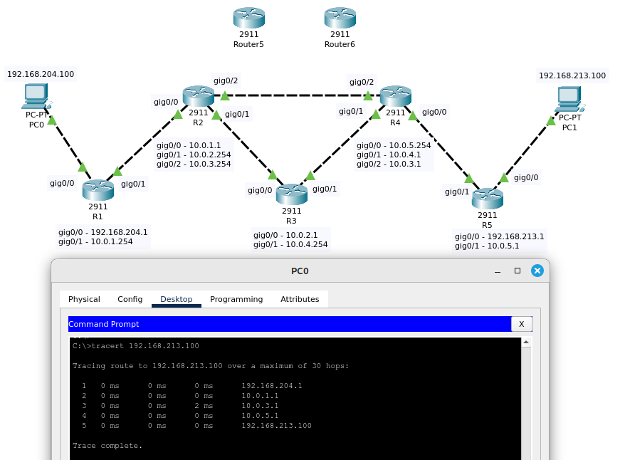

# 02.04. Маршрутизация. Шлюз по умолчанию. Выбор лучшего маршрута - Лебедев Д.С.
### Задание 1. Лабораторная работа "Выбор наилучшего маршрута на базе статической маршрутизации"
> Соберите тестовую сеть согласно топологии ниже:  
> - настройте статическую маршрутизацию для тестовой сети так, чтобы пакеты от PC0 к PC1 маршрутизировались через путь R0 - R2. Проверьте работоспособность сети;
> - измените настройки административной дистанции статических маршрутов так, чтобы пакеты от PC0 к PC1 маршрутизировались через путь R0 - R3 - R2, а путь R0 - R2 оставался запасным.  
> Сделайте вывод, как административная дистанция влияет на маршрут.  
>   
> *Приведите ответ в свободной форме и пришлите pkt-файл.*

*Ответ:*  
<details>
<summary>Команды настройки роутеров, статическая маршрутизация</summary>

```bash
-- Настройка R0 --
Router>en
Router#conf t
Router(config)#hostname R0
R0(config)#int gig0/0
R0(config-if)#ip address 192.168.204.254 255.255.255.0
R0(config-if)#no shutdown
R0(config-if)#exi

R0(config)#int gig0/1
R0(config-if)#ip address 10.1.1.1 255.255.255.0
R0(config-if)#no shutdown
R0(config-if)#exi

R0(config)#int gig0/2
R0(config-if)#ip address 10.1.2.1 255.255.255.0
R0(config-if)#no shutdown
R0(config-if)#exi

R0(config)#ip route 192.168.213.0 255.255.255.0 10.1.1.2
R0(config)#ip route 192.168.213.0 255.255.255.0 10.1.2.254 55
R0(config)#exi
R0#wr
R0#sh run | i route

-- Настрйка R2 --
Router>en
Router#conf t
Router(config)#hostname R2
R2(config)#int gig0/0
R2(config-if)#ip address 192.168.213.254 255.255.255.0
R2(config-if)#no shutdown
R2(config-if)#exi

R2(config)#int gig0/1
R2(config-if)#ip address 10.1.1.2 255.255.255.0
R2(config-if)#no shutdown
R2(config-if)#exi

R2(config)#int gig0/2
R2(config-if)#ip address 10.1.3.2 255.255.255.0
R2(config-if)#no shutdown
R2(config-if)#exi

R2(config)#ip route 192.168.204.0 255.255.255.0 10.1.1.1
R2(config)#ip route 192.168.204.0 255.255.255.0 10.1.3.254 55
R2(config)#exi
R2#wr
R2#sh run | i route

-- Настройка R3 --
Router>en
Router#conf t
Router(config)#hostname R3
R3(config)#int gig0/0
R3(config-if)#ip address 10.1.2.254 255.255.255.0
R3(config-if)#no shutdown
R3(config-if)#exi

R3(config)#int gig0/1
R3(config-if)#ip address 10.1.3.254 255.255.255.0
R3(config-if)#no shutdown
R3(config-if)#exi

R3(config)#ip route 192.168.213.0 255.255.255.0 10.1.3.2
R3(config)#ip route 192.168.204.0 255.255.255.0 10.1.2.1
```
</details>

[PKT-файл, Первая часть задания 1](_attachments/02-04-01-01.pkt)  
Результат:  
  

Для выполнения второй части задания изменяем значение административной дистанции для маршрута R0 - R2 на значение 250 (ранее было дефолтное значение 1):  

```bash
R0#sh run | i route
ip route 192.168.213.0 255.255.255.0 10.1.1.2
ip route 192.168.213.0 255.255.255.0 10.1.2.254 55
R0#conf t
R0(config)#no ip route 192.168.213.0 255.255.255.0 10.1.1.2
R0(config)#ip route 192.168.213.0 255.255.255.0 10.1.1.2 250
R0(config)#exi

R0#sh run | i route
ip route 192.168.213.0 255.255.255.0 10.1.2.254 55
ip route 192.168.213.0 255.255.255.0 10.1.1.2 250
R0#

--
R2#sh run | i route
ip route 192.168.204.0 255.255.255.0 10.1.1.1
ip route 192.168.204.0 255.255.255.0 10.1.3.254 55
R2#conf t
R2(config)#no ip route 192.168.204.0 255.255.255.0 10.1.1.1
R2(config)#ip route 192.168.204.0 255.255.255.0 10.1.1.1 250
R2(config)#exi
R2#sh run | i route
ip route 192.168.204.0 255.255.255.0 10.1.3.254 55
ip route 192.168.204.0 255.255.255.0 10.1.1.1 250
R2#wr
```

[PKT-файл, вторая часть задания 1](_attachments/02-04-01-02.pkt)  
Результат:  
  

Вывод: На практике проверено, что роутеры сравнивают административные дистанции маршрутов, и преимущество получает маршрут с меньшим значением этого показателя.

### Задание 2. Лабораторная работа "Выбор наилучшего маршрута на базе динамической маршрутизации"
> Соберите тестовую сеть, настройте протокол маршрутизации rip для тестовой сети согласно топологии.  
> - Проверьте работоспособность сети.
> - Подключите R6 и R7 маршрутизаторы в разрыв линии R2-R4 маршрутизаторов. Вместо соединения R2-R4 должно быть R2-R6-R7-R4.
> - Выполните их настройку.
> - Протестируйте полученную сеть.
> Как подключение маршрутизаторов повлияло на метрики выбора маршрута и почему, какие выводы вы можете сделать до и после подключения.  
> 
>   
> *Приведите ответ в свободной форме и пришлите pkt файл.*

*Ответ:*  
<details>
<summary>Команды настройки роутеров, динамическая маршрутизация RIP</summary>

```bash
--- R1 ---
Router(config)#hostname R1
R1(config)#int gig0/0
R1(config-if)#ip address 192.168.204.1 255.255.255.0
R1(config-if)#no shutdown
R1(config-if)#exi
R1(config)#int gig0/1
R1(config-if)#ip address 10.0.1.254 255.255.255.0
R1(config-if)#no shutdown
R1(config-if)#exi

R1(config)#router rip
R1(config-router)#version 2
R1(config-router)#network 192.168.204.0
R1(config-router)#network 10.0.0.0
R1(config-router)#exi
R1(config)#exi
R1#wr


--- R2 ---
Router(config)#hostname R2
R2(config)#int gig0/0
R2(config-if)#ip address 10.0.1.1 255.255.255.0
R2(config-if)#no sh
R2(config-if)#exi

R2(config)#int gig0/1
R2(config-if)#ip address 10.0.2.254 255.255.255.0
R2(config-if)#no sh
R2(config-if)#exi

R2(config)#int gig0/2
R2(config-if)#ip address 10.0.3.254 255.255.255.0
R2(config-if)#no sh
R2(config-if)#exi

R2(config)#router rip
R2(config-router)#version 2
R2(config-router)#network 10.0.0.0
R2(config-router)#exi
R2(config)#exi
R2#wr

--- R3 ---
Router(config)#hostname R3
R3(config)#int gig0/0
R3(config-if)#
R3(config-if)#ip address 10.0.2.1 255.255.255.0
R3(config-if)#no sh
R3(config-if)#int gig0/1
R3(config-if)#ip address 10.0.4.254 255.255.255.0
R3(config-if)#no sh
R3(config-if)#exi

R3(config)#router rip
R3(config-router)#version 2
R3(config-router)#network 10.0.0.0
R3(config-router)#exi

R3(config)#exi
R3#wr

---
Router(config)#hostname R4
R4(config)#int gig0/0
R4(config-if)#ip address 10.0.5.254 255.255.255.0
R4(config-if)#no sh
R4(config-if)#int gig0/1
R4(config-if)#ip address 10.0.4.1 255.255.255.0
R4(config-if)#no sh
R4(config-if)#int gig0/2
R4(config-if)#ip address 10.0.3.1 255.255.255.0
R4(config-if)#no sh
R4(config-if)#exi

R4(config)#router rip
R4(config-router)#version 2
R4(config-router)#network 10.0.0.0
R4(config-router)#exi

R4(config)#exi
R4#wr

---
Router(config)#hostname R5
R5(config)#int gig0/0
R5(config-if)#ip address 192.168.213.1 255.255.255.0
R5(config-if)#no sh
R5(config-if)#int gig0/1
R5(config-if)#ip address 10.0.5.1 255.255.255.0
R5(config-if)#no sh
R5(config-if)#exi

R5(config)#router rip
R5(config-router)#version 2
R5(config-router)#network 10.0.0.0
R5(config-router)#network 192.168.213.0
R5(config-router)#exi

R5(config)#exi
R5#wr
```
</details>
[PKT-файл, первая часть задания 2](_attachments/02-04-02-01.pkt)  
Результат:  
  

Как видно из трейса, маршрутизация прописана динамически по пути R1 - R2 - R4 - R5, т.к. в протоколе RIP в качестве метрики используется количество транзитных переходов (хопов), и на данном пути их меньше.

Подключаем и настраиваем роутеры R6, R7, перенастраиваем R4
```bash

--- R6 ---
Router(config)#hostname R6
R6(config)#int gig0/0
R6(config-if)#ip address 10.0.3.1 255.255.255.0
R6(config-if)#no sh
R6(config-if)#int gig0/1
R6(config-if)#ip address 10.0.6.254 255.255.255.0
R6(config-if)#no sh
R6(config-if)#exi

R6(config)#router rip
R6(config-router)#version 2
R6(config-router)#network 10.0.0.0
R6(config-router)#exi
R6(config)#exi
R6#wr


--- R7 ---
Router(config)#hostname R7
R7(config)#int gig0/0
R7(config-if)#ip address 10.0.3.254 255.255.255.0
R7(config-if)#no sh
R7(config-if)#int gig0/1
R7(config-if)#ip address 10.0.7.1 255.255.255.0
R7(config-if)#no sh
R7(config-if)#exi

R7(config)#router rip
R7(config-router)#version 2
R7(config-router)#network 10.0.0.0
R7(config-router)#exi

R7(config)#exi
R7#wr


--- R4 ---
R4(config)#int gig0/2
R4(config-if)#ip address 10.0.7.254 255.255.255.0
R4(config-if)#exi
R4(config)#exi
R4#wr
R4#sh ip int br
```

[PKT-файл, вторая часть задания 2](_attachments/02-04-02-02.pkt)  
Результат:  
  

Вывод: при подключении роутеров R6 и R7 увеличивается количество хопов по этому маршруту, поэтому трафик пойдет через R3, т.к. переходов на этом пути меньше.