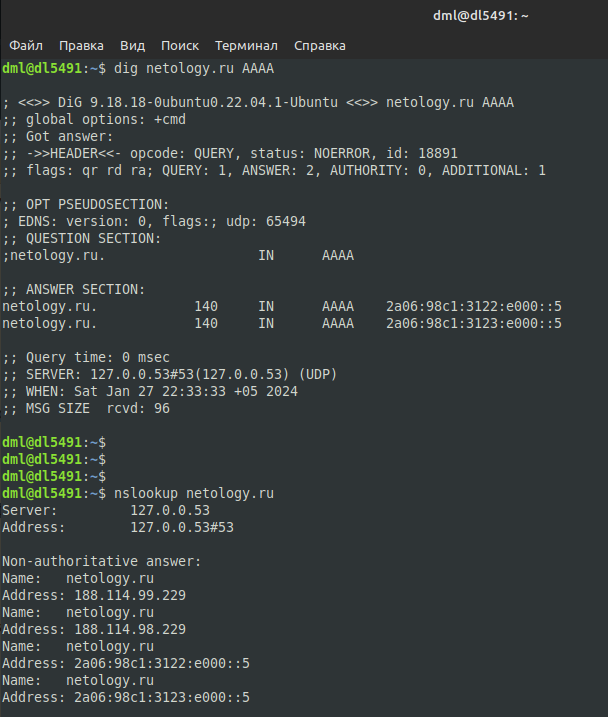

# 02.05. Основы IPv6 - Лебедев Д.С.
### Задание 1.
> Какого типа трафика нет в IPv6, но который имеется в IPv4? Что предусмотрено взамен?  
> *Приведите ответ в свободной форме.*

*Ответ:*  
В IPv6 не существует широковещательных (Broadcast) адресов, их функции переданы мультикастинг-адресам. Всего в IPv6 предусмотрено три типа трафика: unicast, multicast и anycast.

### Задание 2.
> Используя любую консольную утилиту получите IPv6-адрес для какого либо ресурса.  
> *Пришлите скриншот.*

*Ответ:*  
IPv6-адрес можно получить, используя `ping6`, `nslookup`, `dig`, `host`.  

### Задание 3.
> Какие из этих префиксов содержатся в адресе: 2001:DB8:2314:5678::9ABC:DEF0?  
> a)2001:DB8:2314:5::/52  
> b)2001:DB8:2314:5678::9AB8:0/109  
> c)2001:DB8:2314:5660::/59  
> d)2001:DB80::/27

*Ответ:*  

Префиксы под пунктами б) и с).

### Задание 4. Лабораторная работа "Конфигурация сетевых интерфейсов на основе IPv6".
> В Cisco Packet Tracer создайте два маршрутизатора (R1 и R2) и настройте между ними адресацию по IPv6 с помощью глобальных адресов.  
> *Приведите скриншоты, где R2 доступен по ICMPv6 с R1 по ICMPv6*  
> *Пришлите pkt файл.*

*Ответ:*  

### Задание 5*.
> На основе лабораторной работы в Задании 4 к схеме добавьте еще два маршрутизатора R3 к R2, а R4 к R1. Назначьте им IP-адрес-а c помощью механизма EUI-64.  
> *Приведите скриншот, где отображены настройки интерфейса и ip-адрес*  
> *Пришлите pkt файл.*

*Ответ:*  

### Задание 6*.
> На основе лабораторной работы в Задании 4 настройте на одном из интерфейсов R3 локальный адрес IPv6 и включите DHCPv6. Добавьте к этому интерфейсу ПК/Сервер и сделайте так, чтобы он получил IPv6-адрес.  
> *Приведите скриншот, где отображены настройки интерфейса и ip-адрес, который получил клиент в этом интерфейсе.*  
> *Пришлите pkt файл.*

*Ответ:*  

