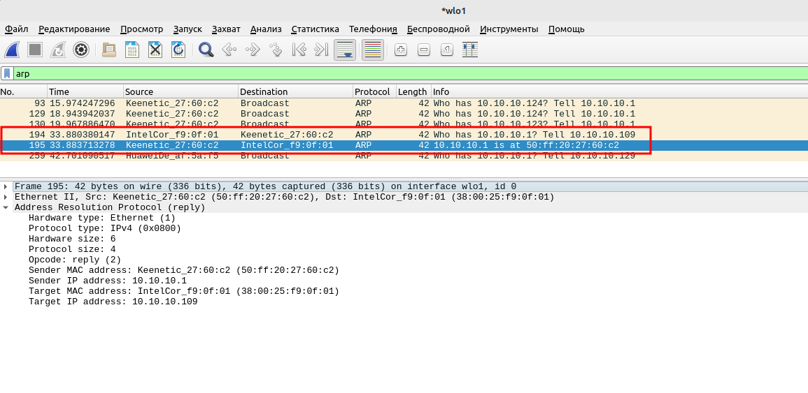
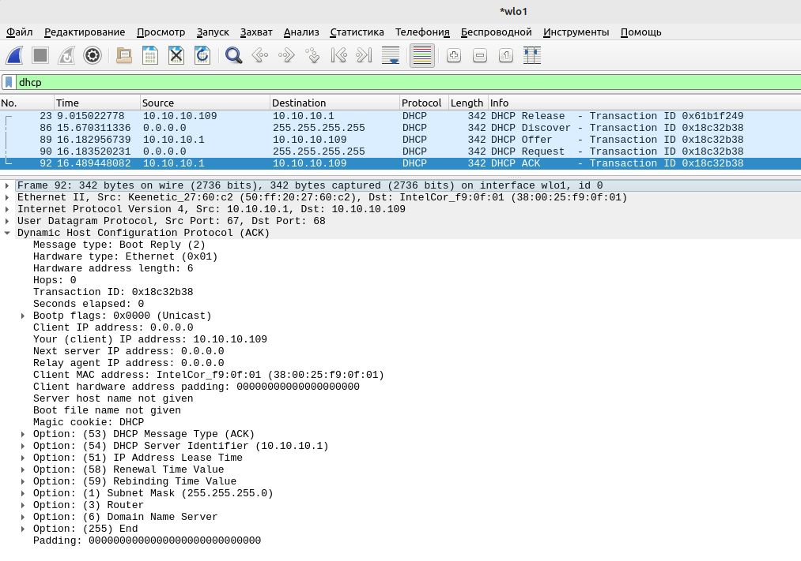
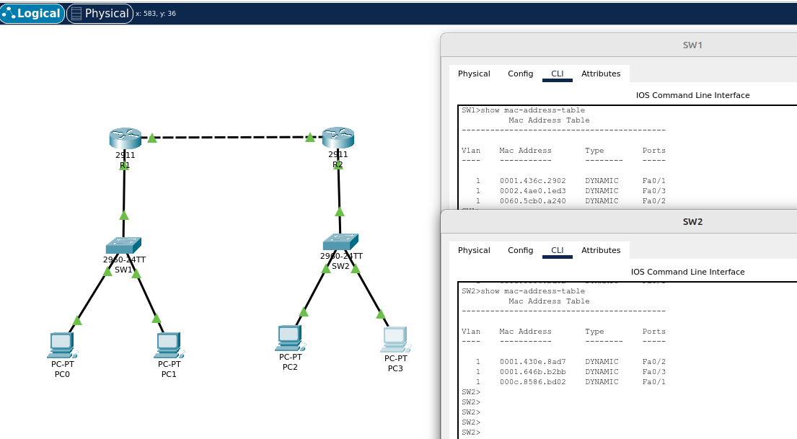
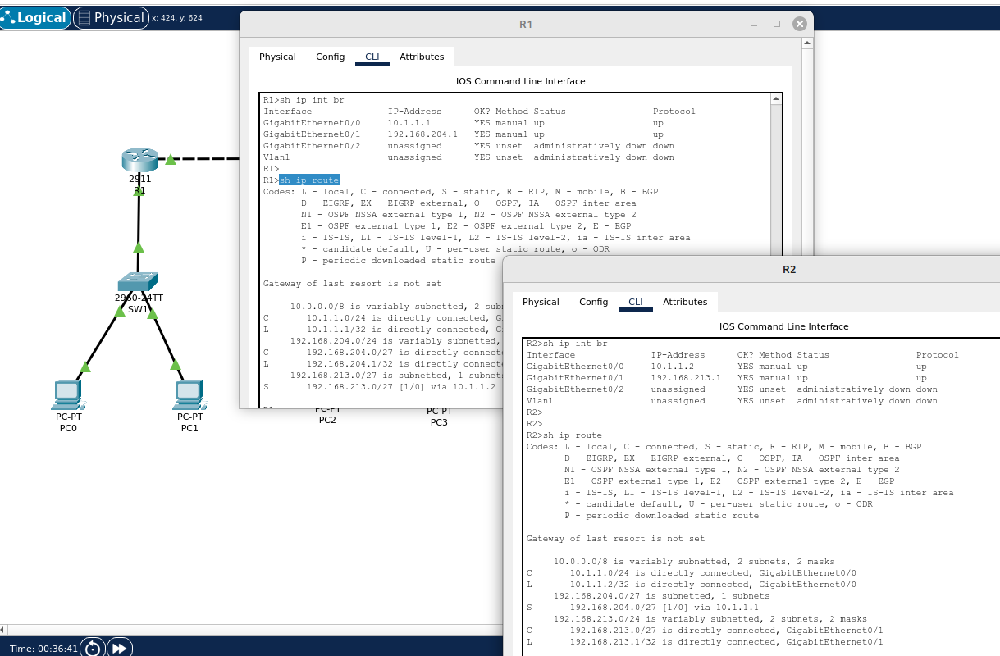
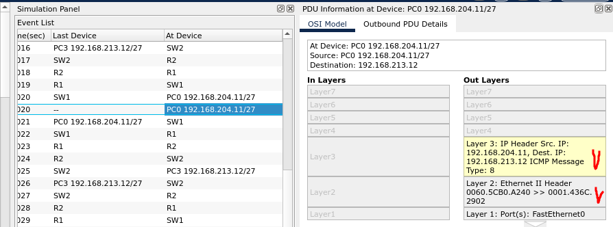
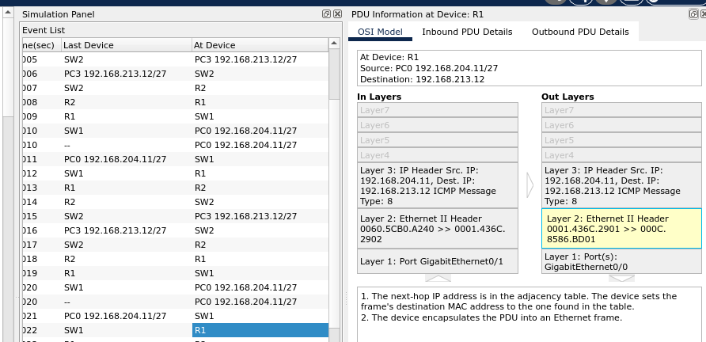
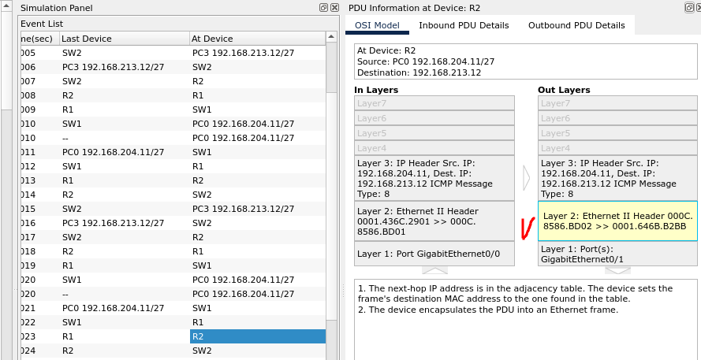
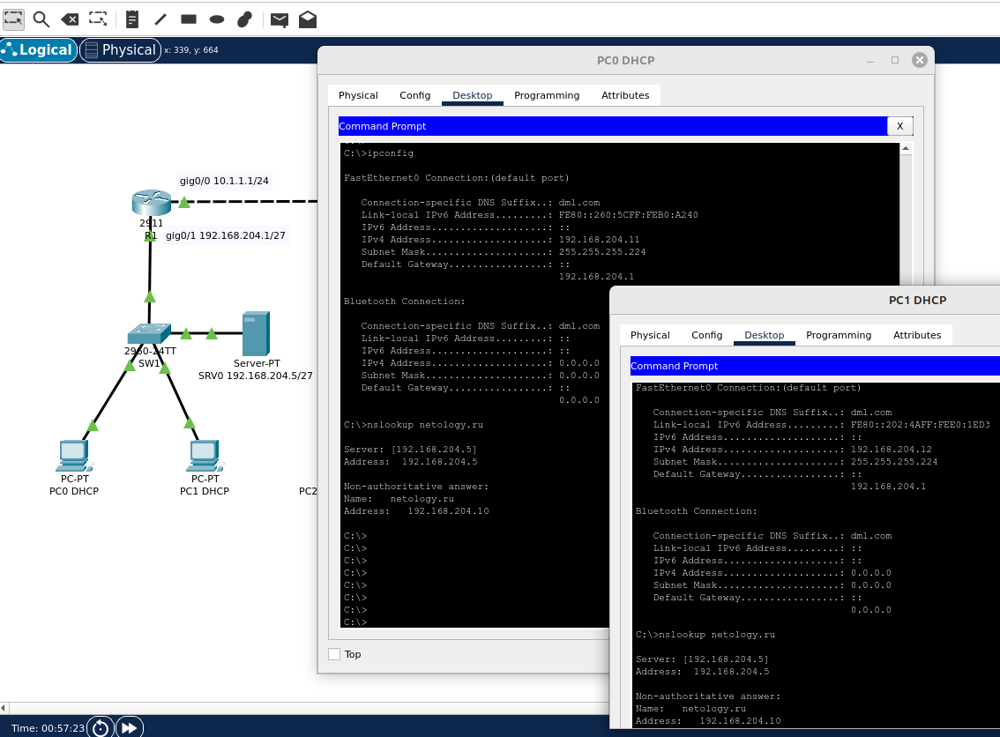

# 02.06. Путь пакета в коммутируемой и маршрутизируемой среде - Лебедев Д.С.
### Задание 1.
> На основном интерфейсе вашего ПК (или виртуальной машины) посмотрите дамп трафика через tshark или Wireshark.  
> *Приведите скриншоты, где показаны основные моменты работы протокола ARP и все этапы работы DHCP-протокола.*

*Ответ:*  
1. Основные моменты работы протокола ARP: протокол работает в режиме запрос-ответ. Роутер выдает широковещательный запрос в сеть (request), хост с запрошенным IP отсылает ему ответ со своим МАК-адресом (reply).  
  

2. Этапы работы протокола DHCP. Для освобождения IP адреса в linux используем команду `dhclient -r`, для запроса нового - команда `dhclient`.  
   
  
### Задание 2.
> Как настраивается для сетевого пакета размер MTU в сетях, использующих только протокол IPv6?  
> *Приведите ответ в свободной форме.*

*Ответ:*  
В IPv6 минимальный размер MTU составляет 1280 байт. Следовательно, пакеты IPv6, размер которых меньше этого ограничения, не разбиваются на фрагменты. Фрагментация поддерживается как опция (информация о фрагментации пакетов вынесена из основного заголовка в расширенные) и возможна только по инициативе передающей стороны. Маршрутизаторы IPv6 не выполняют фрагментацию, а только посылают ICMP-сообщение о слишком длинном пакете конечному узлу, который должен уменьшить размер пакета. Конечные узлы обязаны найти минимальное значение MTU вдоль всего пути, соединяющего исходный узел с узлом назначения (Path MTU Discovery).

### Задание 3. Лабораторная работа "Построение сети и разбор передаваемых в ней пакетов"
> 1. В Cisco Packet Tracer соберите сеть состоящую из двух маршрутизаторов (R1 и R2), за каждым из которых есть коммутатор (Switch1 и Switch2), а за коммутатором по два компьютера (Comp1, Comp2 и Comp3, Comp4). Все устройства этой сети должны быть доступны между собой.  
> Сетевые настройки можно использовать следующие:
> - R1 10.1.1.1/27
> - R2 10.1.2.1/27  
> *Приведите скриншоты таблицы коммутации и таблицы маршрутизации устройств R1, R2, Switch1, Switch2. Пришлите pkt файл.*  
> 2. Как будут выглядеть заголовки пакета на каждом из узловых точек сети из первой части лабораторного задания при обмене данными Comp1 с Comp4?  
> *Приведите ответ в свободной форме.*

*Ответ:*  
1. Команды настройки роутеров  
```bash

-- R1 --
Router(config)#hostname R1
R1(config)#int gig0/1
R1(config-if)#ip address 192.168.204.1 255.255.255.224
R1(config-if)#no sh

R1(config-if)#int gig0/0
R1(config-if)#ip address 10.1.1.1 255.255.255.0
R1(config-if)#no sh
R1(config-if)#exit
R1(config)#ip route 192.168.213.0 255.255.255.224 10.1.1.2
R1(config)#exit
R1#wr

-- R2 --
Router(config)#hostname R2
R2(config)#int gig0/1
R2(config-if)#ip address 192.168.213.1 255.255.255.224
R2(config-if)#no sh

R2(config-if)#int gig0/0
R2(config-if)#ip address 10.1.1.2 255.255.255.0
R2(config-if)#no sh
R2(config-if)#end
R2(config)#exit
R2(config)#ip route 192.168.204.0 255.255.255.224 10.1.1.1
R2#wr
```

Команды настройки коммутаторов:  
```bash

-- SW1 --
Switch(config)#hostname SW1
SW1(config)#interface fa0/1
SW1(config-if)#switchport mode trunk
SW1(config-if)#end
SW1#wr

-- SW2 --
Switch(config)#hostname SW2
SW2(config)#interface fa0/1
SW2(config-if)#switchport mode trunk
SW2(config-if)#end
SW2#wr
```

Таблицы коммутации:  
  

Таблицы маршрутизации:  
  

[PKT - файл](_attachments/02.06-03-01.pkt)  

2. После того, как отработал протокол ARP, на каждом узле создана таблица коммутации. В качестве MAC-адреса получателя PC0 ставит адрес шлюза R1. При этом IP-адрес получателя в пакете остаётся 192.168.213.12.  
  

При прохождении коммутаторов данные канального уровня откидываются, изначальный IP-пакет, не изменяясь, инкапсулируется в новый кадр. В качестве MAC-адреса источника указывается адрес интерфейса шлюза R1, в качестве MAC-адреса получателя указывается адрес стыковочного интерфейса R2.  
  

Роутер R2, в свою очередь, в качестве MAC-адреса получателя указывает адрес конечного хоста PC3.  
  

Далее кадр доставляется коммутатором SW2 до хоста-получателя PC3.

### Задание 4*.
> 1. Загрузите предыдущую лабораторную работу из задания №3.
> 2. Добавьте сервер к любому коммутатору.
> 3. Назначьте ему IP-адрес из той же подсети и включите сервис HTTP.
> 4. Поднимите на этом сервере сервис DNS и сделайте А-запись: "A запись - netology.ru".
> 5. На маршрутизаторе, в сети которого присутствует сервер DNS, настройте выдачу IP-адресов по протоколу DHCP. Также необходимо, чтобы по DHCP клиентам выдавался IP-адрес DNS-сервера.
> 6. С любого компьютера зайдите на сайт netology.ru  
> *Приведите скриншоты, где с помощью утилиты nslookup можно получить IP адрес сайта netology.ru.*

*Ответ:*  
Команды настройки DHCP на маршрутизаторе:  
```bash
R1(config)#ip dhcp excluded-address 192.168.204.1 192.168.204.10 // исключаем из раздачи эти адреса
R1(config)#ip dhcp pool MY-POOL
R1(dhcp-config)#network 192.168.204.0 255.255.255.224
R1(dhcp-config)#default-router 192.168.204.1
R1(dhcp-config)#domain-name dml.com
R1(dhcp-config)#dns-server 192.168.204.5
R1(dhcp-config)#end
R1#wr
```

[PKT - файл задания 4](_attachments/02.06-04-01.pkt)  

Работа DNS сервера:  
  
