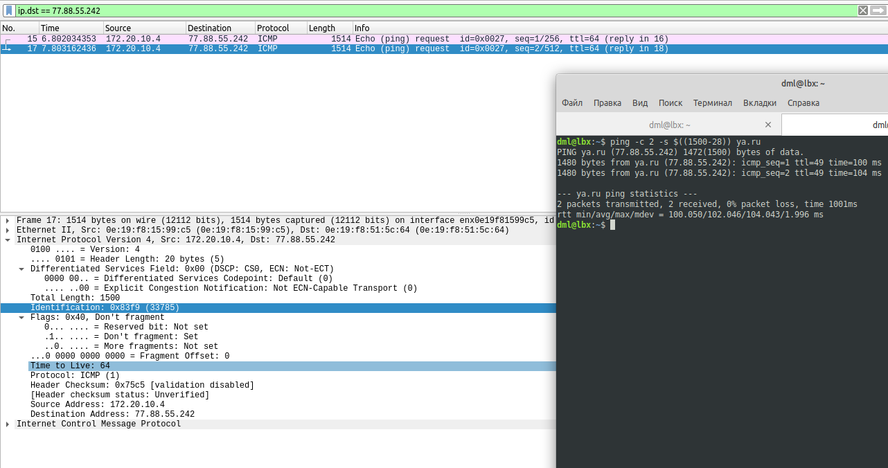
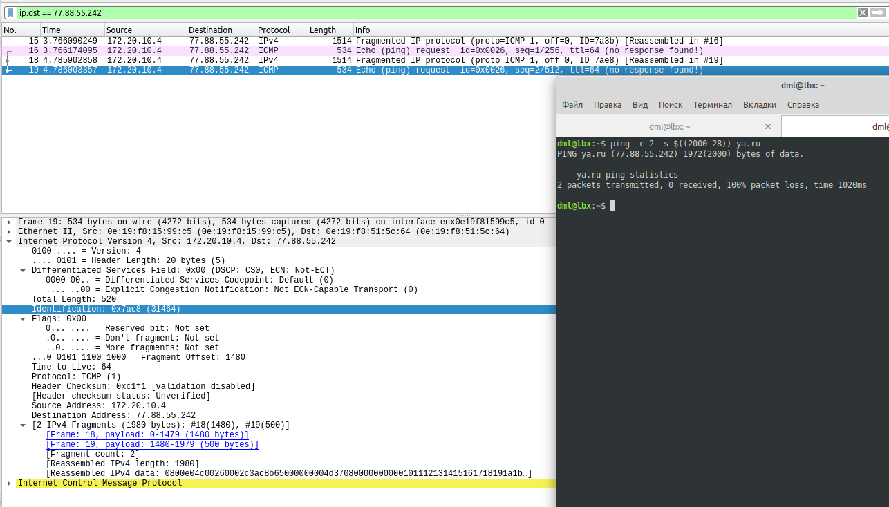
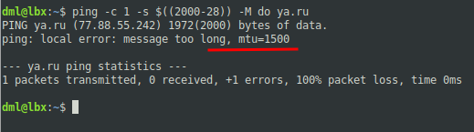
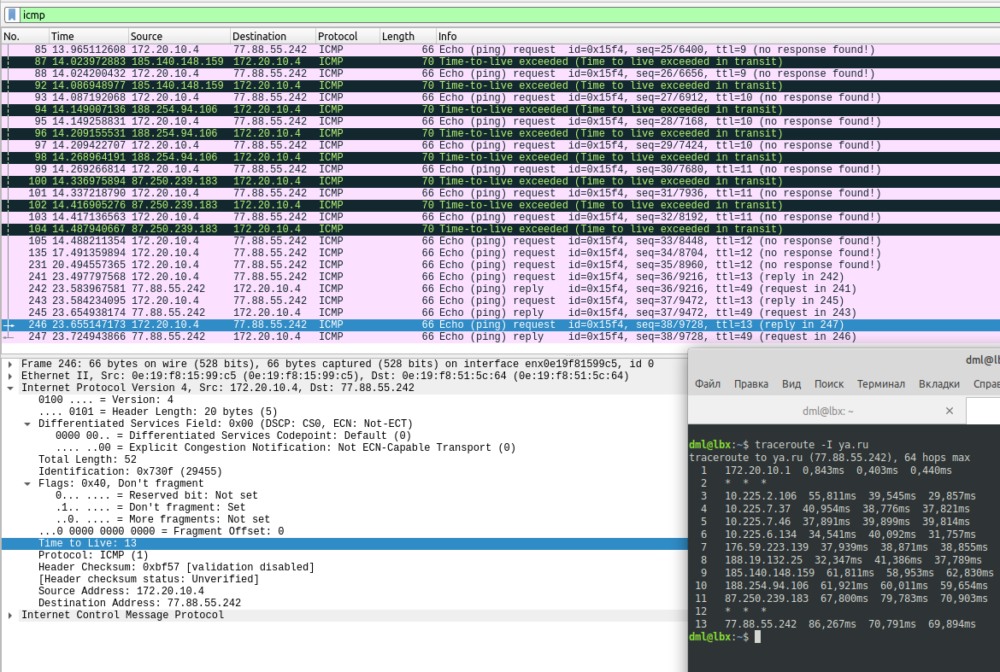
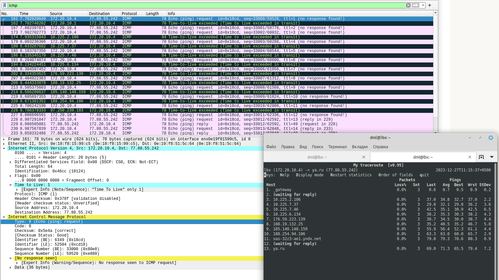

# 02.02. IPv4/IPv6 заголовки - Лебедев Д.С.
### Задание 1.
> 1. Запустите ПО Wireshark.
> 2. Настройте фильтр таким образом, чтобы отображались все фрагменты исходного пакета.
> 3. Запустите cmd.exe. Нажмите сочетание Win + r.
> 4. В появившемся окне напишите "cmd".Нажмите "OK".
> 5. Откроется командная строка.
> 6. Выполните команду ping до любого адреса пакетами размером более 1500 байт, например ya.ru.  
> Сколько пакетов до указанного в ping адреса отправлено?  
> Какие флаги в полях IPv4 заголовка установлены и почему?  
> *Ответ приведите в виде скриншотов с дампа wireshark. Пояснения к дампу- в свободной форме.*

*Ответ:*  
1. Проверим доступность хоста стандартным пакетом, команда `ping -c 2 -s $((1500-28)) ya.ru` посылает 2 пакета на ya.ru. 28 байт вычитается, поскольку они отданы под заголовки IP и ICMP:  
  

2. Далее, меняем размер MTU, `$((2000-28))`:  
  

В итоге - отправлено 4 пакета, т.к. каждый пакет был фрагментирован на 2 части, по 1514 и 534 байта. Поле `Identification` у соответствующих пакетов одинаково. Флаги отличаются полями `More fragments`, у пакета протокола IPv4 он равен 1 (не последний), у пакета протокола ICMP = 0 (последний). Во втором фрагменте `Fragment offset` равен 1480, значит, первый фрагмент добавляется ко второму после 1480-го байта.  

3. Определенной командой можно выяснить, какой ожидается MTU:  

### Задание 2.
> 1. Запустите cmd.exe. Нажмите сочетание Win + r.
> 2. В появившемся окне напишите "cmd".Нажмите "OK".
> 3. Откроется командная строка.
> 4. Выполните трассировку до сайта ya.ru. Команда для запуска трассировки tracert. Лучше запускать с ключами -w 1 -d. Справку по ключам можно получить, выполнив tracert --help.  
> Сколько хопов в вашей трассировке?  
> Какие значения TTL установлены в заголовке IPv4 пакета для каждого хопа?  
> Какой тип icmp сообщения возвращался на каждом этапе трассировки?  
> Какие src-dst адреса установлены в заголовке IPv4 для пакетов на каждом хопе, почему в исходном запросе и в ответе они отличаются?  
> Заголовки пакетов проанализируйте в дампе Wireshark.  
> *Ответ приведите в виде скриншотов с дампа wireshark. Пояснения к дампу - в свободной форме.*

*Ответ:*  
  
Трассировка окончена 13-м хопом. Каждый пакет с одинаковым ttl отправлялся 3 раза, последующие пакеты инкрементируются на единицу.  
С транзитных роутеров возвращался ответ с типом ICMP `Type: 11 (Time-to-live exceeded)`, на последнем хопе вернулся ответ `Type: 0 (Echo (ping) reply)`  
В исходном запросе в заголовке присутствуют ip адреса хоста и источника, в ответах маршрутизаторы в src подставляют свой ip, в dst будет ip хоста - источника (инициатора запроса).  
Удобнее использовать команду `mtr`:  
