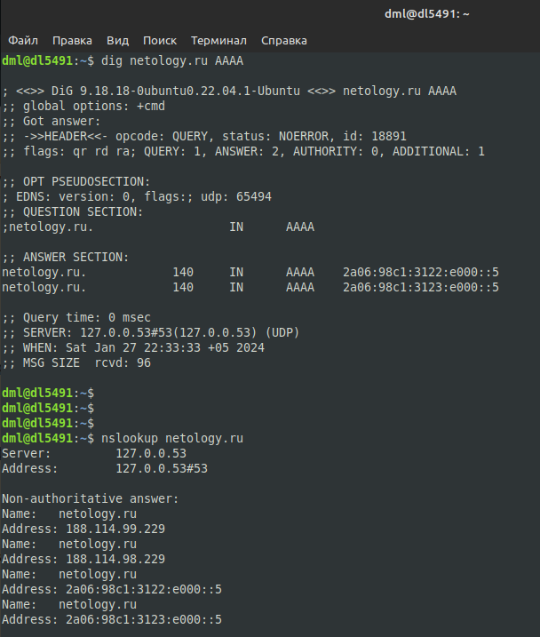
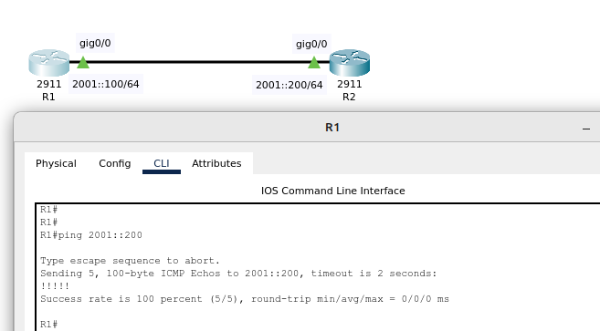
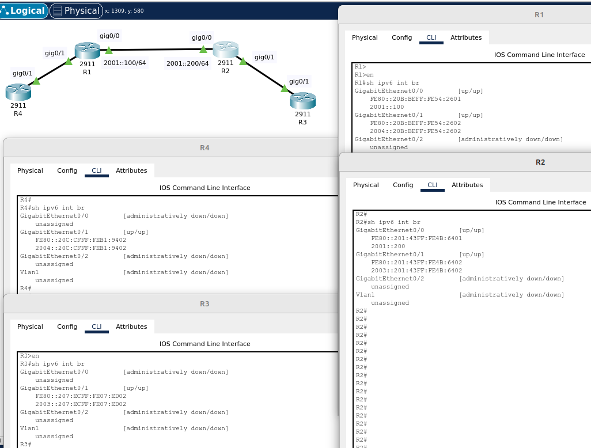
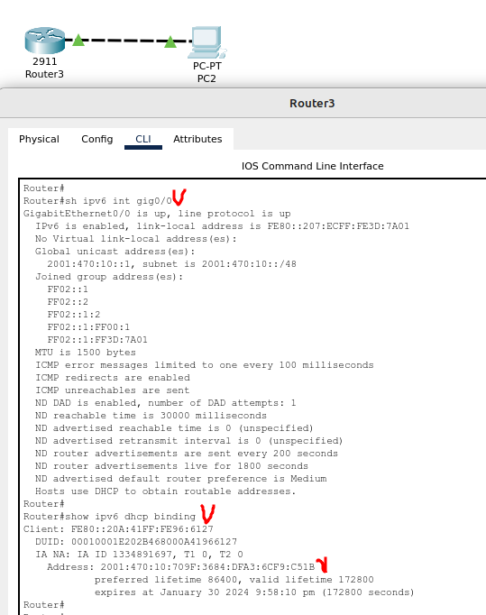

# 02.05. Основы IPv6 - Лебедев Д.С.
### Задание 1.
> Какого типа трафика нет в IPv6, но который имеется в IPv4? Что предусмотрено взамен?  
> *Приведите ответ в свободной форме.*

*Ответ:*  
В IPv6 не существует широковещательных (Broadcast) адресов, их функции переданы мультикастинг-адресам. Всего в IPv6 предусмотрено три типа трафика: unicast, multicast и anycast.

### Задание 2.
> Используя любую консольную утилиту получите IPv6-адрес для какого либо ресурса.  
> *Пришлите скриншот.*

*Ответ:*  
IPv6-адрес можно получить, используя `ping6`, `nslookup`, `dig`.  


### Задание 3.
> Какие из этих префиксов содержатся в адресе: 2001:DB8:2314:5678::9ABC:DEF0?  
> a)2001:DB8:2314:5::/52  
> b)2001:DB8:2314:5678::9AB8:0/109  
> c)2001:DB8:2314:5660::/59  
> d)2001:DB80::/27

*Ответ:*  
Префиксы под пунктами b) и c).

### Задание 4. Лабораторная работа "Конфигурация сетевых интерфейсов на основе IPv6".
> В Cisco Packet Tracer создайте два маршрутизатора (R1 и R2) и настройте между ними адресацию по IPv6 с помощью глобальных адресов.  
> *Приведите скриншоты, где R2 доступен по ICMPv6 с R1 по ICMPv6*  
> *Пришлите pkt файл.*

*Ответ:*  
Команды настройки роутеров R1, R2:  
```bash
-- Настройка R1 --
Router(config)#hostname R1
R1(config)#int gig0/0
R1(config-if)#ipv6 address 2001::100/64
R1(config-if)#no sh
R1(config-if)#exit
R1(config)#ipv6 unicast-routing
R1(config)#exit
R1#wr

-- Настройка R2 --
Router(config)#hostname R2
R2(config)#int gig0/0
R2(config-if)#ipv6 address 2001::200/64
R2(config-if)#no sh
R2(config-if)#exi
R2(config)#ipv6 unicast-routing
R2(config)#exi
R2#wr
```

[PKT - файл задания](_attachments/02.05-04-01.pkt)  

Результат:  


### Задание 5*.
> На основе лабораторной работы в Задании 4 к схеме добавьте еще два маршрутизатора R3 к R2, а R4 к R1. Назначьте им IP-адрес-а c помощью механизма EUI-64.  
> *Приведите скриншот, где отображены настройки интерфейса и ip-адрес*  
> *Пришлите pkt файл.*

*Ответ:*  
Команды настройки роутеров R1, R4, R2, R3:  
```bash
-- R1 --
R1(config)#int gig0/1
R1(config-if)#ipv6 address 2004::/64 eui-64
R1(config-if)#no sh
R1(config-if)#exi
R1(config)#ipv6 unicast-routing
R1(config)#exi
R1#wr

-- R4 --
Router(config)#hostname R4
R4(config)#int gig0/1
R4(config-if)#ipv6 address 2004::/64 eui-64
R4(config-if)#no sh
R4(config-if)#exi
R4(config)#ipv6 unicast-routing
R4(config)#exi
R4#wr
R4#sh ipv6 int br

-- R2 --
R2(config)#int gig0/1
R2(config-if)#ipv6 address 2003::/64 eui-64
R2(config-if)#no sh
R2(config-if)#exi
R2(config)#ipv6 unicast-routing
R2(config)#exi
R2#wr

-- R3 --
Router(config)#hostname R3
R3(config)#int gig0/1
R3(config-if)#ipv6 address 2003::/64 eui-64
R3(config-if)#no sh
R3(config-if)#exi
R3(config)#ipv6 unicast-routing
R3(config)#exi
R3#wr
sh ipv6 int br
```

[PKT - файл задание 5](_attachments/02.05-05-01.pkt)  

Результат:  


### Задание 6*.
> На основе лабораторной работы в Задании 4 настройте на одном из интерфейсов R3 локальный адрес IPv6 и включите DHCPv6. Добавьте к этому интерфейсу ПК/Сервер и сделайте так, чтобы он получил IPv6-адрес.  
> *Приведите скриншот, где отображены настройки интерфейса и ip-адрес, который получил клиент в этом интерфейсе.*  
> *Пришлите pkt файл.*

*Ответ:*  
Команды настройки роутера:  
```bash
Router(config)#ipv6 unicast-routing
Router(config)#ipv6 dhcp pool LAN
Router(config-dhcpv6)#address prefix 2001:470:10::1/48
Router(config-dhcpv6)#dns-server 2001:470:20::2
Router(config-dhcpv6)#domain-name dml.ru
Router(config-dhcpv6)#exit
Router(config)#int gig0/0
Router(config-if)#ipv6 address 2001:470:10::1/48
Router(config-if)#ipv6 enable
Router(config-if)#ipv6 nd managed-config-flag
Router(config-if)#ipv6 dhcp server LAN
Router(config-if)#no sh
Router(config-if)#end
Router#wr
Router#sh ipv6 int gig0/0
Router#sh ipv6 dhcp binding
```

[PKT - файл задания](_attachments/02.05-06-01.pkt)  

Результат:  
