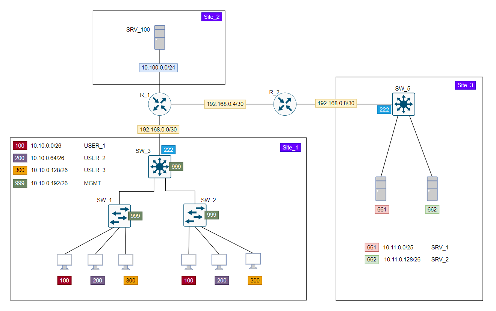
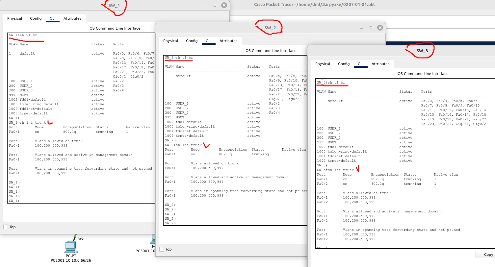
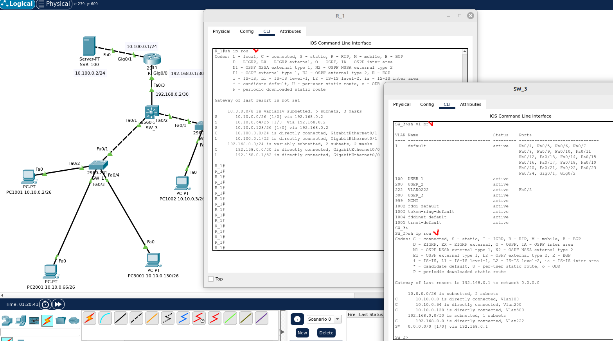
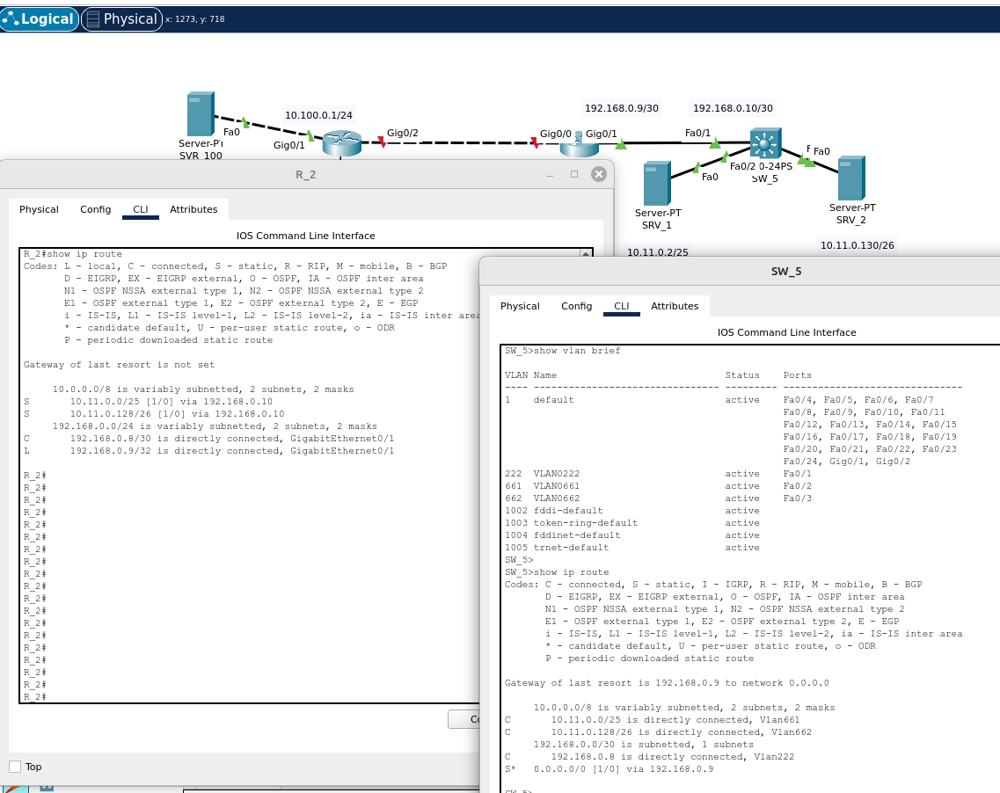
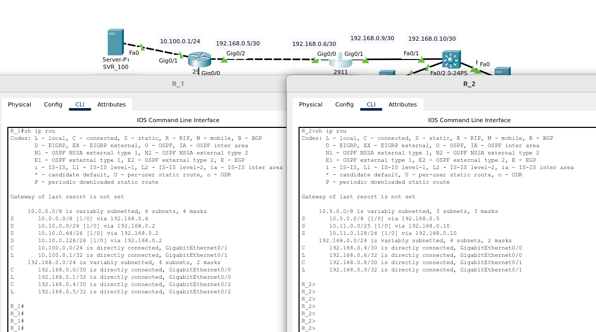

# 02.07. Настройка коммутации и маршрутизации - Лебедев Д.С.
Данная топология сети:  
  


### Задание 1.
> Создать VLANы пользователей 100, 200, 300 на коммутаторах. Создать соответствующие VLAN интерфейсы. Назначить IP адреса на АРМ пользователей. Проверить связанность между пользователями внутри VLAN, между разными VLAN и доступность шлюзов в каждом VLAN.  
> *Результат представить в виде вывода команд `show vlan brief` и `show interface trunk` с коммутаторов SW_1, SW_2, SW_3.*

*Ответ:*  
Созданы требуемые VLAN, виртуальные интерфейсы. Включена маршрутизация на коммутаторе SW_3. Существует связность между пользователями внутри VLAN  и между VLAN (interVlan routing), на SVI настроены соответствующие адреса шлюзов.

<details>
<summary>Команды настройки коммутаторов, задание 1</summary>

```bash
-- SW_1 --
Switch(config)#hostname SW_1
SW_1(config)#vlan 100
SW_1(config-vlan)#name USER_1
SW_1(config-vlan)#exi

SW_1(config)#int f0/2
SW_1(config-if)#switchport mode acc
SW_1(config-if)#spanning-tree portfast
SW_1(config-if)#switchport access vl 100
SW_1(config-if)#exi

SW_1(config)#vl 200
SW_1(config-vlan)#name USER_2
SW_1(config-vlan)#exi

SW_1(config)#int f0/3
SW_1(config-if)#switchport mode acc
SW_1(config-if)#spanning-tree portfast
SW_1(config-if)#switchport access vl 200
SW_1(config-if)#exi

SW_1(config)#int f0/1
SW_1(config-if)#switchport mode trunk
SW_1(config-if)#switchport trunk all vl 100,200
SW_1(config-if)#exi
SW_1(config)#exi
SW_1#wr

SW_1(config)#vl 300
SW_1(config-vlan)#name USER_3
SW_1(config-vlan)#exi

SW_1(config)#vl 999
SW_1(config-vlan)#name MGMT

SW_1(config-vlan)#exi

SW_1(config)#int f0/4
SW_1(config-if)#switchport mode acc
SW_1(config-if)#spanning-tree portfast
SW_1(config-if)#switchport access vl 300
SW_1(config-if)#exi


SW_1(config)#int f0/1
SW_1(config-if)#switchport trunk allowed vlan add 300
SW_1(config-if)#switchport trunk allowed vlan add 999

SW_1(config)#exi
SW_1#wr

-- SW_2 --
Switch(config)#hostname SW_2
SW_2(config)#vl 100
SW_2(config-vlan)#name USER_1
SW_2(config-vlan)#exi
SW_2(config)#vl 200
SW_2(config-vlan)#name USER_2
SW_2(config-vlan)#exi
SW_2(config)#vl 300
SW_2(config-vlan)#name USER_3
SW_2(config-vlan)#exi
SW_2(config)#vl 999
SW_2(config-vlan)#name MGMT
SW_2(config-vlan)#exi

SW_2(config)#interface range fa0/2 - 4
SW_2(config-if-range)#switchport mode acc
SW_2(config-if-range)#spanning-tree portfast

SW_2(config-if-range)#int f0/2
SW_2(config-if)#switchport access vl 100

SW_2(config-if)#int f0/3
SW_2(config-if)#switchport access vl 200

SW_2(config-if)#int f0/4
SW_2(config-if)#switchport access vl 300

SW_2(config-if)#int f0/1
SW_2(config-if)#switchport mode trunk
SW_2(config-if)#switchport trunk all vl 100,200,300,999
SW_2(config-if)#exi
SW_2(config)#exi
SW_2#wr

-- SW_3 --
Switch(config)#hostname SW_3
SW_3(config)#vl 100
SW_3(config-vlan)#name USER_1
SW_3(config-vlan)#exi

SW_3(config)#vl 200
SW_3(config-vlan)#name USER_2
SW_3(config-vlan)#exi

SW_3(config)#vl 300
SW_3(config-vlan)#name USER_3
SW_3(config-vlan)#exi

SW_3(config)#vl 222
SW_3(config-vlan)#exi

SW_3(config)#vl 999
SW_3(config-vlan)#name MGMT
SW_3(config-vlan)#exi

SW_3(config)#interface range fa0/1-2
SW_3(config-if-range)#switchport trunk encapsulation dot1q
SW_3(config-if-range)#switchport mode trunk
SW_3(config-if-range)#switchport trunk all vl 100,200,300,999
SW_3(config-if-range)#exi


--- включить маршрутизацию на SW_3 и настроить виртуальные интерфейсы ---
SW_3(config)#ip routing

SW_3(config)#int vl 100
SW_3(config-if)#ip address 10.10.0.1 255.255.255.192
SW_3(config-if)#exi

SW_3(config)#int vl 200
SW_3(config-if)#
SW_3(config-if)#ip address 10.10.0.65 255.255.255.192
SW_3(config-if)#exi

SW_3(config)#int vl 300
SW_3(config-if)#ip address 10.10.0.129 255.255.255.192
SW_3(config-if)#exi

SW_3(config)#exi
SW_3#wr
```
</details>

Результат:  
  

[PKT - файл](_attachments/02.07-01-01.pkt)

### Задание 2.
> Настроить связанность между SW_3 и R_1. Настроить связанность между SRV_100 и R_1.  
> *Результат представить в виде вывода команды с R_1 `show ip route` и с SW_3 `show vlan brief` и `show ip route`.*

*Ответ:*  
Команды настройки маршрутизатора R_1 и коммутатора SW_3:  
```bash
-- R1 --
Router(config)#hostname R_1
R_1(config)#int ran g0/0-1
R_1(config-if-range)#no sh
R_1(config-if-range)#exi

R_1(config)#int g0/0
R_1(config-if)#ip address 192.168.0.1 255.255.255.252
R_1(config-if)#exi

R_1(config)#int g0/1
R_1(config-if)#ip address 10.100.0.1 255.255.255.0
R_1(config-if)#exi

R_1(config)#ip route 10.10.0.0 255.255.255.192 192.168.0.2
R_1(config)#ip route 10.10.0.64 255.255.255.192 192.168.0.2
R_1(config)#ip route 10.10.0.128 255.255.255.192 192.168.0.2

R_1(config)#exi
R_1#wr


-- SW_3 --
SW_3(config)#int f0/3
SW_3(config-if)#switchport mode acc
SW_3(config-if)#swi acc vl 222
SW_3(config-if)#exi

SW_3(config)#int vl 222 // этот влан для настройки связности!
SW_3(config-if)#ip address 192.168.0.2 255.255.255.252
SW_3(config-if)#exi

SW_3(config)#ip route 0.0.0.0 0.0.0.0 192.168.0.1 // в этой схеме можно дефолтный маршрут

SW_3(config)#exi
SW_3#wr
```

Результат:  


[PKT - файл, задание 2](_attachments/02.07-02-01.pkt)


### Задание 3.
> Настроить связанность на Site_3 аналогично Site_1 и проверить связанность между серверами SRV_1 и 2, а так же доступность R_2 с серверов.  
> *Результат представить в виде вывода команд `show ip route` с R_2 и `show vlan brief` с SW_5.*

*Ответ:*  
Команды настройки роутера и коммутатора:  
```bash
-- sw_3 --

Switch(config)#hostname SW_5
SW_5(config)#vlan 222
SW_5(config-vlan)#exi
SW_5(config)#vlan 661
SW_5(config-vlan)#exi
SW_5(config)#vlan 662
SW_5(config-vlan)#exi

SW_5(config)#int f0/2
SW_5(config-if)#switchport mode acc
SW_5(config-if)#spanning-tree portfast
SW_5(config-if)#switchport access vl 661
SW_5(config-if)#exi

SW_5(config)#int f0/3
SW_5(config-if)#switchport mode acc
SW_5(config-if)#spanning-tree portfast
SW_5(config-if)#switchport access vl 662
SW_5(config-if)#exi

SW_5(config)#ip routing

SW_5(config)#int vl 661
SW_5(config-if)#ip address 10.11.0.1 255.255.255.128
SW_5(config-if)#exi

SW_5(config)#int vl 662
SW_5(config-if)#ip address 10.11.0.129 255.255.255.192
SW_5(config-if)#exi

SW_5(config)#int f0/1
SW_5(config-if)#switchport mode acc
SW_5(config-if)#swi acc vl 222
SW_5(config-if)#exi

SW_5(config)#int vl 222
SW_5(config-if)#ip address 192.168.0.10 255.255.255.252

SW_5(config-if)#ip route 0.0.0.0 0.0.0.0 192.168.0.9

SW_5(config)#exi
SW_5#wr

-- R_2 --

Router(config)#hostname R_2
R_2(config)#int gi0/1
R_2(config-if)#no sh
R_2(config-if)#ip address 192.168.0.9 255.255.255.252
R_2(config-if)#exi

R_2(config)#ip route 10.11.0.0 255.255.255.128 192.168.0.10
R_2(config)#ip route 10.11.0.128 255.255.255.192 192.168.0.10

R_2(config)#exi
R_2#wr
```

Результат:  
  

[PKT - файл, задание 3](_attachments/02.07-03-01.pkt)

### Задание 4*.
> С помощью статических маршрутов на R_1 и R_2 обеспечьте связанность между всеми сегментами на всех Site.  
> *Результат представить в виде вывода команд `show ip route` с R_1 и R_2*

*Ответ:*  
Дописываем маршруты:  
```bash
-- R_1 --
R_1(config)#int gi0/2
R_1(config-if)#no sh
R_1(config-if)#ip address 192.168.0.5 255.255.255.252
R_1(config-if)#exi

R_1(config)#ip route 10.0.0.0 255.0.0.0 192.168.0.6

R_1(config)#exi
R_1#wr

-- R_2 --
R_2(config)#int gi0/0
R_2(config-if)#no sh
R_2(config-if)#ip address 192.168.0.6 255.255.255.252
R_2(config-if)#exi

R_2(config)#ip route 10.0.0.0 255.0.0.0 192.168.0.5

R_2(config)#exi
R_2#wr
```

Результат:  
  

[PKT - файл](_attachments/02.07-04-01.pkt)
