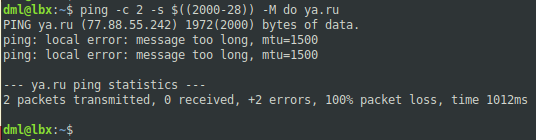
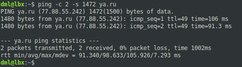
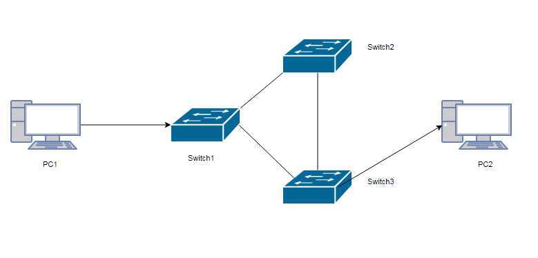
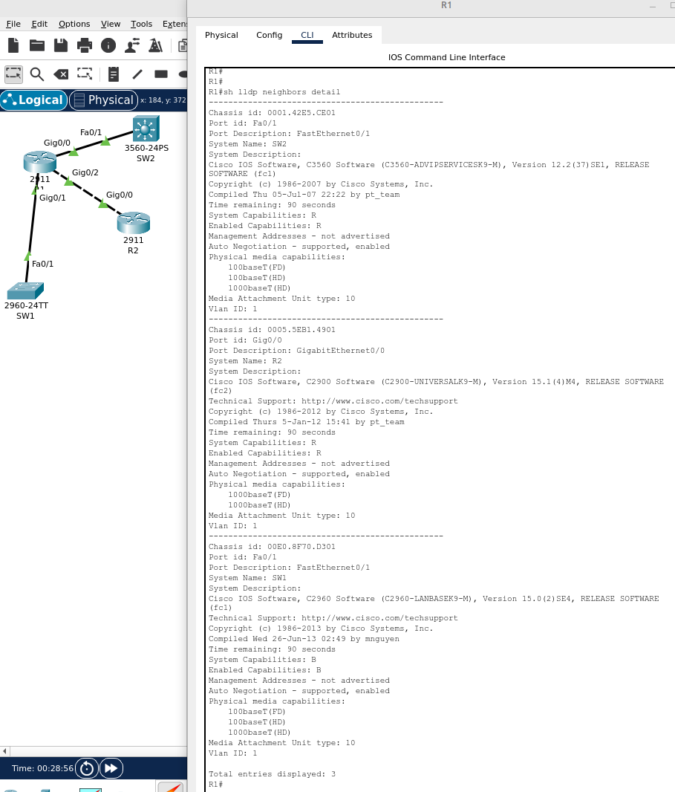
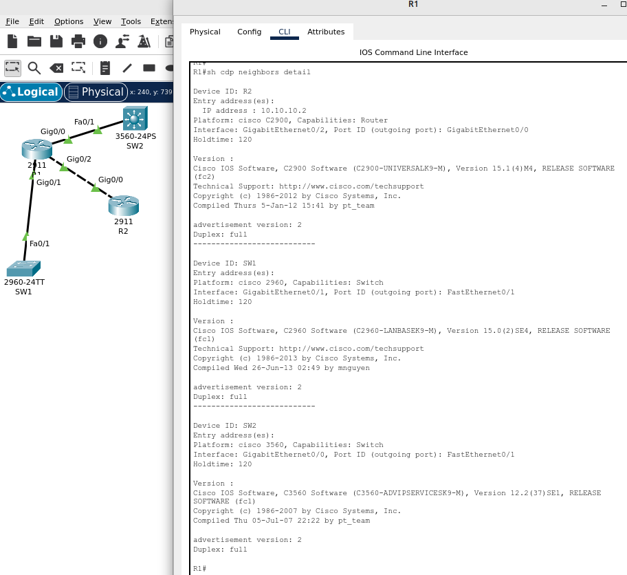

# 02.08. Инструменты и подходы к поиску и устранению неисправностей в Ethernet сетях. CDP/LLDP. - Лебедев Д.С.
### Задание 1.
> Как с помощью утилиты ping можно определить установленный максимальный размер одного пакета (MTU), который может быть передан по сети без фрагментации? Расчитайте размер по формуле: MTU = размер пакета ICMP + заголовок IP + заголовок ICMP.  
> *Приведите скриншоты отправки пакетов и получившееся число MTU.*

*Ответ:*  
Можно дать команду `ping -c 2 -s $((2000-28)) -M do ya.ru`, указав произвольное число MTU, например, 2000. В ответе содержится ожидаемое MTU:  
  
Очевидно, что от хоста ожидается 1500 MTU. В каждую транзакцию автоматически добавляются 20 байтов IP и 8 байтов заголовков ICMP. Таким образом, 1500-28 = 1472 - это максимальный размер данных полезной нагрузки, который мы можем указать в команде ping:  
  

### Задание 2.
> Пользователь в вашей локальной сети жалуется на низкую скорость. Опишите, как вы будете выполнять диагностику проблемы и какие самые вероятные причины проблемы?  
> *Приведите ответ в свободной форме.*

*Ответ:*  
1. Соберу данные: массовое ли явление, после каких действий появилась проблема, удостоверюсь, что проблема действительно существует, на заведомо исправном оборудовании.
2. На основании собранных данных локализую неисправность.
3. Исходя из симптоматики, проверю настройки оборудования (скорость на портах, работа ПО) или физическую часть - соединения, расстояния, препятствия распространения сигнала Wi-Fi и т.п.
4. По результатам - устраняем проблему.
5. Проверка, фиксирование результата, отписки заинтересованным.

### Задание 3.
> 
>   
> Какая топология сети изображена на схеме? Сможет ли PC1 передать информацию PC2?  
> *Приведите ответ в свободной форме.*

*Ответ:*  
На данной схеме коммутаторы подключены кольцом. Данная топология позволяет осуществлять передачу данных в двух направлениях. Если кольцо обрывается на определенном звене, то передача осуществляется по обратному пути. Для исключения петель должен работать протокол STP. Хосты могут связаться между собой, если их сетевые настройки корректны.

### Задание 4*. Лабораторная работа "Построение сети и поиск соседних устройств".
> В Cisco Packet Tracer создайте сеть минимум из 4 устройств, настройте на них LLDP.  
> *Приведите скриншоты, где по LLDP и CDP отображена информация о соседнем устройстве.*

*Ответ:*  
1. Данные работы протокола LLDP:  
  

2. Данные работы протокола CDP:  
  
