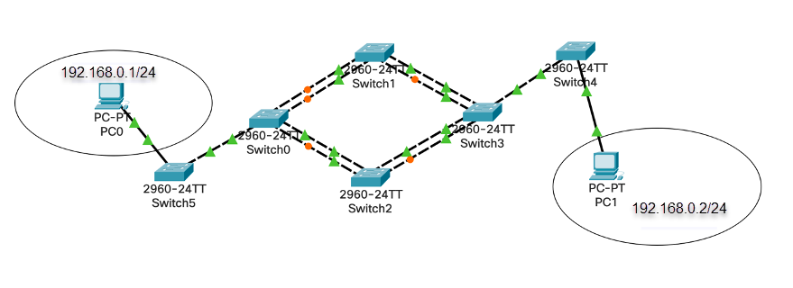

# 03.01. Отказоустойчивые сети - Лебедев Д.С.
### Задание 1.
> В организацию вызвали сетевого инженера для решения сложившейся проблемы. Пользователи жалуются, что:
> - они не могут попасть в глобальную сеть,
> - нет доступа к серверу почты,
> - они не видят соседей в системе
> - нет доступа в корпоративный портал на сервер web.
> Проанализируйте сеть и предложите пути решения, что пошло не так?  
>    
> *Ответьте в свободной форме, что нужно проверить и как решить сложившуюся ситуацию.*

*Ответ:*  

### Задание 2. Лабораторная работа "Отказоустойчивость в коммутируемых сетях".
> Для увеличения надежности и отказоустойчивости сети организации необходимо реализовать STP протокол.  
>   
> 
> Ваша задача:
> 1. Построить топологию.
> 2. Настроить STP протокол на коммутаторах.
> 3. Отключить один порт на коммутаторе или отключить соединение коммутатора с другим коммутатором.
> 4. Проверить работоспособность.  
> *Пришлите pkt с полученным проектом.*

*Ответ:*  
