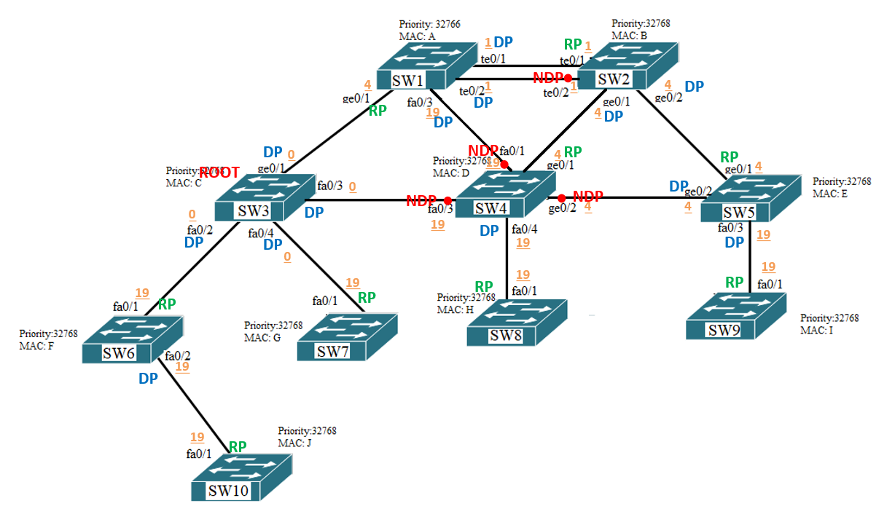

# 03.02. Протоколы связующего дерева - Лебедев Д.С.
### Задание 1.
>  
> 
> Для заданной схемы сети определите:
> 1. Корневой коммутатор
> 2. Корневые порты
> 3. Назначенный порты
> 4. Неназначенные порты.  
> Обоснуйте своё решение.  
> В результате необходимо получить древовидную топологию сети во главе с корневым коммутатором. То есть определить, какие порты будут заблокированы, а какие будут пропускать трафик.  
> *Приведите ответ в виде картинки со схемой (внесите изменения) или в виде таблицы. Обоснование в свободной форме.*

*Ответ:*  
1. <u>Определение корневого коммутатора</u>. Корневым становится тот, у кого меньше значение `BID`. Так как по условиям задачи `Priority port` у всех одинаков, выигрывает устройство с наименьшим MAC - адресом, т.е. `SW1`. Все порты у корневого коммутатора - `DP`;
2. Для определения <u>корневого порта</u> в STP используется метрика, которая указывается в поле `BPDU` - `Root Path Cost` (стоимость маршрута до корневого свича). Данная стоимость определяется по скорости канала;
3. `Designated Port` (назначенный) - <u>некорневой порт</u> моста между сегментами сети, принимающий трафик из соответствующего сегмента;
4. `Nondesignated Port` - <u>неназначенный порт</u> сегмента - порт, не являющийся корневым, или назначенным. Передача фреймов данных через такой порт запрещена.  
В результате работы протокола STP получается следующая древовидная топология сети во главе с корневым коммутатором:  

  

### Задание 2.
> Определите, что нужно изменить в настройках STP, чтобы на схеме из задания 1 изменился корневой коммутатор?
> Как изменится при этом топология?  
> В результате необходимо получить древовидную топологию сети во главе с корневым коммутатором. То есть определить, какие порты будут заблокированы, а какие будут пропускать трафик.  
> *Приведите ответ в виде картинки со схемой (внесите изменения) или в виде таблицы. Обоснование в свободной форме.*

*Ответ:*  
Для изменения корневого коммутатора необходимо изменить (уменьшить) параметр `Priority` у выбранного свича. Значение поля priority по умолчанию равно 32768, может задаваться администратором сети. Шаг - 4096.
Для примера, зададим параметр `Priority` для `SW3`, равным 28672.
В результате работы протокола STP получается следующая древовидная топология сети:

  
### Задание 3.
> Опишите этапы алгоритма RSTP для сети, топология которой изменилась. По аналогии с описанием для STP на слайде № 48 презентации к лекции.  
> *Приведите ответ в свободной форме.*

*Ответ:*  

