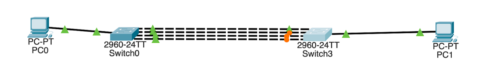
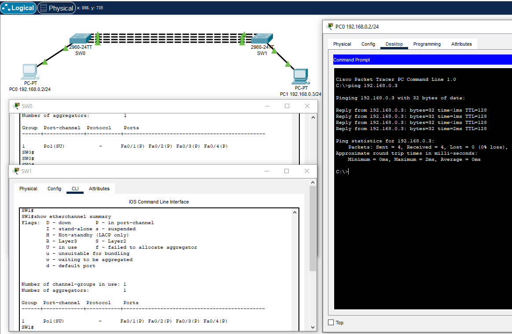
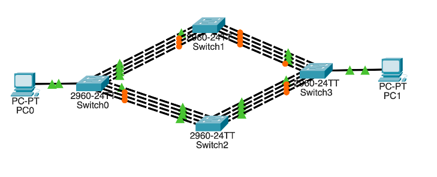
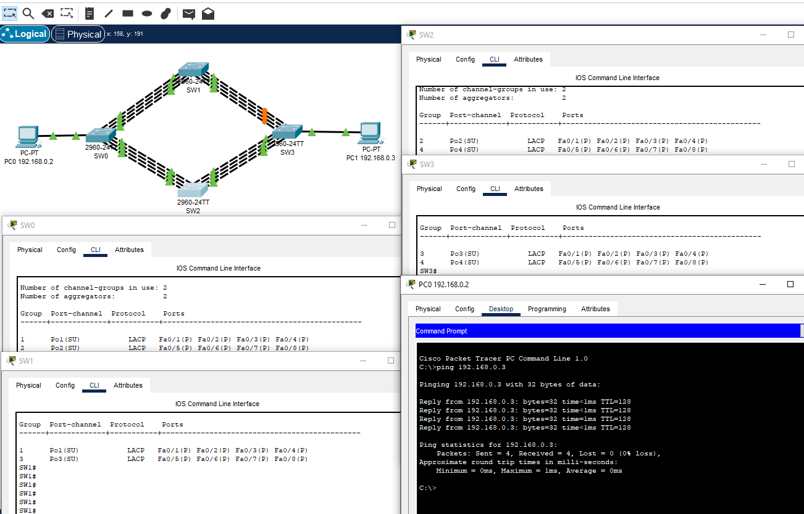
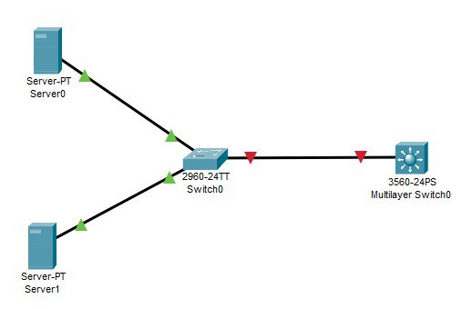
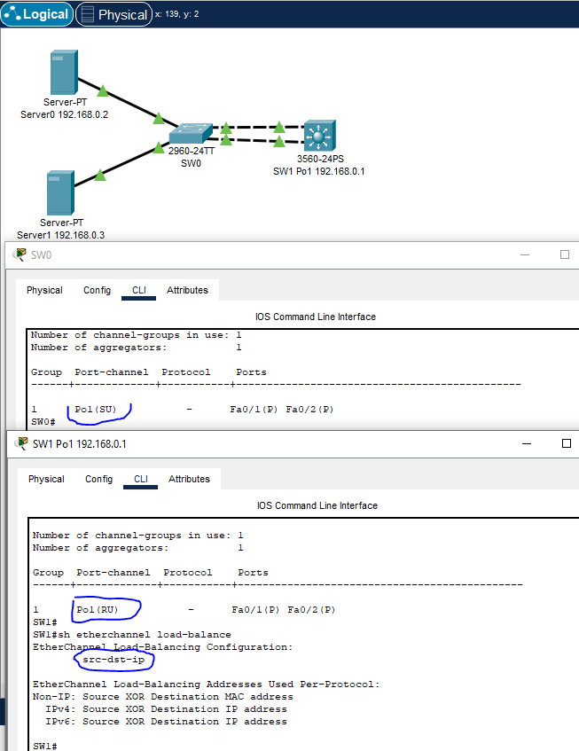

# 03.03. Методы логического объединения интерфейсов. Балансировка нагрузки, протоколы - Лебедев Д.С.
### Задание 1
> Компания ОАО «XXX – век» планирует увеличить пропускную способность канала связи. К вам поступила заявка: настроить статическую агрегацию для сети.  
> Необходимо настроить и проверить доступность компьютеров, проверить настройки через пространство команд show.
>    
> *Пришлите pkt с полученным проектом*

*Ответ:*  
<details>
<summary>Команды настройки коммутаторов</summary>

```bash
-- SW0 --

SW0(config)#int ran fa0/1-4
SW0(config-if-range)#sh
SW0(config-if-range)#channel-group 1 mode on
SW0(config-if-range)#exi
SW0(config)#int po1
SW0(config-if)#switchport mode trunk
SW0(config-if)#exi
SW0(config)#exi
SW0#wr
SW0#show etherchannel summary

-- SW1 --

Switch(config)#hostname SW1
SW1(config)#int ran fa0/1-4
SW1(config-if-range)#channel-group 1 mode on
SW1(config-if-range)#exi
SW1(config)#int po1
SW1(config-if)#switchport mode trunk
SW1(config-if)#exi
SW1(config)#exi
SW1#wr

-- SW0 --

SW0(config)#int ran fa0/1-4
SW0(config-if-range)#no sh

---

show etherchannel summary
```
</details>

[PKT - файл Задания 1](_attachments/0303-01-01.pkt)  



### Задание 2
> Компания ОАО «XXX – век» после модернизации и расширения сети задумалась над резервированием существующего агрегированного канала.  
> К вам поступила заявка: настроить динамическую агрегацию каналов для сети, так как есть риск разрыва соединения на основных интерфейсах.  
> Необходимо:
> - настроить сетевое оборудование и проверить доступность компьютеров,
> - проверить настройки через пространство команд show,
> - проверить работу после отключения основных интерфейсов.
> 
>   
> 
> *Пришлите pkt с полученным проектом*

*Ответ:*  
<details>
<summary>Команды настройки коммутаторов</summary>

```bash
-- SW0 --

SW0(config)#int range fa0/1-8
SW0(config-if-range)#sh

SW0(config-if-range)#int range fa0/1-4
SW0(config-if-range)#channel-group 1 mode activ
SW0(config-if-range)#exi
SW0(config)#int po1
SW0(config-if)#switchport mode trunk

SW0(config-if)#int range fa0/5-8
SW0(config-if-range)#channel-group 2 mode activ
SW0(config-if-range)#exi
SW0(config)#int po2
SW0(config-if)#switchport mode trunk

SW0(config-if)#exi
SW0(config)#exi
SW0#wr

-- SW3 --

SW3(config)#int range fa0/1-8
SW3(config-if-range)#sh

SW3(config-if-range)#int range fa0/1-4
SW3(config-if-range)#channel-group 3 mode activ
SW3(config-if-range)#exi
SW3(config)#int po3
SW3(config-if)#switchport mode trunk

SW3(config-if)#int range fa0/5-8
SW3(config-if-range)#channel-group 4 mode activ
SW3(config-if-range)#exi
SW3(config)#int po4
SW3(config-if)#switchport mode trunk

SW3(config-if)#exi
SW3(config)#exi
SW3#wr

-- SW1 --

SW1(config)#int range fa0/1-4
SW1(config-if-range)#channel-group 1 mode activ
SW1(config-if-range)#exi
SW1(config)#int po1
SW1(config-if)#switchport mode trunk

SW1(config-if)#int range fa0/5-8
SW1(config-if-range)#channel-group 3 mode activ
SW1(config-if-range)#exi
SW1(config)#int po3
SW1(config-if)#switchport mode trunk

SW1(config-if)#exi
SW1(config)#exi
SW1#wr

-- SW2 --

SW2(config)#int range fa0/1-4
SW2(config-if-range)#channel-group 2 mode activ
SW2(config-if-range)#exi
SW2(config)#int po2
SW2(config-if)#switchport mode trunk

SW2(config-if)#int range fa0/5-8
SW2(config-if-range)#channel-group 4 mode activ
SW2(config-if-range)#exi
SW2(config)#int po4
SW2(config-if)#switchport mode trunk

SW2(config-if)#exi
SW2(config)#exi
SW2#wr

--- SW ---

SW..(config)#int range fa0/1-8
SW..(config-if-range)#no sh
SW..#show etherchannel summary
```
</details>

[PKT - файл Задания 2](_attachments/0303-02-01.pkt)



### Задание 3
> Компания ОАО «XXX – век» разместила в своей сети сетевые сервисы. Для увеличения полосы пропускания, повышения надежности и реализации высокой доступности серверов и расположенных на них сервисах Вам поставили задачу доработать топологию сети с учетом возможностей оборудования и настроить балансировку на основе ip адресов источника и получателя.  
> Необходимо:
> - настроить и проверить доступность компьютеров,
> - проверить настройки через пространство команд show.
> 
>   
> 
> Пришлите pkt с полученным проектом

*Ответ:*  
<details>
<summary>Команды настройки коммутаторов</summary>

```bash
-- SW0 --

SW0(config)#int ran fa0/1-2
SW0(config-if-range)#sh
SW0(config-if-range)#channel-group 1 mode on
SW0(config-if-range)#exi
SW0(config)#int po1
SW0(config-if)#switchport mode trunk
SW0(config-if)#exi
SW0(config)#exi
SW0#wr

-- SW1 --

SW1(config)#int ran fa0/1-2
SW1(config-if-range)#channel-group 1 mode on
SW1(config)#int po1
SW1(config-if)#no switchport
SW1(config-if)#ip address 192.168.0.1 255.255.255.0
SW1(config-if)#exi
SW1(config)#port-channel load-balance src-dst-ip
SW1(config)#exi
SW1#wr

-- SW --

SW0(config)#int ran fa0/1-2
SW0(config-if-range)#no sh

show etherchannel summary
sh ip int br
sh etherchannel load-balance
port-channel load-balance 
```
</details>

[PKT - файл Задания 3](_attachments/0303-03-01.pkt)


