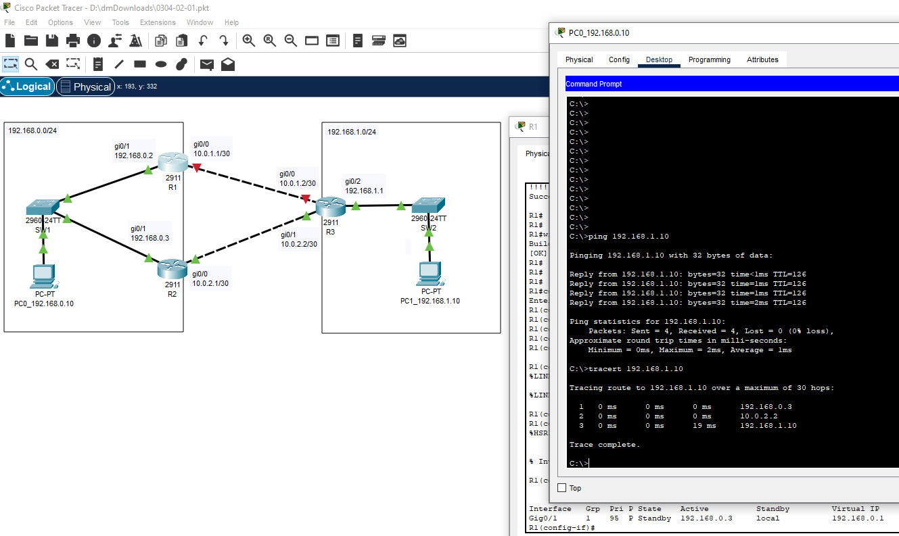

# 03.04. Протоколы FHRP - Лебедев Д.С.
### Кейс
> У вашей компании есть центральный офис и филиал. В центральном офисе коммутатор и два маршрутизатора. В филиале один коммутатор и один маршрутизатор. До филиала построено два канала L3. Один канал основной и второй канал - резервный. Резервный канал - дорогой, оплата по количеству трафика, пользоваться им необходимо по возможности реже. При этом необходимо автоматическое переключение в случае отказа основного канала и возврат в исходное состояние при восстановлении связи. Сеть офиса - 192.168.0.0/24 Сеть филиала - 192.168.1.0/24 Основной канал - 10.0.1.0/30 Резервный канал - 10.0.2.0/30

### Задание 1
> Уточнение - оборудование **Juniper**
> 1. Выбрать протокол из семейства FHRP и обосновать свой выбор.
> 2. Нарисовать схему сети.
> 3. Настроить маршрутизаторы центрального офиса в соответствии с выбранным протоколом.
> *- Ответы на вопрос 1 привести в свободной форме, в текстовом виде.*  
> *- На вопрос 2 - приложить файл в формате .png или .jpg.*  
> *- На вопрос 3 - привести настройки интерфейсов в текстовом виде (в синтаксисе Juniper - [ссылка на руководство](https://www.juniper.net/documentation/us/en/software/junos/high-availability/topics/example/vrrp-configuring-example.html))*  

*Ответ:*  
1. Для оборудования Juniper предпочтительно выбрать протокол VRRP, т.к. этот протокол является частично открытым.
2. Схема сети:  
  
3. Настройки интерфейсов:  
```c
--R1--
set interfaces ge-0/1 unit 0 family inet address 192.168.0.2/24 vrrp-group 1 virtual-address 192.168.0.1
set interfaces ge-0/1 unit 0 family inet address 192.168.0.2/24 vrrp-group 1 priority 110
set interfaces ge-0/1 unit 0 family inet address 192.168.0.2/24 vrrp-group 1 accept-data
set interfaces ge-0/1 unit 0 family inet address 192.168.0.2/24 vrrp-group 1 track interface ge-0/2 priority-cost 20
set interfaces ge-0/2 unit 0 family inet address 10.0.1.1/30
set routing-options static route 0.0.0.0/0 next-hop 10.0.1.2

--R2--
set interfaces ge-0/1 unit 0 family inet address 192.168.0.3/24 vrrp-group 1 virtual-address 192.168.0.1
set interfaces ge-0/1 unit 0 family inet address 192.168.0.3/24 vrrp-group 1 accept-data
set interfaces ge-0/2 unit 0 family inet address 10.0.2.1/30
set routing-options static route 0.0.0.0/0 next-hop 10.0.2.2

--R3--
set interfaces ge-0/0 unit 0 family inet address 10.0.1.2/30
set interfaces ge-0/1 unit 0 family inet address 10.0.2.2/30
set routing-options static route 192.168.0.0/24 next-hop 10.0.1.1
set routing-options static route 192.168.0.0/24 next-hop 10.0.2.1
```

### Задание 2. Лабораторная работа "Выбор и настройка протокола из семейства FHRP"
> Компания из кейса, но все оборудование **Cisco**.  
> 1. Выбрать протокол из семейства FHRP и обосновать свой выбор.
> 2. Построить топологию в Сisco Packet Tracer.
> 3. Настроить оборудование центрального офиса и филиала.
> 4. Проверить работу резервирования связи с филиалом. Для этого отключить основной канал, проверить командами ping и tracert доступность ПК в филиале и путь до него.
> - *На вопрос 1 - ответ в свободной форме, в текстовом виде.*
> - *На вопросы 2 и 3 - приложить .pkt файл.*
> - *На вопрос 4 - скриншоты выполнения команд ping и tracert.*

*Ответ:*  
1. Логичным выбором будет протокол HSRP, т.к это проприетарный протокол разработанный Cisco для своего оборудования. Протокол HSRP рассчитан на 2 роутера.
2. [PKT - файл задания 2](_attachments/0304-02-01.pkt)  

<details>
<summary>Команды настройки устройств</summary>

```c
--SW1--
Switch(config)#hostname SW1
SW1(config)#int ran fa0/1-2
SW1(config-if-range)#switchport mode trunk

--SW2--
Switch(config)#hostname SW2
SW2(config)#int fa0/1
SW2(config-if)#switchport mode trunk

--R1--
Router(config)#hostname R1
R1(config)#ip route 192.168.1.0 255.255.255.0 10.0.1.2

R1(config)#int ran gi0/0-1
R1(config-if-range)#no sh

R1(config-if-range)#int gi0/0
R1(config-if)#ip address 10.0.1.1 255.255.255.252

R1(config-if)#int gi0/1
R1(config-if)#ip address 192.168.0.2 255.255.255.0

R1(config-if)#standby 1 ip 192.168.0.1
R1(config-if)#standby version 2
R1(config-if)#standby 1 priority 105
R1(config-if)#standby 1 track gi0/0
R1(config-if)#standby 1 preempt

--R2--
Router(config)#hostname R2
R2(config)#ip route 192.168.1.0 255.255.255.0 10.0.2.2

R2(config)#int ran gi0/0-1
R2(config-if-range)#no sh

R2(config-if-range)#int gi0/0
R2(config-if)#ip address 10.0.2.1 255.255.255.252

R2(config-if)#int gi0/1
R2(config-if)#ip address 192.168.0.3 255.255.255.0

R2(config-if)#standby 1 ip 192.168.0.1
R2(config-if)#standby version 2
R2(config-if)#standby 1 priority 100
R2(config-if)#standby 1 preempt

--R3--
Router(config)#hostname R3
R3(config)#ip route 192.168.0.0 255.255.255.0 10.0.1.1
R3(config)#ip route 192.168.0.0 255.255.255.0 10.0.2.1

R3(config)#int ran gi0/0-2
R3(config-if-range)#no sh

R3(config-if-range)#int gi0/2
R3(config-if)#ip address 192.168.1.1 255.255.255.0

R3(config-if)#int gi0/0
R3(config-if)#ip address 10.0.1.2 255.255.255.252

R3(config-if)#int gi0/1
R3(config-if)#ip address 10.0.2.2 255.255.255.252

--
sh standby 
sh standby brief
```
</details>

4. Проверка работы резервирования:
- Рабочий режим:  
  

- Выход из строя основного канала связи:  
  

### Задание 3
> Компания та же, но в центральном офисе добавили еще один маршрутизатор. Оборудование Cisco. Адресация для каналов Интернет:  
> 1. 10.1.0.0/30
> 2. 10.2.0.0/30
> 3. 10.3.0.0/30
> Для имитации сети Интернет можно добавить еще один маршрутизатор, к которому подключить все три канала интернет. На этом же маршрутизаторе создать Loopback интерфейс с адресом 10.10.10.10/32 и использовать этот адрес для проверки доступности сети Интернет.  
> Необходимо обеспечить компании доступ в Интернет. Непрерывно и с балансировкой по трем каналам.  
> 1. Выбрать протокол из семейства FHRP и обосновать свой выбор.
> 2. Нарисовать схему сети.
> 3. Настроить маршрутизаторы центрального офиса в соответствии с выбранным протоколом.
> - *Ответы на вопрос 1 привести в свободной форме, в текстовом виде.*
> - *На вопрос 2 - приложить файл в формате .png или .jpg.*
> - *На вопрос 3 - привести настройки интерфейсов в текстовом виде (в синтаксисе Cisco)*

*Ответ:*  
1. В данном случае логично выбрать протокол GLBP (Gateway Load Balancing Protocol) - проприетарный протокол Cisco, обеспечивающий распределение нагрузки на несколько маршрутизаторов.
2. Схема сети:  
  

3. Команды настройки протокола GLBP на маршрутизаторах:  
```c++
R1
--
R1(config)# track 1 interface gi0/1 line-protocol
R1(config)# int gi0/0
R1(config-if)# glbp 1 ip 192.168.0.1 // включение GLBP
R1(config-if)# glbp 1 authentication text CISCO // Аутентификация в открытом виде
R1(config-if)# glbp 1 priority 200 //установка приоритета 200 (если приоритет будет выше остальных, то он станет AVG по умолчанию 100)
R1(config-if)# glbp 1 weighting track 1 decrement 150 // если упадет внешний интерфейс gi0/1, уменьши приоритет на 150 пунктов на интерфейсе локалки. Трафик пойдет через другой роутер, у которого приоритет будет больше.

R2
--
R2(config)# track 1 interface gi0/2 line-protocol
R2(config)# int gi0/0
R2(config-if)# glbp 1 ip 192.168.0.1 // включение GLBP
R2(config-if)# glbp 1 authentication text CISCO // Аутентификация в открытом виде
R2(config-if)# glbp 1 priority 190 // установка приоритета 190 (если приоритет будет выше остальных, то он станет AVG по умолчанию 100)
R2(config-if)# glbp 1 weighting track 1 decrement 150 // если упадет внешний интерфейс gi0/2, уменьши приоритет на 150 пунктов на интерфейсе локалки. Трафик пойдет через другой роутер, у которого приоритет будет больше.

R3
--
R3(config)# int gi0/0
R3(config-if)# glbp 1 ip 192.168.0.1 // включение GLBP
R3(config-if)# glbp 1 authentication text CISCO // Аутентификация в открытом виде

--
*Балансировка нагрузки между маршрутизаторами по умолчанию (round-robin).
```
