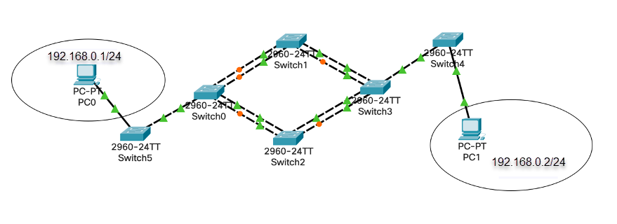
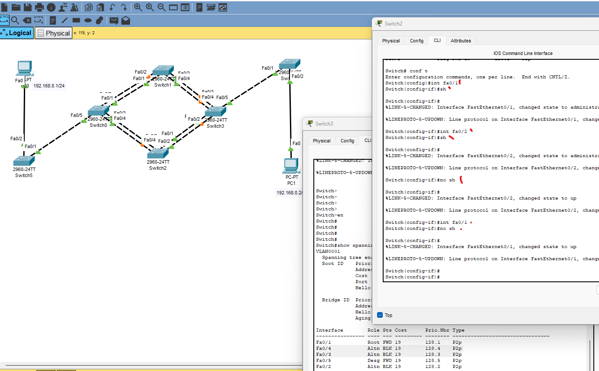

# 03.01. Отказоустойчивые сети - Лебедев Д.С.
### Задание 1.
> В организацию вызвали сетевого инженера для решения сложившейся проблемы. Пользователи жалуются, что:
> - они не могут попасть в глобальную сеть,
> - нет доступа к серверу почты,
> - они не видят соседей в системе
> - нет доступа в корпоративный портал на сервер web.
> Проанализируйте сеть и предложите пути решения, что пошло не так?  
>    
> *Ответьте в свободной форме, что нужно проверить и как решить сложившуюся ситуацию.*

*Ответ:*  
При анализе схемы сети явно проявляются следующие проблемы:
1. *Не могут попасть в глобальную сеть*: очевидно, что нет соединения между Switch0 и Router2. Это точка отказа при выходе в глобальную сеть. Проверить физическое соединение (патч корд, порты) и настройки порта на Router2 (маршрут, IP адреса);
2. *Нет доступа к серверу почты, а так же в корпоративный портал на сервер web.* И недоступен NTP-сервер. Данный участок сети "выпал" из-за отсутствия соединения между Router1 и Switch2. Проверяем физику, порты;
3. *Не видят соседей в системе.* У PC0 явные проблемы с физикой (сетевая карта, патч корд, порт на Switch1). На хостах PC2 и PC4 одинаковый IP адрес вследствие неправильной настройки. Изменить IP на одной из машин;
4. Потенциальная угроза надежности - разные маски подсети 11.0.0.0. В данном случае работает, но возможны проблемы при расширении сети.
### Задание 2. Лабораторная работа "Отказоустойчивость в коммутируемых сетях".
> Для увеличения надежности и отказоустойчивости сети организации необходимо реализовать STP протокол.  
>   
> Ваша задача:
> 1. Построить топологию.
> 2. Настроить STP протокол на коммутаторах.
> 3. Отключить один порт на коммутаторе или отключить соединение коммутатора с другим коммутатором.
> 4. Проверить работоспособность.  
> *Пришлите pkt с полученным проектом.*

*Ответ:*  
[PKT - файл топологии](_attachments/0301-02-01.pkt)

Данная сеть может обойтись дефолтными настройками STP. Для ускорения работы протокола изменим режим на `rapid-pvst` (RSTP).  
Для проверки работы отключаем порт, оба порта.  
  

На продуктивных сетях целесообразно проводить расширенную настройку STP/RSTP, например, назначить приоритет интерфейса для определения root port, настроить нужные интерфейсы как edge (не ожидает BPDU от хостов), включить чистый stp для совместимости с устаревшим оборудованием.
