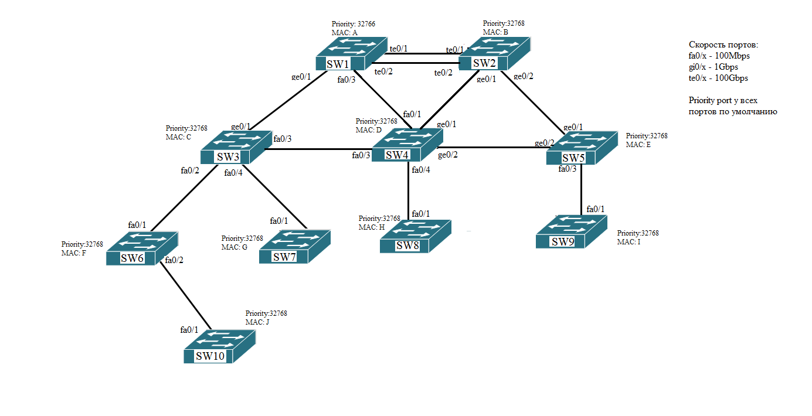
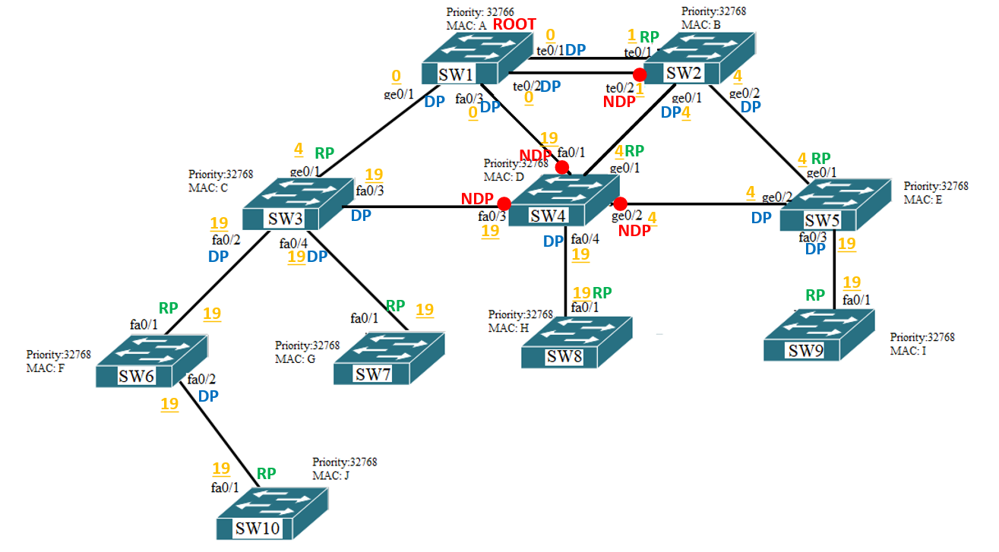
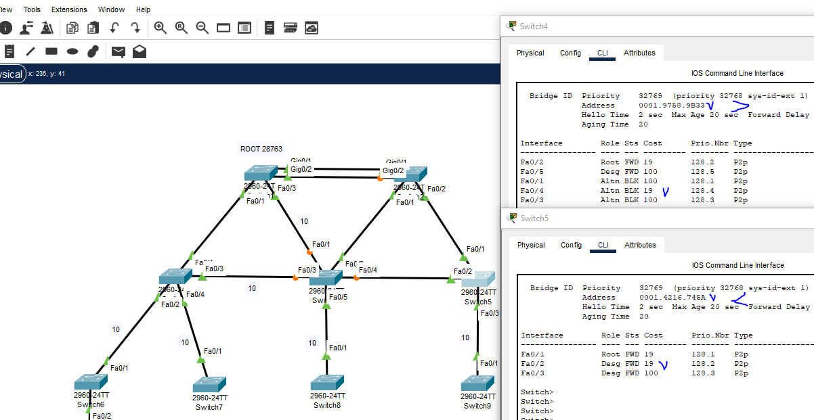
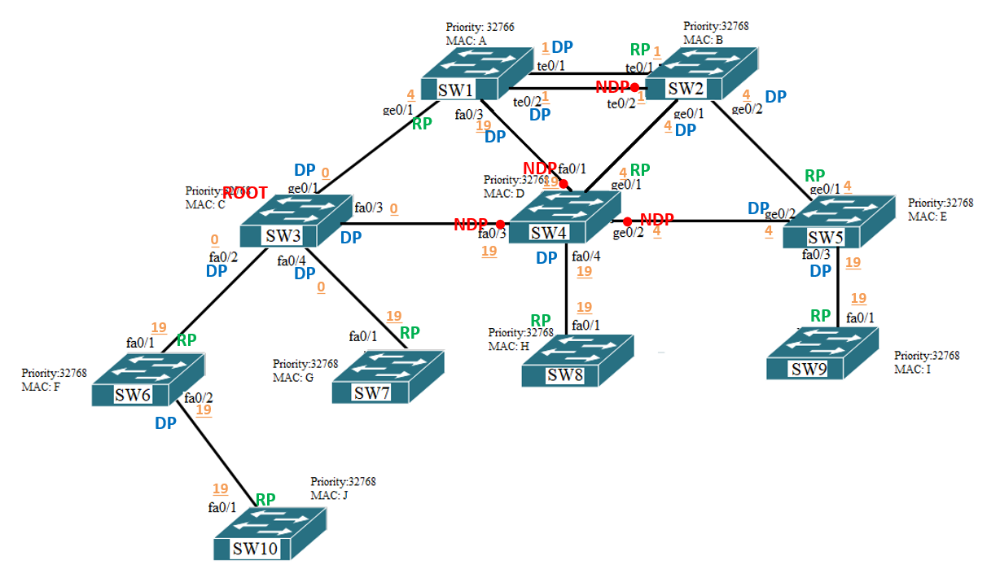

# 03.02. Протоколы связующего дерева - Лебедев Д.С.
### Задание 1.
>  
> 
> Для заданной схемы сети определите:
> 1. Корневой коммутатор
> 2. Корневые порты
> 3. Назначенный порты
> 4. Неназначенные порты.  
> Обоснуйте своё решение.  
> В результате необходимо получить древовидную топологию сети во главе с корневым коммутатором. То есть определить, какие порты будут заблокированы, а какие будут пропускать трафик.  
> *Приведите ответ в виде картинки со схемой (внесите изменения) или в виде таблицы. Обоснование в свободной форме.*

*Ответ (см. замечание):*  
1. <u>Определение корневого коммутатора</u>. Корневым становится тот, у кого меньше значение `BID`. В данном случае выигрывает устройство с наименьшим значением `Priority`, т.е. `SW1`. Все порты у корневого коммутатора - `DP`;
2. Для определения <u>корневого порта</u> в STP используется метрика, которая указывается в поле `BPDU` - `Root Path Cost` (стоимость маршрута до корневого свитча). Данная стоимость определяется по скорости канала;
3. `Designated Port` (назначенный) - <u>некорневой порт</u> моста между сегментами сети, принимающий трафик из соответствующего сегмента;
4. `Non-designated Port` - <u>неназначенный порт</u> сегмента - порт, не являющийся корневым, или назначенным. Передача фреймов данных через такой порт запрещена.  
В результате работы протокола STP получается следующая древовидная топология сети во главе с корневым коммутатором:  

  

> **Замечание: Не могли бы подробнее объяснить ход рассуждения в задании 1 в части линка SW4 - SW5? Почему DP/NDP распределены именно так?**  

Роль DP-NDP выбирается по наименьшему RPC. В сегменте SW4 - SW5 RPC одинаков, поэтому DP выбирается по наименьшему mac-адресу коммутатора. Если считать, что адрес "D" меньше адреса "E", то роли на схеме нужно поменять местами, SW4 ge0/2 будет DP, соответственно, SW5 ge0/2 - NDP.
В моей симуляции CPT был обратный случай, адрес SW4 > адреса SW5, поэтому роли портов распределены по-другому.

  
### Задание 2.
> Определите, что нужно изменить в настройках STP, чтобы на схеме из задания 1 изменился корневой коммутатор?
> Как изменится при этом топология?  
> В результате необходимо получить древовидную топологию сети во главе с корневым коммутатором. То есть определить, какие порты будут заблокированы, а какие будут пропускать трафик.  
> *Приведите ответ в виде картинки со схемой (внесите изменения) или в виде таблицы. Обоснование в свободной форме.*

*Ответ:*  
Для изменения корневого коммутатора необходимо изменить (уменьшить) параметр `Priority` у выбранного свича. Значение поля priority по умолчанию равно 32768, может задаваться администратором сети. Шаг - 4096. 
Для примера, зададим параметр `Priority` для `SW3`, равным 24576.
В результате работы протокола STP получается следующая древовидная топология сети:

  
### Задание 3.
> Опишите этапы алгоритма RSTP для сети, топология которой изменилась. По аналогии с описанием для STP на слайде № 48 презентации к лекции.  
> *Приведите ответ в свободной форме.*

*Ответ:*  
Когда топология сети изменяется, алгоритм RSTP выполняет следующие действия:
1. При изменении в топологии сети (например, добавление нового устройства или изменение структуры сети), коммутаторы инициируют процесс обнаружения изменений и рассылают через все порты (корневой и назначенные) BPDU c флагом TC;
2. Коммутаторы удаляют из таблицы все MAC адреса доступные через не edge порты, за исключением того, где был получен BPDU c флагом TC;
3. Определяются порты, которые должны быть заблокированы или переведены в состояние пересчета на основе обновленной информации;
4. Пересчитываются пути до корневого коммутатора, определяются новые пути и блокируются ненужные;
5. Новая топология сети активируется, коммутаторы начинают пересылать данные в соответствии с обновленной структурой.
