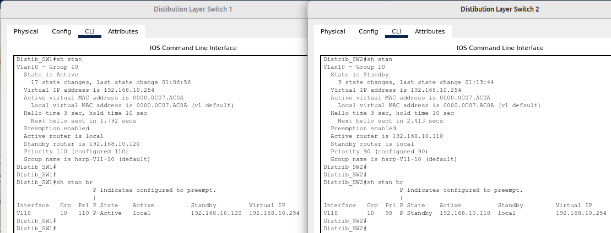

# 03.06. Построение отказоустойчивых сетей - Лебедев Д.С.
## Лабораторная работа "Настройка и поиск неисправностей в отказоустойчивых сетях"
### Задание 1. Траблуштинг
> 1. Проверить, какая версия протокола STP запущена и найти Root Bridge.
> 2. Показать на Laptop 0, какая версия HSRP и какой номер группы используется (версию HSRP можно идентифицировать с помощью проверки ARP-таблицы).
> 3. Выяснить, через какие линки трафик доходит от Laptop0 до Loopback1 интерфейса WAN Primary. Решить проблему неоптимальной передачи данных, если таковая существует. Озвучить найденную проблему.
> 4. Разрешить проблемы с доступностью Laptop1. Laptop1 должен пинговать 4.4.8.8 - Loopback1 интерфейс Backup Маршрутизатора.

*Ответ:*  
1. Находим Root Bridge. Команда `show spanning-tree` позволяет узнать, является ли коммутатор Root. Если не является, то следуем интерфейсу с ролью Root. Таким образом, выяснено, что Root Bridge - `Distribbution Layer Switch 1`. В выводе команды так же содержится версия протокола STP - ieee, базовый STP.  
  

2. Для дальнейшей работы поправляем настройки устройств:

```sh
--- Настройка Switch1 ---
Switch1(config)#int fa0/2
Switch1(config-if)#switchport mode access
Switch1(config-if)#switchport access vlan 10

--- Настройка Distib_SW1 ---
-- правильный IP на интерфейсе к WAN Prim --
Distib_SW1(config)#int gi1/0/1
Distib_SW1(config-if)#no ip add 172.16.1.2 255.255.255.252
Distib_SW1(config-if)#ip add 172.16.10.2 255.255.255.252

-- первичная настройка HSRP для получения информации --
Distib_SW1(config)#int vlan 10
Distib_SW1(config-if)#standby 10 ip 192.168.10.254
Distib_SW1(config-if)#standby preempt
```

  

При выводе arp - таблицы можно узнать из mac - адреса, что версия HSRP - 1 (0c07), номер группы - 10 (0a).

3. На данном этапе настройки оборудования путь передачи трафика от Laptop0 до Loopback1 интерфейса WAN Primary оптимален.  
  

4. Проблема с доступностью Laptop 2 решается правильным подключением кабеля к Fa0, настройкой IP адреса и шлюза. На данном этапе задания добавляем линк от коммутатора доступа Switch3 к коммутатору распределения Distrib_SW2 и прописываем нужные vlan на нём.

```sh
Switch3(config)#interface FastEthernet0/2
Distrib_SW2(config)#vlan 10
Distrib_SW2(config-vlan)#vlan 20
Distrib_SW2(config-vlan)#vlan 30
```


### Задание 2. Настройки
> 0. Пропишите IP адреса на Laptop:
> - Laptop0 - 192.168.10.10/24
> - Laptop1 - 192.168.20.10/24
> - Laptop2 - 192.168.10.20/24
> 1. Подключить коммутатор Distibution Layer Switch 2 таким образом, чтобы он обеспечивал отказоусточивость для коммутаторов уровня доступа (Access layer sw1-sw3).
> 2. Настроить порты на коммутаторах в соответствии с их ролями. Пользовательские порты в access, между свитчами в режиме trunk.
> 3. Поменять STP на Rapid PVST на всей сети.
> 4. Назначить Root Bridge свитч Distrib_SW1 root primary, Distrib_SW2 - root secondary для всех VLAN. Покажите какой Bridge priority у root secondary.
> 5. Добавить пару линков между Distrib_SW1 и Distrib_SW2 на портах Fa0/23-0/24. Убедиться, что один из портов перешел в состояние BLK
> 6. Собрать между ними LACP (Po1) зафиксировать, что сейчас оба интерфейса в состоянии FWD. На одном конце подключение должно инициироваться, а на другом - ожидаться.
> 7. Настроить HSRP на виртуальных interface vlan10 на Distribution Layer Switch vlan 10 192.168.10.254. Не забыть указать задержку, если используете опцию preempt.
> 

*Ответ:*  
1. Коммутаторы соединены дополнительными линками.
2. Режим работы портов приведен в соответствие. На транковых интерфейсах оставлены только нужные vlan.
3. На коммутаторах установлен режим Rapid PVST командой `spanning-tree mode rapid-pvst`
4. Командами `spanning-tree vlan 1-4094 root primary/secondary` назначены приоритеты на коммутаторах уровня распределения (для всех vlan)  

  

5. Линки добавлены, один блокирован работой протокола RSTP:  
  

6. Настройка LACP:  
```sh
--- Distib_SW1 ---
Distib_SW1(config)#int port-channel 10
Distib_SW1(config-if)#switchport mode trunk
Distib_SW1(config-if)#switchport trunk allowed vlan 10,20,30
Distib_SW1(config-if)#no sh

Distib_SW1(config-if)#int ran gi1/0/23-24
Distib_SW1(config-if-range)#switchport mode trunk
Distib_SW1(config-if-range)#switchport trunk allowed vlan 10,20,30
Distib_SW1(config-if-range)#channel-group 10 mode active

--- Distrib_SW2 ---
Distrib_SW2(config)#int port-channel 10
Distrib_SW2(config-if)#switchport mode trunk
Distrib_SW2(config-if)#switchport trunk allowed vlan 10,20,30
Distrib_SW2(config-if)#no sh

Distrib_SW2(config-if)#int ran gi1/0/23-24
Distrib_SW2(config-if-range)#switchport mode trunk
Distrib_SW2(config-if-range)#switchport trunk allowed vlan 10,20,30
Distrib_SW2(config-if-range)#channel-group 10 mode passive

---
sh eth sum
```

  

7. Настройка HSRP:  
```sh
--- Distib_SW1 ---
Distib_SW1(config)#int vlan 10
Distib_SW1(config-if)#standby 10 ip 192.168.10.254
Distib_SW1(config-if)#standby 10 priority 110
Distib_SW1(config-if)#standby 10 preempt
Distib_SW1(config-if)#standby 10 preempt delay minimum 300 // не работает в CPT

--- Distrib_SW2 ---
Distrib_SW2(config)#int vlan 10
Distrib_SW2(config-if)#standby 10 ip 192.168.10.254
Distrib_SW2(config-if)#standby 10 priority 90
Distrib_SW2(config-if)#standby 10 preempt
Distrib_SW2(config-if)#standby 10 preempt delay minimum 300 // не работает в CPT

---
sh stan
sh stan br
```

  

[PKT файл проекта](_attachments/0306-00-00.pkt)
