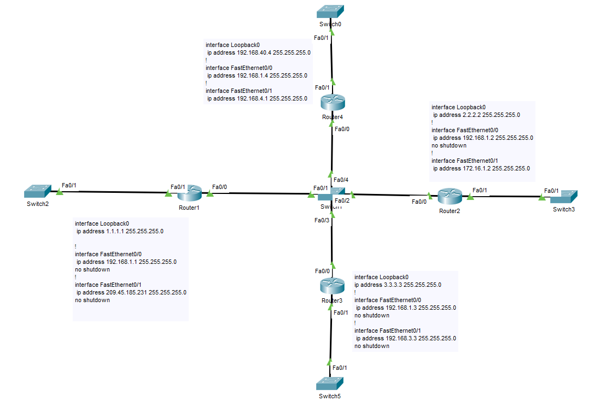
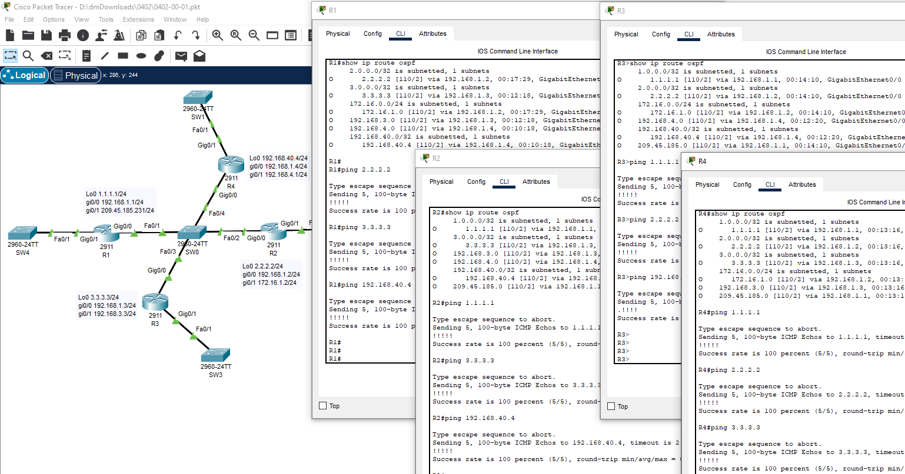
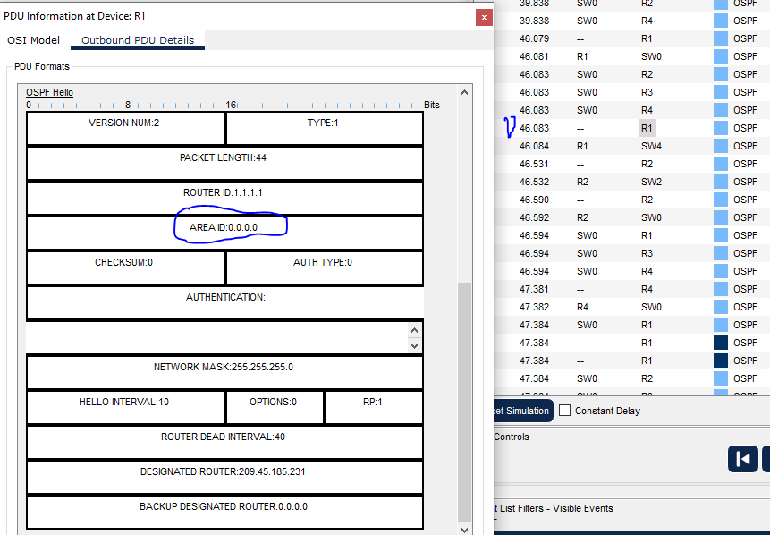
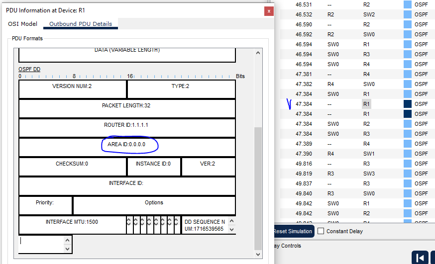
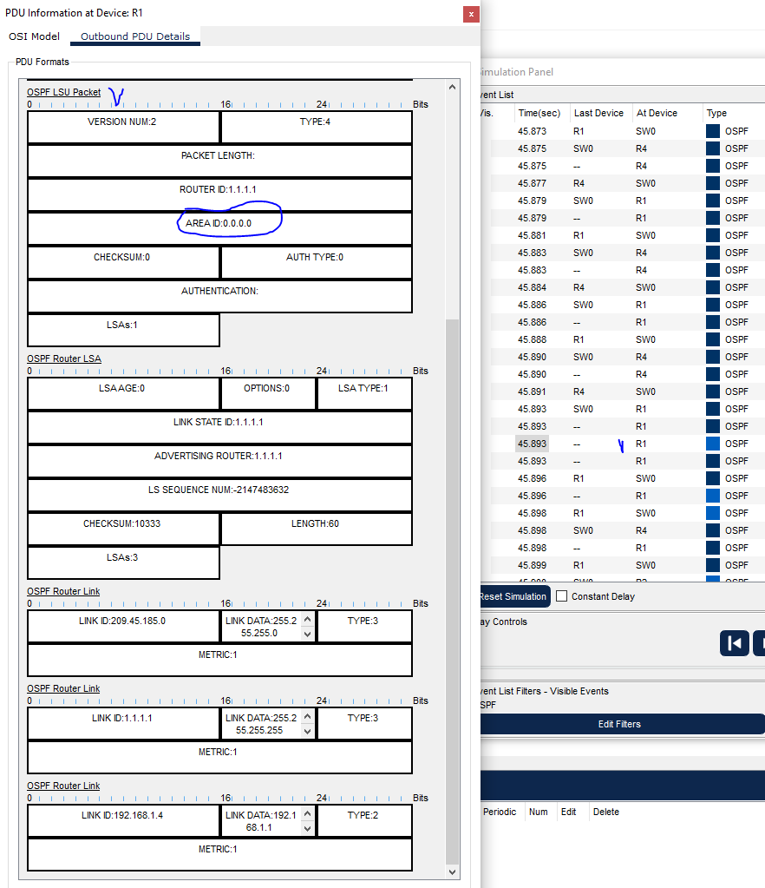
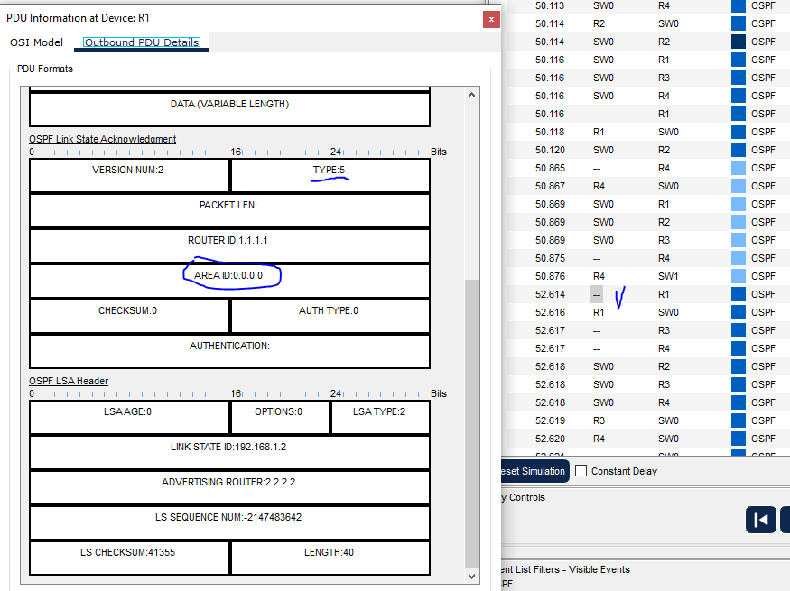
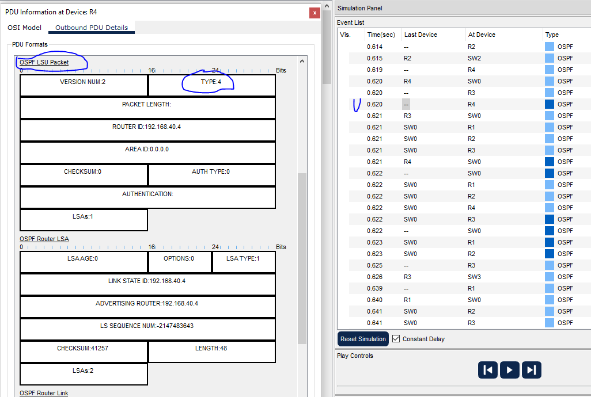
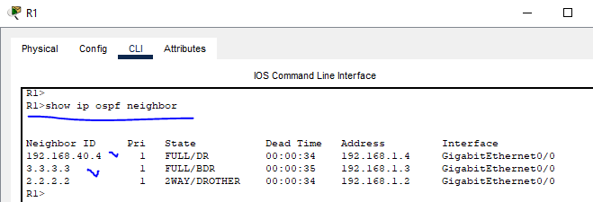

# 04.02. Протокол OSPF. Построение соседства, машина состояний, LSDB - Лебедев Д.С.
## Лабораторная работа "Базовая конфигурация протокола OSPF"
> Подготовка
> 1. Запустите Cisco Packet Tracer.
> 2. Скачайте файл топологии из папки с заданием или постройте топологию сами по картинке.  
>   
### 0. Построение топологии сети

<details>
<summary>Команды первоначальной настройки маршрутизаторов</summary>

```bash
-- Настройка R1 --
Router(config)#host R1

R1(config)#int range gi0/0-1
R1(config-if-range)#no sh
R1(config-if-range)#ex

R1(config)#int loo0
R1(config-if)#ip addr 1.1.1.1 255.255.255.0

R1(config-if)#int gi0/0
R1(config-if)#ip addr 192.168.1.1 255.255.255.0

R1(config-if)#int gi0/1
R1(config-if)#ip addr 209.45.185.231 255.255.255.0

R1(config-if)#end
R1#wr

-- Настройка R2 --
Router(config)#host R2

R2(config)#int lo0
R2(config-if)#ip addr 2.2.2.2 255.255.255.0

R2(config-if)#int gi0/0
R2(config-if)#ip addr 192.168.1.2 255.255.255.0
R2(config-if)#no sh

R2(config-if)#int gi0/1
R2(config-if)#ip addr 172.16.1.2 255.255.255.0
R2(config-if)#no sh

R2(config-if)#end
R2#wr

-- Настройка R3 --
Router(config)#host R3

R3(config)#int lo0
R3(config-if)#ip addr 3.3.3.3 255.255.255.0

R3(config-if)#int gi0/0
R3(config-if)#ip addr 192.168.1.3 255.255.255.0
R3(config-if)#no sh

R3(config-if)#int gi0/1
R3(config-if)#ip addr 192.168.3.3 255.255.255.0
R3(config-if)#no sh

R3(config-if)#do wr
R3(config-if)#end

-- Настройка R4 --
Router(config)#host R4

R4(config)#int lo0
R4(config-if)#ip addr 192.168.40.4 255.255.255.0

R4(config-if)#int gi0/0
R4(config-if)#ip addr 192.168.1.4 255.255.255.0
R4(config-if)#no sh

R4(config-if)#int gi0/1
R4(config-if)#ip addr 192.168.4.1 255.255.255.0
R4(config-if)#no sh

R4(config-if)#do wr
R4(config-if)#end
```
</details>

[pkt файл](_attachments/0402-00-00.pkt)
### Задание 1. Запуск протокола OSPF
> Запустите протокол OSPF:
> - Анонсируйте ip адреса Fa0/0, Fa0/1 и Loopback 0 в Area 0;
> - Проверьте наличие маршрутов OSPF в таблице маршрутизации;
> - Проверьте наличие связности всех Loopback адресов со всех маршрутизаторов.
> *Выполните необходимую конфигурацию и приложите список сделанных команд для каждого маршрутизатора.*

*Ответ:*  
Команды конфигурации протокола OSPF:  
```sh
-- osfp R1 --
R1(config)#router ospf 1
R1(config-router)#network 0.0.0.0 255.255.255.255 area 0

-- osfp R2 --
R2(config)#router ospf 2
R2(config-router)#network 0.0.0.0 255.255.255.255 area 0

-- osfp R3 --
R3(config)#rou os 3
R3(config-router)#net 0.0.0.0 255.255.255.255 area 0

-- osfp R4 --
R4(config)#rou os 4
R4(config-router)#net 192.168.0.0 0.0.255.255 area 0

--
#show ip route ospf
```

Проверка наличия маршрутов OSPF и связности:  

  
[файл Задание 1](_attachments/0402-01-01.pkt)
### Задание 2. Проверка построения соседства
> 1. Выключите интерфейс Fa0/0 на одном из маршрутизаторов, подождите 40 секунд.
> 2. Включите Packet Simulation в Packet Tracer на этом порту.
> 3. Включите интерфейс и посмотрите процесс установления соседства на пакетном уровне.  
> В данных пакетах OSPF найти поле AreaID. В каких пакетах передается AreaID? В каком формате передается?
> *Выполните необходимую конфигурацию и приведите ответы на вопросы в свободной форме.*

*Ответ:*  
Используемые команды:  
```sh
-- R1 отключаем-включаем интерфейс gi0/0 --
R1(config)#int gi0/0
R1(config-if)#sh
-- wai 40 --
R1(config-if)#no sh
```

Поле AreaID передается во всех пакетах OSPF. Идентификатор может быть указан в десятичном формате или в формате записи IP-адреса.  
**Примечание:**<u></u> В симуляции CPT отсутствует LSR - запрос информации о состоянии канала. Все остальные типы пакетов OSPF присутствуют.  

  

  

  

  
### Задание 3. Оповещение соседей о потерянном маршруте
> После установления соседства, отключите Loopback 0 на Router4 и посмотрите, каким образом произойдет оповещение соседей о потере маршрута. Посредством чего OSPF маршрутизатор оповещает соседей о потерянном маршруте?  
> *Приведите ответы на вопросы в свободной форме.*

*Ответ:*  
При образовании, изменении в состоянии или исчезновении связи, маршрутизатор должен изменить свою копию LSDB и немедленно известить все остальные маршрутизаторы OSPF-системы о произошедших изменениях, чтобы они также внесли исправления в свои копии базы данных. 
Для этого посылается сообщение LSU (Link State Update), которое ретранслируется в сети всеми маршрутизаторами, получение LSU подтверждается сообщениями типа LSAc (Link State Acknowledgment).  

  
### Задание 4. Определение DR и BDR
> Сделайте предположение, какие маршрутизаторы будут выбраны в качестве DR и BDR. Узнайте, какие маршрутизаторы выбраны DR и BDR в реальности при помощи команд на маршрутизаторе. Какую команду необходимо использовать для получения информации о DR/BDR? Сошлись ли предположения с реальностью? Если нет, то почему?  
> *Приведите ответы на вопросы в свободной форме*

*Ответ:*  
Для исключения влияния на эти роли очередности настройки маршрутизаторов, <u>перезапускаем сеть в CPT</u>.  
Для того чтобы выбрать для сети DR и BDR, маршрутизаторы просматривают значение приоритета в hello-сообщениях и следуют таким условиям:
-  Маршрутизатор с наивысшим значением приоритета становится DR.
-  Маршрутизатор со вторым наивысшим значением приоритета становится BDR.
-  По умолчанию приоритет интерфейса равен 1. Если у маршрутизаторов одинаковые приоритеты, то DR и BDR выбираются по значению Router ID. Маршрутизатор с наивысшим Router ID становится DR, а маршрутизатор со вторым наивысшим Router ID - BDR.
Так как приоритеты интерфейсов не выставлялись вручную, значение Router ID присваивается исходя из наибольшего адреса из настроенных на маршрутизаторе loopback интерфейсов. При отсутствии loopback интерфейсов принимается больший адрес из всех включенных на маршрутизаторе интерфейсов.
- Наибольший адрес у R4 Loopback 0 (192.168.40.4), он становится DR.
- BDR становится маршрутизатор со следующим по значению адресом, т.е. 3.3.3.3 - R3.

Это подтверждается выводом результата команды `show ip ospf neighbor`:  

  
### Задание 5. Диагностика работы протокола
> 1. Какой командой узнать RouterID?
> 2. Какой командой узнать список анонсированных сетей?
> 3. Какой командой узнать список соседей?
> 4. Какой командой узнать список интерфейсов, на которых активирован OSPF?
> 5. Какой командой перезапустить процесс OSPF?  
> *Приложите список сделанных команд.*

*Ответ:*  
```sh
1. sh ip ospf / sh ip protocols
2. sh ip ospf interface / sh ip ospf database router
3. sh ip ospf neighbor
4. sh ip ospf interface brief
5. clear ip ospf process
```
