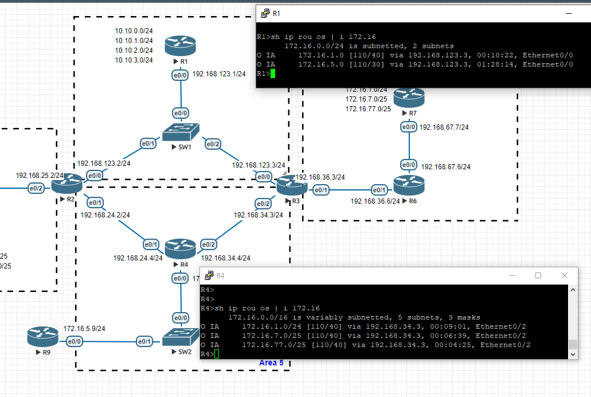
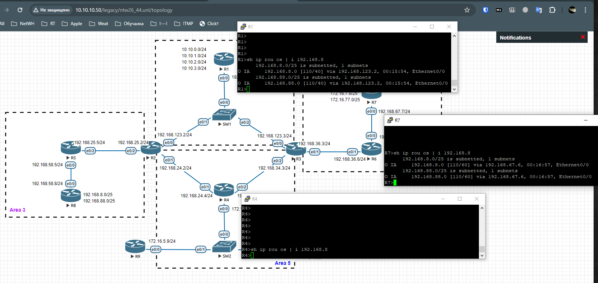
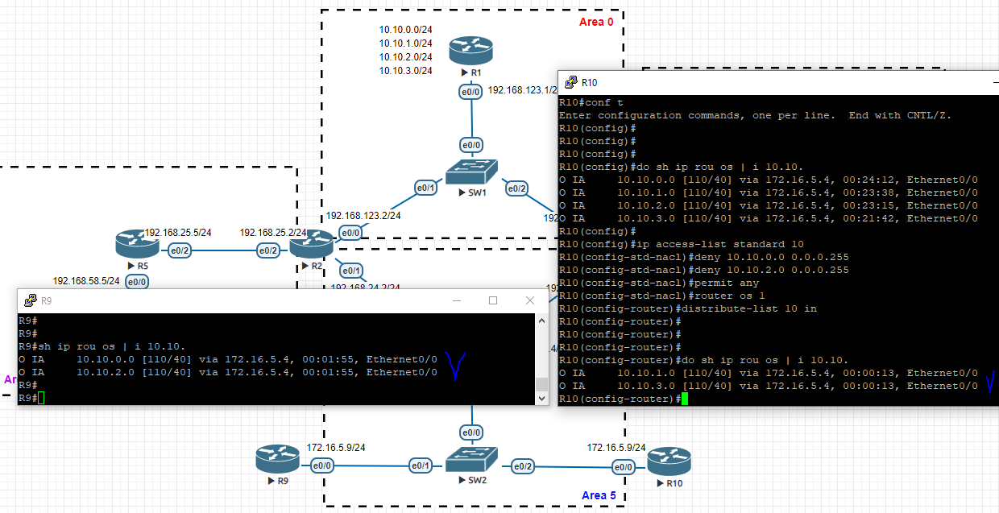
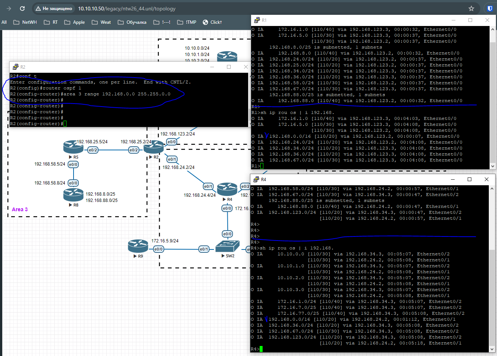
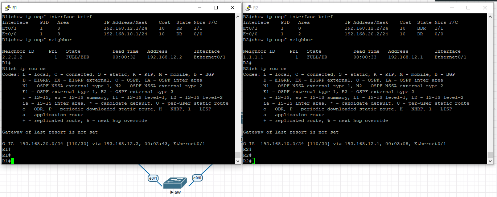

# 04.04. Протокол OSPF. Настройка и диагностика - Лебедев Д.С.
### Задание 1.
> Все сети указанные на картинке анонсированы. Изначальную конфигурацию вы сможете найти по [ссылке](_attachments/0404-00-00_homework_4_4_routers_config.md).
>   
> Необходимо:
> - настроить фильтрацию маршрутов из Area 7. В Area 0 из Area 7 должны попадать только маршруты с подсетью /24, в другие зоны передаются все маршруты. На каких маршрутизаторах и какие команды надо применить для выполнения данного правила?
> - настроить фильтрацию маршрутов из Area 3 так, чтоб маршруты: 192.168.8.0/25 и 192.168.88.0/25 не попадали в Area 5.
> - настроить так, чтобы в таблице маршрутизации:
>   - на R9 были только чётные маршруты: 10.10.0.0/24, 10.10.2.0/24 из Area 0,
>   - на R10 нечетные: 10.10.1.0/24, 10.10.3.0/24.
> *Для каждого подзадания приведите список маршрутизаторов, на которых необходимы изменения со списком полных команд на нём.*

*Ответ:*  
<details>
<summary>Начальная конфигурация маршрутизаторов</summary>

```sh
-- R1 --
R1(config)#int e0/0
R1(config-if)#no sh
R1(config-if)#ip address 192.168.123.1 255.255.255.0

R1(config)#int e0/1
R1(config-if)#no sh

R1(config-if)#int e0/1.100
R1(config-subif)#encapsulation dot1Q 100
R1(config-subif)#ip address 10.10.0.1 255.255.255.0

R1(config-if)#int e0/1.101
R1(config-subif)#encapsulation dot1Q 101
R1(config-subif)#ip address 10.10.1.1 255.255.255.0

R1(config-if)#int e0/1.102
R1(config-subif)#encapsulation dot1Q 102
R1(config-subif)#ip address 10.10.2.1 255.255.255.0

R1(config-if)#int e0/1.103
R1(config-subif)#encapsulation dot1Q 103
R1(config-subif)#ip address 10.10.3.1 255.255.255.0

R1(config-subif)#router ospf 1
R1(config-router)#network 192.168.123.0 0.0.0.255 area 0
R1(config-router)#network 10.10.0.0 0.0.255.255 area 0


-- R2 --
R2(config)#int range e0/0-2
R2(config-if-range)#no sh

R2(config)#int e0/0
R2(config-if)#ip address 192.168.123.2 255.255.255.0

R2(config-if)#int e0/1
R2(config-if)#ip address 192.168.24.2 255.255.255.0

R2(config-if)#int e0/2
R2(config-if)#ip address 192.168.25.2 255.255.255.0

R2(config-if)#router ospf 1
R2(config-router)#network 192.168.123.0 0.0.0.255 area 0
R2(config-router)#network 192.168.24.0 0.0.0.255 area 5
R2(config-router)#network 192.168.25.0 0.0.0.255 area 3


-- R3 --
R3(config)#int ran e0/0-2
R3(config-if-range)#no sh

R3(config-if-range)#int e0/0
R3(config-if)#ip address 192.168.123.3 255.255.255.0

R3(config-if)#int e0/1
R3(config-if)#ip address 192.168.36.3 255.255.255.0

R3(config-if)#int e0/2
R3(config-if)#ip address 192.168.34.3 255.255.255.0

R3(config-if)#router ospf 1
R3(config-router)#network 192.168.123.0 0.0.0.255 area 0
R3(config-router)#network 192.168.34.0 0.0.0.255 area 5
R3(config-router)#network 192.168.36.0 0.0.0.255 area 7


--- R4 --
R4(config)#int ran e0/0-2
R4(config-if-range)#no sh

R4(config-if-range)#int e0/0
R4(config-if)#ip address 172.16.5.4 255.255.255.0

R4(config-if)#int e0/1
R4(config-if)#ip address 192.168.24.4 255.255.255.0

R4(config-if)#int e0/2
R4(config-if)#ip address 192.168.34.4 255.255.255.0

R4(config-if)#router ospf 1
R4(config-router)#network 172.16.5.0 0.0.0.255 area 5
R4(config-router)#network 192.168.24.0 0.0.0.255 area 5
R4(config-router)#network 192.168.34.0 0.0.0.255 area 5


-- R5 --
R5(config)#int e0/0
R5(config-if)#ip address 192.168.58.5 255.255.255.0
R5(config-if)#no sh

R5(config-if)#interface e0/2
R5(config-if)#ip address 192.168.25.5 255.255.255.0
R5(config-if)#no sh

R5(config-if)#router ospf 1
R5(config-router)#network 192.168.58.0 0.0.0.255 area 3
R5(config-router)#network 192.168.25.0 0.0.0.255 area 3


-- R6 --

R6(config-if)#int e0/1
R6(config-if)#ip address 192.168.36.6 255.255.255.0
R6(config-if)#no sh

R6(config)#int e0/0
R6(config-if)#ip address 192.168.67.6 255.255.255.0
R6(config-if)#no sh

R6(config-if)#router ospf 1
R6(config-router)#network 192.168.36.0 0.0.0.255 area 7
R6(config-router)#network 192.168.67.0 0.0.0.255 area 7


-- R7 --
R7(config)#int e0/0
R7(config-if)#ip address 192.168.67.7 255.255.255.0
R7(config-if)#no sh

R7(config)#int e0/1
R7(config-if)#no sh

R7(config-if)#int e0/1.1
R7(config-subif)#encapsulation dot1Q 1
R7(config-subif)#ip address 172.16.1.7 255.255.255.0
R7(config-subif)#no sh

R7(config-subif)#int e0/1.107
R7(config-subif)#encapsulation dot1Q 107
R7(config-subif)#ip address 172.16.7.7 255.255.255.128

R7(config-subif)#router ospf 1
R7(config-router)#network 192.168.67.0 0.0.0.255 area 7
R7(config-router)#network 172.16.1.0 0.0.0.255 area 7
R7(config-router)#network 172.16.7.0 0.0.0.127 area 7
R7(config-router)#network 172.16.77.0 0.0.0.127 area 7


-- R8 --
R8(config)#int e0/0
R8(config-if)#ip address 192.168.58.8 255.255.255.0
R8(config-if)#no sh

R8(config-if)#int e0/1
R8(config-subif)#no sh

R8(config-if)#int e0/1.8
R8(config-subif)#encapsulation dot1Q 8
R8(config-subif)#ip address 192.168.8.8 255.255.255.128
R8(config-subif)#no sh

R8(config-subif)#int e0/1.88
R8(config-subif)#encapsulation dot1Q 88
R8(config-subif)#ip address 192.168.88.8 255.255.255.128
R8(config-subif)#no sh

R8(config-subif)#router ospf 1
R8(config-router)#network 192.168.58.0 0.0.0.255 area 3
R8(config-router)#network 192.168.8.0 0.0.0.127 area 3
R8(config-router)#network 192.168.88.0 0.0.0.127 area 3


-- R9 --
R9(config)#int e0/0
R9(config-if)#ip address 172.16.5.9 255.255.255.0
R9(config-if)#no sh

R9(config-if)#router ospf 1
R9(config-router)#network 172.16.5.0 0.0.0.255 area 5


-- R10 --
R10(config)#int e0/0
R10(config-if)#ip address 172.16.5.10 255.255.255.0
R10(config-if)#no sh

R10(config-if)#router ospf 1
R10(config-router)#network 172.16.5.0 0.0.0.255 area 5
```
</details>

1. Настройка фильтрации маршрутов из Area 7. Необходимо на R3 создать и применить префикс лист с ограничением по маске для сетей, анонсируемых из зоны 7 в зону 3:

```sh
R3(config)#ip prefix-list ONLY_24 permit 0.0.0.0/0 ge 24 le 24
R3(config)#router ospf 1
R3(config-router)#area 0 filter-list prefix ONLY_24 in
```

Результат на примере анонса сетей с разными масками от R7:   


2. Фильтрация определенных маршрутов из Area 3 осуществляется настройкой роутеров R2 и R3:

```sh
R2(config)#ip prefix-list L3_5 deny 192.168.8.0/25
R2(config)#ip prefix-list L3_5 deny 192.168.88.0/25
R2(config)#ip prefix-list L3_5 permit 0.0.0.0/0 le 32
R2(config)#router os 1
R2(config-router)#area 5 filter-list prefix L3_5 in

R3(config)#ip prefix-list L3_5 deny 192.168.8.0/25
R3(config)#ip prefix-list L3_5 deny 192.168.88.0/25
R3(config)#ip prefix-list L3_5 permit 0.0.0.0/0 le 32
R3(config)#router os 1
R3(config-router)#area 5 filter-list prefix L3_5 in
```

Результат:  


3. Для принятия только определенных маршрутов на R9 и R10 используем distribute-list:

```sh
--- R9 ---
R9(config)#ip access-list standard 10
R9(config-std-nacl)#deny 10.10.1.0 0.0.0.255
R9(config-std-nacl)#deny 10.10.3.0 0.0.0.255
R9(config-std-nacl)#permit any

R9(config)#router os 1
R9(config-router)#distribute-list 10 in

--- R10 ---
R10(config)#ip access-list standard 10
R10(config-std-nacl)#deny 10.10.0.0 0.0.0.255
R10(config-std-nacl)#deny 10.10.2.0 0.0.0.255
R10(config-std-nacl)#permit any

R10(config)#router os 1
R10(config-router)#distribute-list 10 in
```

Результат:  

### Задание 2.
> По топологии из Задания 1, настройте следующую суммаризацию:
> 1. Маршруты из Area 3 во всех других зонах должны быть представлены как суммированный маршрут 192.168.0.0 255.255.0.0. На каких маршрутизаторах и какие команды надо применить для выполнения данного правила?
> 2*. На маршрутизаторах R7 и R8 настроить анонс маршрута по умолчанию. Сделать так, чтобы маршрутизатор R1 предпочитал маршрут по умолчанию из Area 7, из Area 3 должен быть резервным. На каких маршрутизаторах и какие команды надо применить для выполнения данного правила?
> *Для каждого подзадания приведите список маршрутизаторов, на которых необходимы изменения со списком полных команд на нём.*

*Ответ:*  
1. Настройка суммаризации на пограничном маршрутизаторе R2:

```sh
R2(config)#router ospf 1
R2(config-router)#area 3 range 192.168.0.0 255.255.0.0
R2(config-router)#
```

Результат:  


### Задание 3.
> По картинке и конфигурации, определить установят ли соседство маршрутизаторы R1 и R2? Почему? Как без использования команд просмотра конфигурации `show running-config`, используя команды диагностики OSPF `show ip ospf *`, можно установить и решить проблему установления соседства?
>   
> *Приведите ответы на вопросы в свободной форме. Пришлите список маршрутизаторов и команд, сделанных на этих маршрутизаторах.*

*Ответ:*  
В текущей конфигурации выявлены следующие несоответствия:
1. Одинаковый IP адрес у маршрутизаторов на Fa0/1, необходимо исправить на R2; 
2. Различные зоны OSPF на соседних интерфейсах роутеров. На R2 сообщение  `Received invalid packet: mismatched area ID from backbone area from 192.168.12.1, Ethernet0/1`, необходимо на R2 перенести в backbone area;
3. Возможно, неоходимо включить в анонсирование OSPF сети, построенные на loopback-интерфейсах.

После исправления соседство установлено, можно удостовериться в этом командами:  
```sh
show ip ospf neighbor
show ip ospf interface brief
```

Результат:  

