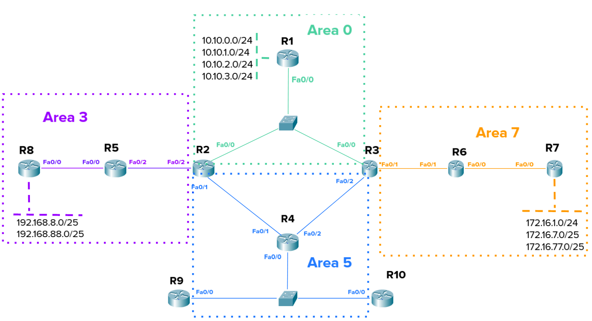
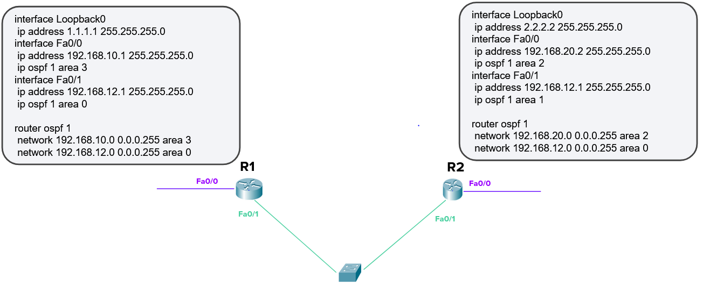

# 04.04. Протокол OSPF. Настройка и диагностика - Лебедев Д.С.
### Задание 1.
> Все сети указанные на картинке анонсированы. Изначальную конфигурацию вы сможете найти по [ссылке](_attachments/0404-00-00_homework_4_4_routers_config.md).
>   
> Необходимо:
> - настроить фильтрацию маршрутов из Area 7. В Area 0 из Area 7 должны попадать только маршруты с подсетью /24, в другие зоны передаются все маршруты. На каких маршрутизаторах и какие команды надо применить для выполнения данного правила?
> - настроить фильтрацию маршрутов из Area 3 так, чтоб маршруты: 192.168.8.0/25 и 192.168.88.0/25 не попадали в Area 5.
> - настроить так, чтобы в таблице маршрутизации:
>   - на R9 были только чётные маршруты: 10.10.0.0/24, 10.10.2.0/24 из Area 0,
>   - на R10 нечетные: 10.10.1.0/24, 10.10.3.0/24.
> *Для каждого подзадания приведите список маршрутизаторов, на которых необходимы изменения со списком полных команд на нём.*

*Ответ:*  

### Задание 2.
> По топологии из Задания 1, настройте следующую суммаризацию:
> 1. Маршруты из Area 3 во всех других зонах должны быть представлены как суммированный маршрут 192.168.0.0 255.255.0.0. На каких маршрутизаторах и какие команды надо применить для выполнения данного правила?
> 2. (*дополнительное со звездочкой*) На маршрутизаторах R7 и R8 настроить анонс маршрута по умолчанию. Сделать так, чтобы маршрутизатор R1 предпочитал маршрут по умолчанию из Area 7, из Area 3 должен быть резервным. На каких маршрутизаторах и какие команды надо применить для выполнения данного правила?
> *Для каждого подзадания приведите список маршрутизаторов, на которых необходимы изменения со списком полных команд на нём.*

*Ответ:*  

### Задание 3.
> По картинке и конфигурации, определить установят ли соседство маршрутизаторы R1 и R2? Почему? Как без использования команд просмотра конфигурации `show running-config`, используя команды диагностики OSPF `show ip ospf *`, можно установить и решить проблему установления соседства?
>   
> *Приведите ответы на вопросы в свободной форме. Пришлите список маршрутизаторов и команд, сделанных на этих маршрутизаторах.*

*Ответ:*  

