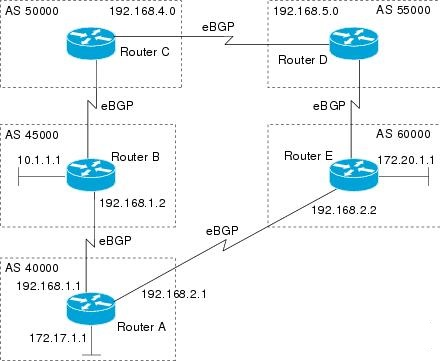
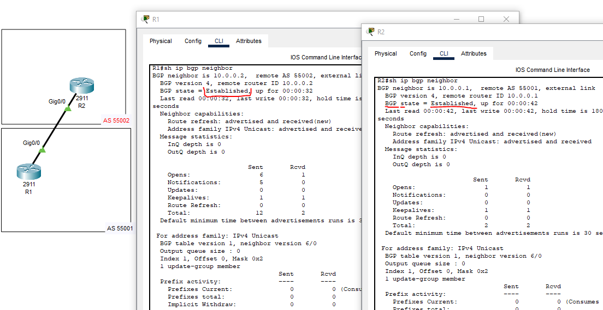
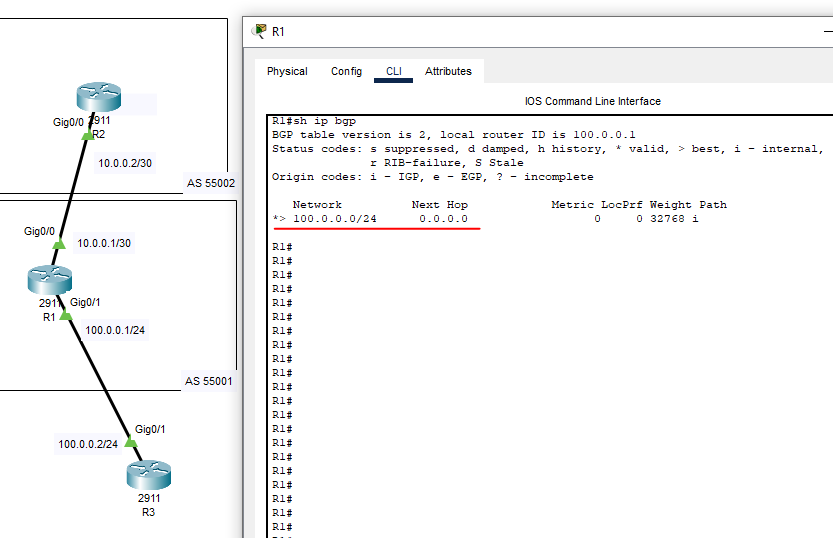

# 04.05. Маршрутизация в сети Интернет. Автономные системы - Лебедев Д.С.
### Задание 1
> Маршрутизатор А объявляет свою собственную сеть 172.17.1.0 своим одноранговым узлам BGP.
> - Какой маршрутной информацией будет обладать маршрутизатор D о доступности сети 172.17.1.0?
> - Как будут выглядеть атрибуты AS-path?
> - Через какие роутеры пройдет трафик при передаче информации от маршрутизатора D к маршрутизатору А?  
>   
> *Приведите ответ в свободной форме.*

*Ответ:*  
1. В процессе работы протокола BGP роутер D получит информацию о сети 172.17.1.1 через оба пути, AS55000 и AS60000. В маршрутной информации будет указан полный путь до сети - AS-path (а так же другие атрибуты), версия протокола, ID маршрутизатора. 
2. AS-path для маршрутизатора D будет включать в себя последовательность номеров автономных систем (AS), через которые прошел каждый маршрут.
3. Если все политики настроены по умолчанию (атрибуты, кроме AS-path, одинаковы), решение о предпочтительном маршруте принимается на основании AS-path. Маршрутизатор D выберет более короткий путь через маршрутизатор E, так как он содержит меньшее количество переходов.
### Задание 2
> Что означает следующий узел 0.0.0.0 в выходных данных команды show ip bgp?  
> *Приведите ответ в свободной форме.*

*Ответ:*  
Предпочтителен локальный маршрут роутера. В этом случае BGP использует локальный интерфейс для доставки пакетов к указанному маршруту.
### Задание 3. Лабораторная работа "Настройка конфигурации BGP"
> В Cisco Packet Tracer соберите сеть, состоящую из двух маршрутизаторов R1 и R2, находящиеся в разных AS. Настройте между ними BGP.  
> *Приведите скриншоты, где на R1 и R2 BGP-соединение в статусе Established. Пришлите pkt файл.*

*Ответ:*  
Команды настройки маршрутизаторв:  
```sh
-- Настройка R1 --
Router(config)#host R1

R1(config)#int gi0/0
R1(config-if)#ip addr 10.0.0.1 255.255.255.252
R1(config-if)#no sh

R1(config)#router bgp 55001
R1(config-router)#neighbor 10.0.0.2 remote-as 55002

-- Настройка R2 --
Router(config)#host R2

R2(config)#int gi0/0
R2(config-if)#ip addr 10.0.0.2 255.255.255.252
R2(config-if)#no sh

R2(config)#router bgp 55002
R2(config-router)#neighbor 10.0.0.1 remote-as 55001

--
R(config)#sh ip bgp neighbor
```

Статус  
  

[PKT-файл](_attachments/0405-03-00.pkt)
### Задание 4*
> На основе лабораторной работы в Задании 3 к маршрутизатору R1 добавьте еще маршрутизатор R3 и сделайте так, чтобы с R1 анонсировался дефолт на R3.  
> *Приведите скриншот маршрутизатора R1, где отображена таблица BGP. Пришлите pkt файл.*

*Ответ:*  
Команды настройки роутера R1:  
```sh
R1(config)#router bgp 55001
R1(config-router)#network 100.0.0.0 mask 255.255.255.0
R1(config-router)#exi
R1(config)#ip route 100.0.0.0 255.255.255.0 Null 0
```

Таблица маршрутизации:  
  

[PKT-файл](_attachments/0405-04-00.pkt)