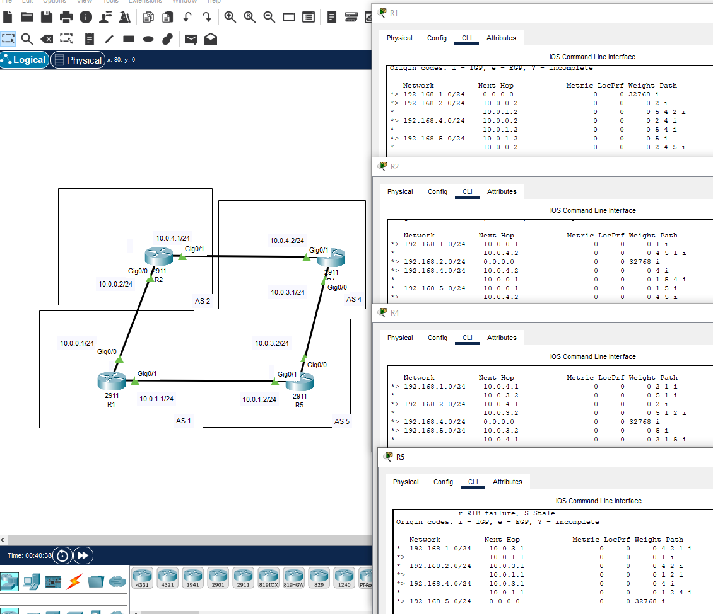
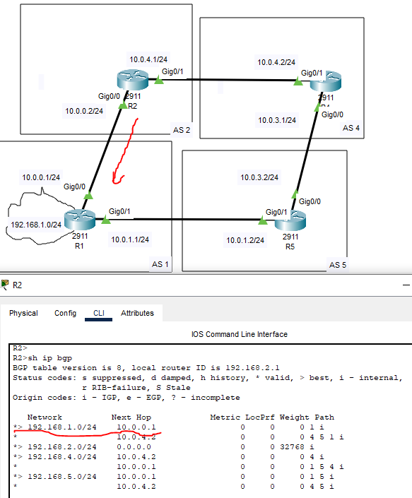

# 04.06. BGP в корпоративных сетях. Построение соседства, машина состояний, типы сообщений - Лебедев Д.С.
### Задание 1
> Существует установленная BGP-сессия, у которой uptime 20 часов. Какие сообщения гарантированно не передавались между соседями последние 2 часа?  
> *Приведите ответ в свободной форме.*

*Ответ:*  
Исходя из того, что BGP-сессия не обрывалась 20 часов, за последние 2 часа гарантированно не было сообщений `OPEN` (передаются только на этапе формирования отношений) и `NOTIFICATION`, так как это сообщение приводит к закрытию BGP-соединения.
### Задание 2. Лабораторная работа "Настройка конфигурации BGP"
> 1. В Cisco Packet Tracer соберите сеть, состоящую из двух маршрутизаторов R1 и R2, находящиеся в разных AS.
> 2. Настройте между ними BGP.
> 3. К маршрутизатору R1 добавьте еще маршрутизатор R5, а к R2 - маршрутизатор R4.
> 4. Соедините R4 и R5 между собой и настройте BGP.
> 5. Все маршрутизаторы должны находиться в уникальных AS.
> *Пришлите pkt файл.*

*Ответ:*  
В процессе выполнения собрана сеть, настроен BGP протокол, установлено соседство по принципу "каждый с каждым". На роутерах анонсированы локальные сети, для наглядного отображения маршрутов.

<details>
<summary>Команды настройки маршрутизаторов</summary>

```bash
-- Настройка R1 --
R1(config)#int gi0/0
R1(config-if)#ip addr 10.0.0.1 255.255.255.0
R1(config-if)#no sh
R1(config-router)#int gi0/1
R1(config-if)#ip addr 10.0.1.1 255.255.255.0
R1(config-if)#no sh
R1(config)#int loo0
R1(config-if)#ip addr 192.168.1.1 255.255.255.0

R1(config-if)#router bgp 1
R1(config-router)#neighbor 10.0.0.2 remote-as 2
R1(config-router)#neighbor 10.0.1.2 remote-as 5
R1(config-router)#network 192.168.1.0 mask 255.255.255.0


-- Настройка R2 --
R2(config)#int gi0/0
R2(config-if)#ip addr 10.0.0.2 255.255.255.0
R2(config-if)#no sh
R2(config)#int gi0/1
R2(config-if)#ip addr 10.0.4.1 255.255.255.0
R2(config-if)#no sh
R2(config)#int loo0
R2(config-if)#ip addr 192.168.2.1 255.255.255.0

R2(config-if)#router bgp 2
R2(config-router)#neighbor 10.0.0.1 remote-as 1
R2(config-router)#neighbor 10.0.4.2 remote-as 4
R2(config-router)#network 192.168.2.0 mask 255.255.255.0

-- Настройка R4 --
R4(config)#int gi0/1
R4(config-if)#ip addr 10.0.4.2 255.255.255.0
R4(config-if)#no sh
R4(config-if)#int gi0/0
R4(config-if)#ip addr 10.0.3.1 255.255.255.0
R4(config-if)#no sh
R4(config)#int loo0
R4(config-if)#ip addr 192.168.4.1 255.255.255.0

R4(config-if)#router bgp 4
R4(config-router)#neighbor 10.0.3.2 remote-as 5
R4(config-router)#neighbor 10.0.4.1 remote-as 2
R4(config-router)#network 192.168.4.0 mask 255.255.255.0

-- Настройка R5 --
R5(config)#int gi0/1
R5(config-if)#ip addr 10.0.1.2 255.255.255.0
R5(config-if)#no sh
R5(config)#int gi0/0
R5(config-if)#ip addr 10.0.3.2 255.255.255.0
R5(config-if)#no sh
R5(config-if)#ip addr 192.168.5.1 255.255.255.0

R5(config-if)#router bgp 5
R5(config-router)#neighbor 10.0.3.1 remote-as 4
R5(config-router)#neighbor 10.0.1.1 remote-as 1
R5(config-router)#network 192.168.5.0 mask 255.255.255.0

--
R(config)#sh ip bgp neighbor
R(config)#sh ip bgp
```
</details>

  

[PKT-файл](_attachments/0406-02-00.pkt)  
### Задание 3
> На основе предыдущей лабораторной работы настройте маршрутизацию таким образом, чтобы трафик от R2 проходил через маршрутизаторы: R4->R5->R1. В качестве ответа приложите примеры конфигураций устройств.   
> *Приведите ответ в свободной форме.*

*Ответ:*  
При дефолтных настройках трафик от R2 к сети 192.168.1.0/24, анонсированной на R1, проходит по кратчайшему пути:  
  

Управлять выбором маршрутов в протоколе BGP возможно с помощью использования AS-Path ACL, Prefix-list, Weight, Local Preference, MED.  
AS-Path ACL и Prefix-list позволяют фильтровать анонсируемые или принимаемые маршруты, другие устанавливают приоритеты.
С помощью AS-Path ACL на R2 можно запретить принимать анонс маршрута от AS 1. Для примера отфильтруем маршруты, отбросим локальные соседа 10.0.0.1: 
```sh
-- Настройка R2 --
--- Создание ACL --
ip as-path access-list 168_1 deny ^1$
ip as-path access-list 168_1 permit .*

--- Применение ACL 168_1 ---
R2(config)#router bgp 2
R2(config-router)#neighbor 10.0.0.1 filter-list 168_1 in
```
