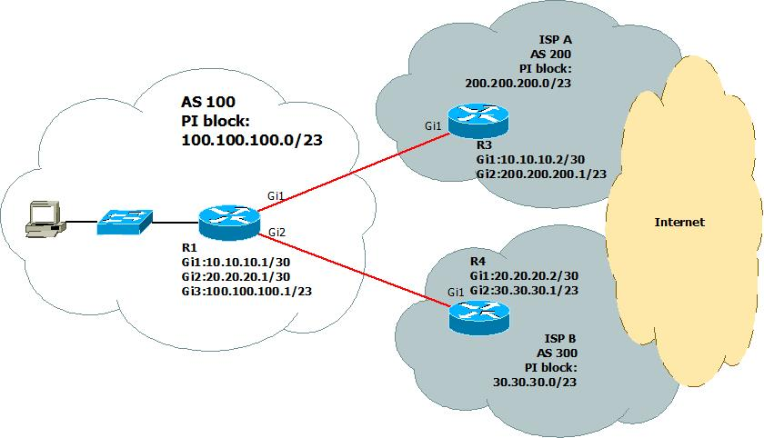
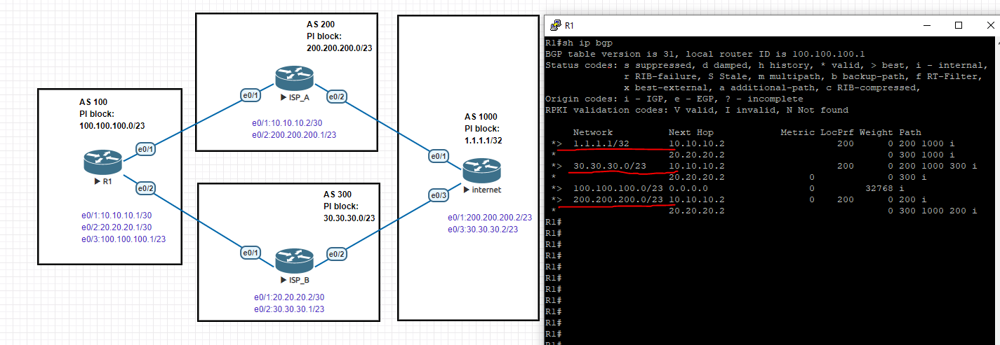
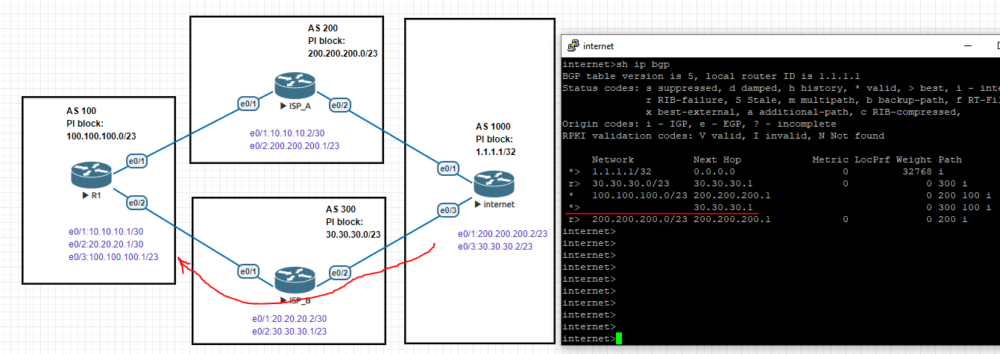
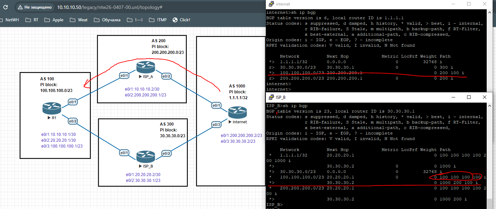
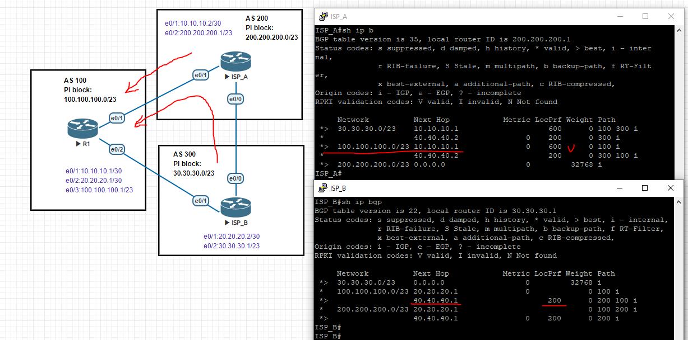

# 04.07. Методы управления трафиком - Лебедев Д.С.
### Задание 1
> Топология:
> 
> 
> 
> Ваша компания владеет AS 100 и имеет два подключения к сети Интернет с использованием протокола BGP.
> - Канал к ISP А (AS200) дешевый и с большой пропускной способностью.
> - Канал к ISP B (AS300) меньше и менее надежный.
> Сетевое оборудование Cisco.
> 
> Стоит задача - максимально использовать первый канал для доступа в сеть Интернет.
> 1. Выберите технологию управления исходящим трафиком, которая с наименьшими затратами позволит решить эту задачу.
> 2. Обоснуйте свой выбор.
> 3. Приведите пример настройки выбранной технологии, основываясь на информации отображенной на схеме.
> *Приведите ответ в свободной форме.*

*Ответ:*  
<details>
<summary>Начальная конфигурация</summary>

```bash
---R1
R1(config)#int e0/3
R1(config-if)#ip addr 100.100.100.1 255.255.254.0
R1(config-if)#no sh
R1(config-if)#exi
R1(config)#ip route 100.100.100.0 255.255.254.0 null 0

R1(config)#router bgp 100
R1(config-router)#network 100.100.100.0 mask 255.255.254.0

R1(config-router)#neighbor 10.10.10.2 remote-as 200
R1(config-router)#neighbor 20.20.20.2 remote-as 300

R1(config)#int e0/1
R1(config-if)#ip addr 10.10.10.1 255.255.255.252
R1(config-if)#no sh

R1(config-if)#int e0/2
R1(config-if)#ip addr 20.20.20.1 255.255.255.252
R1(config-if)#no sh


--ISP_A
ISP_A(config)#int e0/1
ISP_A(config-if)#ip addr 10.10.10.2 255.255.255.252
ISP_A(config-if)#no sh

ISP_A(config-if)#int e0/2
ISP_A(config-if)#ip addr 200.200.200.1 255.255.254.0
ISP_A(config-if)#no sh

ISP_A(config)#ip route 200.200.200.0 255.255.254.0 null 0
ISP_A(config)#router bgp 200

ISP_A(config-router)#network 200.200.200.0 mask 255.255.254.0
ISP_A(config-router)#neighbor 10.10.10.1 remote-as 100
ISP_A(config-router)#neighbor 200.200.200.2 remote-as 1000


--ISP_B
ISP_B(config)#int e0/1
ISP_B(config-if)#ip addr 20.20.20.2 255.255.255.252
ISP_B(config-if)#no sh

ISP_B(config-if)#int e0/2
ISP_B(config-if)#ip addr 30.30.30.1 255.255.254.0
ISP_B(config-if)#no sh

ISP_B(config)#ip route 30.30.30.0 255.255.254.0 null 0
ISP_B(config)#router bgp 300

ISP_B(config-router)#network 30.30.30.0 mask 255.255.254.0
ISP_B(config-router)#neighbor 20.20.20.1 remote-as 100
ISP_B(config-router)#neighbor 30.30.30.2 remote-as 1000


--internet
internet(config)#int e0/1
internet(config-if)#ip addr 200.200.200.2 255.255.254.0
internet(config-if)#no sh

internet(config-if)#int e0/3
internet(config-if)#ip addr 30.30.30.2 255.255.254.0
internet(config-if)#no sh

internet(config-if)#int loo1
internet(config-if)#ip addr 1.1.1.1 255.255.255.255

internet(config)#router bgp 1000
internet(config-router)#neighbor 200.200.200.1 remote-as 200
internet(config-router)#neighbor 30.30.30.1 remote-as 300
internet(config-router)#network 1.1.1.1 mask 255.255.255.255
```
</details>

1. Наиболее подходящая для управления исходящим трафиком технология - изменение атрибута Local Preference для входящих анонсов.
2. Так как свойство распространяется на все устройства внутри автономной системы, это позволит всему исходящему трафику предпочтительно использовать канал к ISP A (AS 200).
3. Пример настройки с помощью route-map:  
```sh
R1(config)#route-map as200-in
R1(config-route-map)#set local-preference 200
R1(config-route-map)#router bgp 100
R1(config-router)#neighbor 10.10.10.2 route-map as200-in in
```

После данной настройки исходящий трафик использует маршрут через AS 200:  
   

### Задание 2
> Топология и компания те же.  
> Решив вопрос с исходящим трафиком, через некоторое время вы заметили, что большая часть входящего трафика поступает в вашу сеть от ISP B (AS300).  
> Вас такое положение не устраивает. Теперь необходимо решить вопрос с входящим трафиком.
> 1. Выберите технологию управления входящим трафиком, которая с наименьшими затратами позволит решить эту задачу.
> 2. Обоснуйте свой выбор.
> 3. Приведите пример настройки выбранной технологии, основываясь на информации отображенной на схеме.
> *Приведите ответ в свободной форме.*

*Ответ:*  
Исходное состояние, входящий трафик  через ISP_B:  
  

1. Для управления входящим трафиком можно использовать AS-path prepending для исходящих анонсов, или применять BGP community, если ISP поддерживает.
2. Подразумевается, что в этом случае доступна для управления AS 100, поэтому наименее затратно использовать AS-path prepending, намеренно увеличивая маршрут через ISP_B.
3. Используем route-map для исходящих анонсов, ухудшая условия для трафика из AS 300:  
```sh
R1(config)#route-map as300-out
R1(config-route-map)#set as-path prepend 100 100 100
R1(config-route-map)#router bgp 100
R1(config-router)#neighbor 20.20.20.2 route-map as300-out out
```

После данной настройки входящий трафик так же использует маршрут через AS 200:  
  
### Задание 3
> Топология и компания те же.  
> Решение, выбранное в Задании 2, помогло, но недостаточно. Вы пообщались с провайдерами и выяснили, что у обоих провайдеров есть политики управления трафиком, определяемые community.  
> ISP A AS_200 community: 200:xxx - Local-pref to your AS  
> ISP B AS_300 community: 300:xxx - Local-pref to your AS  
> А также Вы узнали, что между ними есть прямая связь. На этом стыке установлен атрибут local-pref со значением 200 с обоих сторон.  
> Теперь необходимо воспользоваться полученным знанием, чтобы улучшить свои политики управления входящим трафиком.
> 1. Выберите технологию управления входящим трафиком которая позволит решить эту задачу.
> 2. Обоснуйте свой выбор.
> 3. Приведите пример настройки выбранной технологии основываясь на информации отображенной на схеме.
> *Приведите ответ в свободной форме.*

*Ответ:*  
1. Имея информацию о BGP communities, возможно запросить у ISP установку определенного local-preference для маршрутов к AS 100. Это позволит повысить приоритетность AS 100 при маршрутизации входящего трафика.
2. Использование атрибута community позволяет более гибко настраивать свою систему и взаимодействовать с ISP/
3. Пример настройки:  

```sh
===== Донастройка ISP_A ======
ISP_A(config)#int e0/0
ISP_A(config-if)#ip addr 40.40.40.1 255.255.255.252
ISP_A(config-if)#no sh

ISP_A(config-if)#router bgp 200
ISP_A(config-router)#neighbor 40.40.40.2 remote-as 300
ISP_A(config-router)#neighbor 40.40.40.2 route-map local-pref-300 in

ISP_A(config)#route-map local-pref-300
ISP_A(config-route-map)#set local-preference 200

ISP_A(config)#ip community-list standard cli-in permit 200:600
ISP_A(config)#route-map cli-in
ISP_A(config-route-map)#match community cli-in
ISP_A(config-route-map)#set local-preference 600
ISP_A(config-route-map)#route-map cli-in permit 20
ISP_A(config-route-map)#ip bgp-community new-format

ISP_A(config)#router bgp 200
ISP_A(config-router)#neighbor 10.10.10.1 route-map cli-in in

===== Донастройка ISP_B ======
ISP_B(config)#int e0/0
ISP_B(config-if)#ip addr 40.40.40.2 255.255.255.252
ISP_B(config-if)#no sh

ISP_B(config-if)#router bgp 300
ISP_B(config-router)#neighbor 40.40.40.1 remote-as 200
ISP_B(config-router)#neighbor 40.40.40.1 route-map local-pref-200 in

ISP_B(config)#route-map local-pref-200
ISP_B(config-route-map)#set local-preference 200

ISP_B(config)#ip community-list standard cli-in permit 300:500
ISP_B(config)#route-map cli-in
ISP_B(config-route-map)#match community cli-in
ISP_B(config-route-map)#set local-preference 500
ISP_B(config-route-map)#route-map cli-in permit 20
ISP_B(config-route-map)#ip bgp-community new-format
ISP_B(config)#router bgp 300
ISP_B(config-router)#neighbor 20.20.20.1 route-map cli-in in
```

Применяем на R1 для приоритизации входящего трафика от AS 200:  

```sh
R1(config)#route-map comm200-out
R1(config-route-map)#set community 200:600 additive
R1(config-route-map)#ip bgp-community new-format

R1(config-route-map)#router bgp 100
R1(config-router)#neighbor 10.10.10.2 send-community
R1(config-router)#neighbor 10.10.10.2 route-map comm200-out out
```

  
### Задание 4*
> В указанной топологии вы управляете маршрутизатором ISPA в AS200.  
> Требуется настроить обработку комьюнити 200:xxx для изменения Local Prefernece анонсов от клиента из AS100, которые тегированы данным community. Возможные значения xxx:
> 1. 300 - Local Prefernece 300
> 2. 600 - Local Preference 600
> 3. Создайте нужное количество community list
> 4. Создайте route-map, примените route-map на стык с клиентом
> *Приведите ответ в свободной форме.*

*Ответ:*  
Создание требуемых community list:  
```sh
ISP_A(config)#ip community-list standard pref-100 permit 200:300
ISP_A(config)#ip community-list standard pref-100 permit 200:600
```

 Создание route-map для изменения Local Preference в зависимости от значения community:  
```sh
ISP_A(config)#route-map set-local-pref permit 10
ISP_A(config-route-map)#match community pref-100
ISP_A(config-route-map)#set local-preference 300

ISP_A(config)#route-map set-local-pref permit 20
ISP_A(config-route-map)#match community pref-100
ISP_A(config-route-map)#set local-preference 600
```

Применение route-map на стыке с AS 100:  
```sh
ISP_A(config)#router bgp 200
ISP_A(config-router)#neighbor 10.10.10.1 route-map set-local-pref in
```

Такая настройка позволят применять различные значения Local Preference в зависимости от значений xxx в community, что позволит управлять маршрутами от клиента AS100.