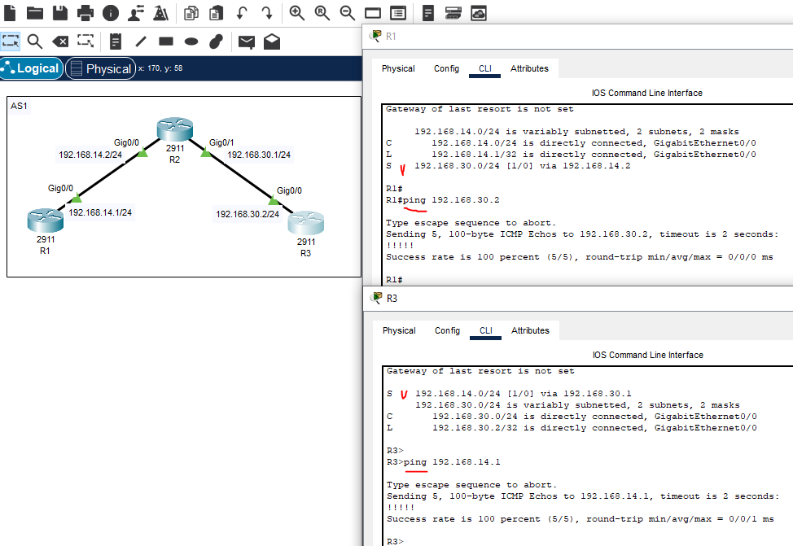
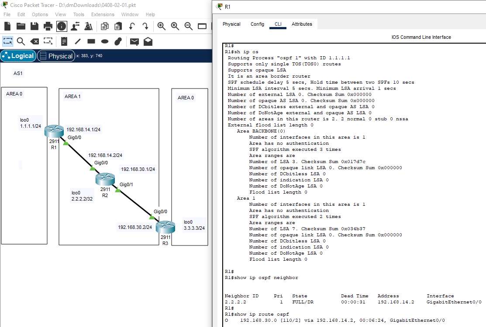
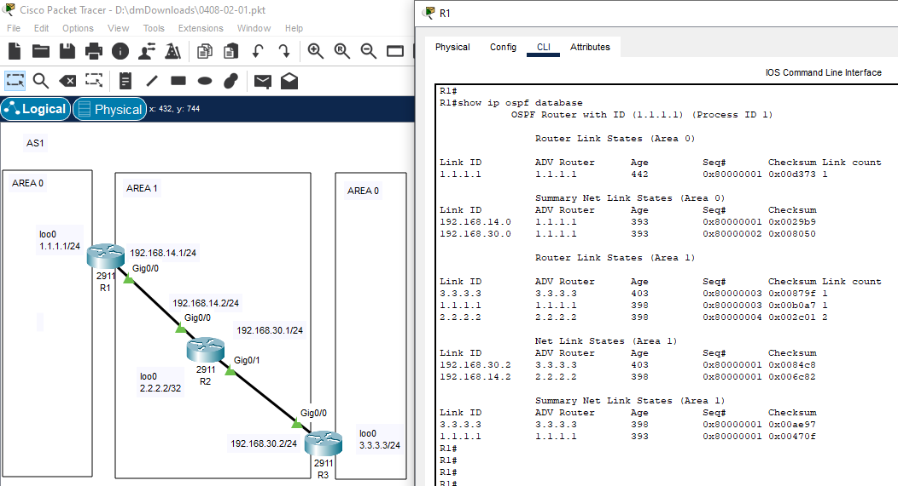
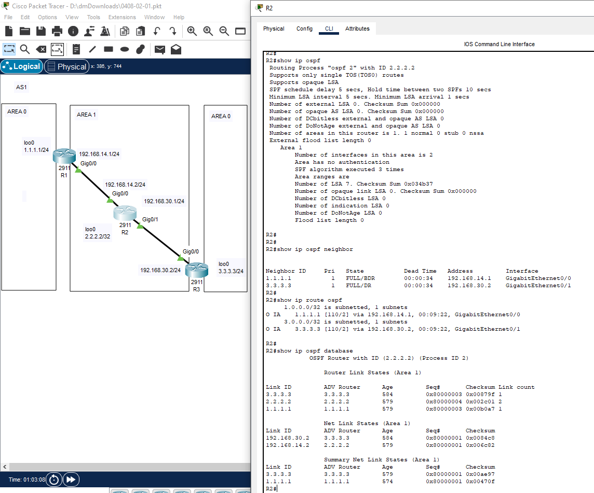
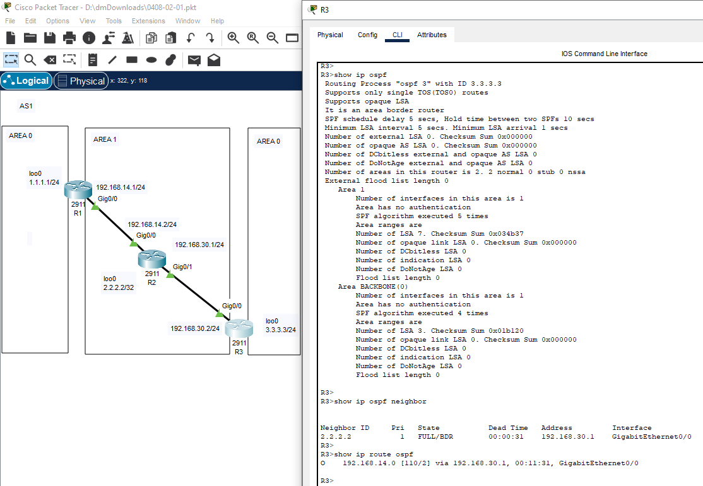
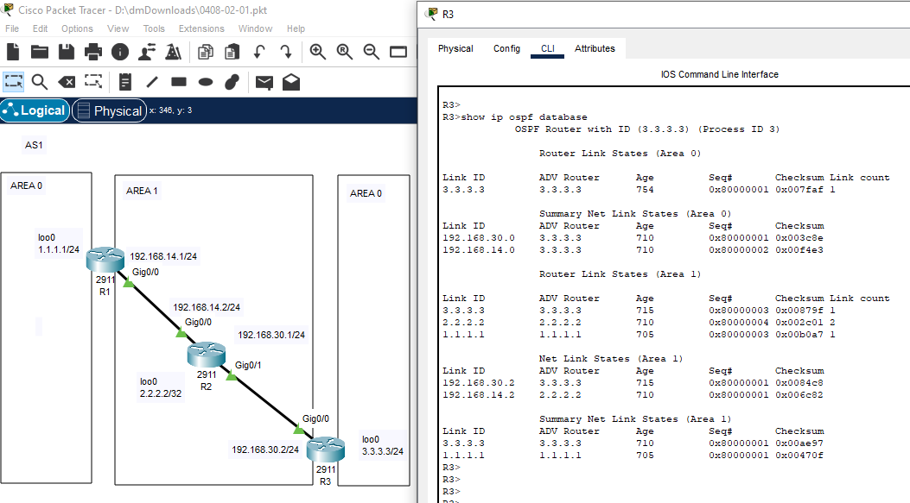
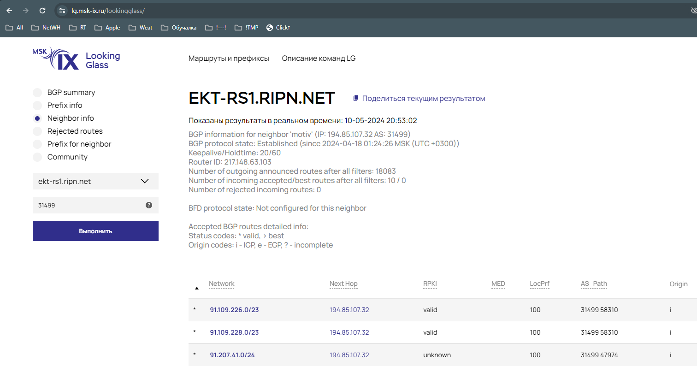
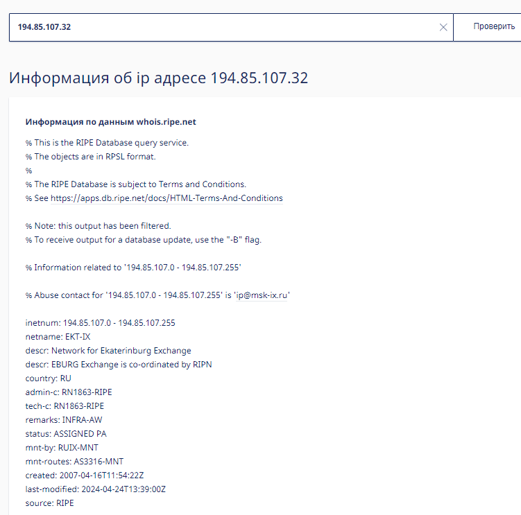
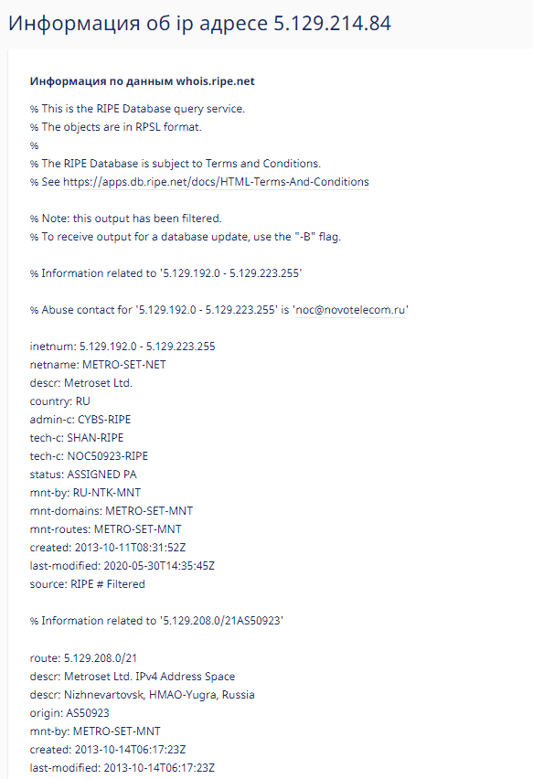

# 04.08. Отсутствие связности: диагностика и устранение - Лебедев Д.С.
### Задание 1.
> Кейс: топология сети на картинке. Для построения сети воспользуйтесь Cisco Packet Tracer.   
> 
> 
> Необходимо:
> 1. настроить маршрутизаторы, используя сетевые настройки, указанные на картинке. Маршрутизация статическая
> 2. выполнить команду ping между R1 и R3. Результат зафиксировать скриншотом
> 3. добиться прохождения ping между R1 и R3, используя статическую маршрутизацию. Результат зафиксировать скриншотом. В свободной форме объяснить, что вы сделали, чтобы связь между маршрутизаторами появилась.
> *Результаты выполнения задания оформить в один документ: скриншоты + текст. Так же предоставить файл .pkt*

*Ответ:*  
Для получения связности необходимо настроить маршрутизаторы R1, R2, R3 и прописать статические маршруты в соответствии с заданием на R1 и R3.  

<details>
<summary>Команды настройки маршрутизаторов</summary>

```bash
--R1
Router(config)#host R1

R1(config)#int gi0/0
R1(config-if)#ip addr 192.168.14.1 255.255.255.0
R1(config-if)#no sh

R1(config)#ip route 192.168.30.0 255.255.255.0 192.168.14.2

R1(config)#do wr


--R2
Router(config)#host R2

R2(config)#int gi0/0
R2(config-if)#no sh
R2(config-if)#ip addr 192.168.14.2 255.255.255.0

R2(config)#int gi0/1
R2(config-if)#no sh
R2(config-if)#ip addr 192.168.30.1 255.255.255.0

R2(config)#do wr

--R3
Router(config)#hostname R3

R3(config)#interface gi0/0
R3(config-if)#no sh
R3(config-if)#ip addr 192.168.30.2 255.255.255.0

R3(config)#ip route 192.168.14.0 255.255.255.0 192.168.30.1

R3(config)#do wr
```
</details>

[PKT-файл задания 1](_attachments/0408-01-01.pkt)  

Результат выполнения задания:  

### Задание 2.
> Кейс: топология сети на картинке.  
> Для построения сети воспользуйтесь Cisco Packet Tracer.
> 
> 
> 
> 1. Настройте ospf на маршрутизаторах
> 2. Сделайте на каждом маршрутизаторе вывод команд:
>    - show ip ospf
>    - show ip ospf neighbor
>    - show ip ospf database
>    - show ip route ospf
> 3. В чём проблема?
> *Вывод команд оформить в виде скриншотов, ответ на 3 в текстовом виде. Всё оформить в один документ. Также предоставить файл .pkt*

*Ответ:*  
<details>
<summary>Команды настройки OSPF на маршрутизаторах</summary>

```bash
---R1
R1(config)#int loo0
R1(config-if)#ip addr 1.1.1.1 255.255.255.0

R1(config-if)#router ospf 1
R1(config-router)#network 1.1.1.0 0.0.0.255 area 0
R1(config-router)#network 192.168.14.0 0.0.0.255 area 1

---R2
R1(config)#int loo0
R1(config-if)#ip addr 2.2.2.2 255.255.255.0
R2(config)#router ospf 2
R2(config-router)#network 192.168.14.0 0.0.0.255 area 1
R2(config-router)#network 192.168.30.0 0.0.0.255 area 1

---R3
R3(config)#int loo0
R3(config-if)#ip addr 3.3.3.3 255.255.255.0

R3(config)#router ospf 3
R3(config-router)#network 3.3.3.0 0.0.0.255 area 0
R3(config-router)#network 192.168.30.0 0.0.0.255 area 1
```
</details>

Просмотр параметров OSPF роутер `R1`:  
  
  

Просмотр параметров OSPF роутер `R2`:  
  

Просмотр параметров OSPF роутер `R3`:  
  
  

В данной топологии  Area0 разъединена. Согласно RFC по OSPF, роутер ABR не может передавать LSA Type3, если он получен не из магистральной зоны, поэтому маршруты R1 из Area0 к R3 не придут, а так же от R3 к R1.
Для решения проблемы можно настроить виртуальный линк для  Area0 через Area1.

[PKT-файл Задание 2](_attachments/0408-02-01.pkt)  
### Задание 3.
> 1. Найдите в интернете несколько серверов looking glass. В текстовом файле приложите ссылки
> 2. Используя [LG](https://lg.msk-ix.ru/lookingglass/)
>    - выберите один из маршрутизаторов "Route-server"
>    - с помощью "BGP summary" найдите идентификатор одного из соседей
>    - с помощью "Neighbor info" найдите информацию о соседе В ответе прикрепите скриншот вывода информации и в свободной форме опишите, что вы видите в выводе.
> 3. Используя whois сайта nic.ru:
>    - посмотрите информацию о соседе, которого нашли в пункте 2
> *В ответе прикрепите скриншот вывода информации и в свободной форме опишите, что вы видите в выводе.*

*Ответ:*  
Пример серверов looking glass:  
https://lg.msk-ix.ru/lookingglass/
https://lg.selectel.ru/#/
http://lg.gldn.net/

  

Можно увидеть описание автономной системы (AS31499, Мотив), RouterID, количество входящих, исходящих, отклоненных маршрутов.

  

Можно узнать информацию о своем провайдере:   
  