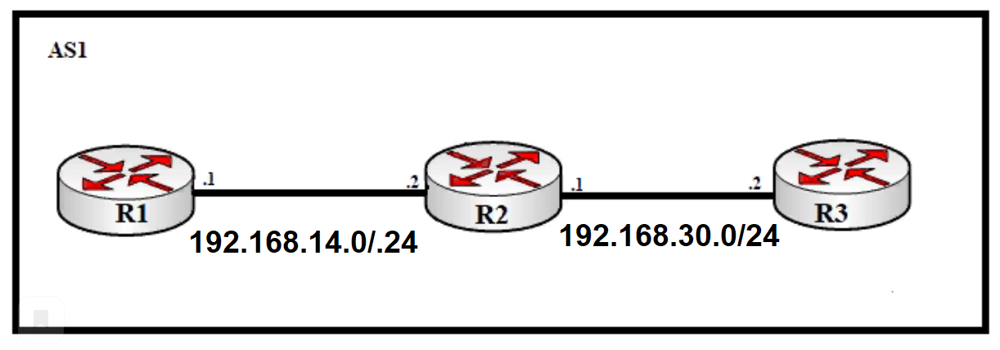
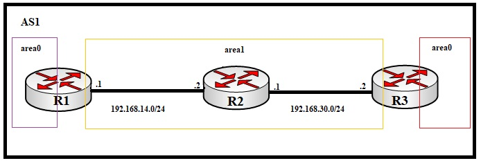

# 04.08. Отсутствие связности: диагностика и устранение - Лебедев Д.С.
### Задание 1.
> Кейс: топология сети на картинке. Для построения сети воспользуйтесь Cisco Packet Tracer.   
> 
> 
> Необходимо:
> 1. настроить маршрутизаторы, используя сетевые настройки, указанные на картинке. Маршрутизация статическая
> 2. выполнить команду ping между R1 и R3. Результат зафиксировать скриншотом
> 3. добиться прохождения ping между R1 и R3, используя статическую маршрутизацию. Результат зафиксировать скриншотом. В свободной форме объяснить, что вы сделали, чтобы связь между маршрутизаторами появилась.
> *Результаты выполнения задания оформить в один документ: скриншоты + текст. Так же предоставить файл .pkt*

*Ответ:*  

### Задание 2.
> Кейс: топология сети на картинке.  
> Для построения сети воспользуйтесь Cisco Packet Tracer.
> 
> 
> 
> 1. Настройте ospf на маршрутизаторах
> 2. Сделайте на каждом маршрутизаторе вывод команд:
>    - show ip ospf
>    - show ip ospf neighbor
>    - show ip ospf database
>    - how ip route ospf
> 3. В чём проблема?
> *Вывод команд оформить в виде скриншотов, ответ на 3 в текстовом виде. Всё оформить в один документ. Также предоставить файл .pkt*

*Ответ:*  

### Задание 3.
> 1. Найдите в интернете несколько серверов looking glass. В текстовом файле приложите ссылки
> 2. Используя [LG](https://lg.msk-ix.ru/lookingglass/)
>    - выберите один из маршрутизаторов "Route-server"
>    - с помощью "BGP summary" найдите идентификатор одного из соседей
>    - с помощью "Neighbor info" найдите информацию о соседе В ответе прикрепите скриншот вывода информации и в свободной форме опишите, что вы видите в выводе.
> 3. Используя whois сайта nic.ru:
>    - посмотрите информацию о соседе, которого нашли в пункте 2
> *В ответе прикрепите скриншот вывода информации и в свободной форме опишите, что вы видите в выводе.*

*Ответ:*  

