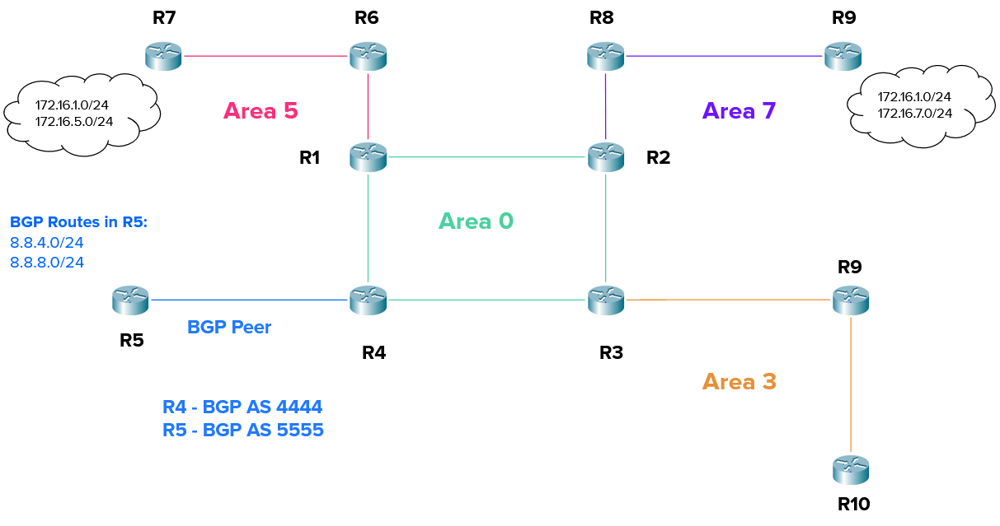

# 04.09. Передача маршрутной информации между различными протоколами маршрутизации - Лебедев Д.С.

  

### Подготовка к выполнению задания
В симуляторе EVE-NG сформирована и настроена сеть:  


<details>
<summary>Команды настройки маршрутизаторов</summary>

```sh
---R1
R1(config)#int e0/0
R1(config-if)#ip addr 192.168.10.1 255.255.255.0
R1(config-if)#no sh

R1(config-if)#int e0/1
R1(config-if)#ip addr 192.168.40.1 255.255.255.0
R1(config-if)#no sh

R1(config-if)#int e0/2
R1(config-if)#ip addr 192.168.55.1 255.255.255.0
R1(config-if)#no sh

R1(config-if)#router ospf 1
R1(config-router)#router-id 1.1.1.1
R1(config-router)#network 192.168.10.0 0.0.0.255 area 0
R1(config-router)#network 192.168.40.0 0.0.0.255 area 0
R1(config-router)#network 192.168.55.0 0.0.0.255 area 5


---R2
R2(config)#int e0/0
R2(config-if)#ip addr 192.168.10.2 255.255.255.0
R2(config-if)#no sh

R2(config-if)#int e0/1
R2(config-if)#ip addr 192.168.20.2 255.255.255.0
R2(config-if)#no sh

R2(config-if)#int e0/2
R2(config-if)#ip addr 192.168.77.2 255.255.255.0
R2(config-if)#no sh

R2(config-if)#router ospf 1
R2(config-router)#router-id 2.2.2.2
R2(config-router)#network 192.168.10.0 0.0.0.255 area 0
R2(config-router)#network 192.168.20.0 0.0.0.255 area 0
R2(config-router)#network 192.168.77.0 0.0.0.255 area 7
R2(config-router)#area 7 nssa no-summary


---R3
R3(config)#int e0/0
R3(config-if)#ip addr 192.168.30.3 255.255.255.0
R3(config-if)#no sh

R3(config-if)#int e0/1
R3(config-if)#ip addr 192.168.20.3 255.255.255.0
R3(config-if)#no sh

R3(config-if)#int e0/2
R3(config-if)#ip addr 192.168.33.3 255.255.255.0
R3(config-if)#no sh

R3(config-if)#router ospf 1
R3(config-router)#router-id 3.3.3.3
R3(config-router)#network 192.168.20.0 0.0.0.255 area 0
R3(config-router)#network 192.168.30.0 0.0.0.255 area 0
R3(config-router)#network 192.168.33.0 0.0.0.255 area 3
R3(config-router)#area 3 stub


---R4
R4(config)#int e0/0
R4(config-if)#ip addr 192.168.30.4 255.255.255.0

R4(config-if)#int e0/1
R4(config-if)#ip addr 192.168.40.4 255.255.255.0
R4(config-if)#no sh

R4(config-if)#int e0/2
R4(config-if)#ip addr 192.168.88.4 255.255.255.0
R4(config-if)#no sh

R4(config-if)#router ospf 1
R4(config-router)#router-id 4.4.4.4
R4(config-router)#network 192.168.30.0 0.0.0.255 area 0
R4(config-router)#network 192.168.40.0 0.0.0.255 area 0

R4(config-router)#router bgp 4444
R4(config-router)#bgp router-id 4.4.4.4
R4(config-router)#neighbor 192.168.88.5 remote-as 5555


---R5
R5(config)#int e0/0
R5(config-if)#ip addr 192.168.88.5 255.255.255.0
R5(config-if)#no sh

R5(config)#int loo884
R5(config-if)#ip addr 8.8.4.5 255.255.255.0
R5(config-if)#int loo888
R5(config-if)#ip addr 8.8.4.5 255.255.255.0

R5(config-if)#router bgp 5555
R5(config-router)#bgp router-id 5.5.5.5
R5(config-router)#neighbor 192.168.88.4 remote-as 4444
R5(config-router)#network 8.8.4.0 mask 255.255.255.0
R5(config-router)#network 8.8.8.0 mask 255.255.255.0

--R6
R6(config)#int e0/0
R6(config-if)#ip addr 192.168.55.6 255.255.255.0
R6(config-if)#no sh

R6(config-if)#int e0/1
R6(config-if)#ip addr 192.168.5.6 255.255.255.0
R6(config-if)#no sh

R6(config-if)#router ospf 1
R6(config-router)#router-id 6.6.6.6
R6(config-router)#network 192.168.55.0 0.0.0.255 area 5
R6(config-router)#network 192.168.5.0 0.0.0.255 area 5

---R7
R7(config)#int e0/0
R7(config-if)#ip addr 192.168.5.7 255.255.255.0
R7(config-if)#no sh

R7(config-if)#int loo161
R7(config-if)#ip addr 172.16.1.7 255.255.255.0
R7(config-if)#ip ospf network point-to-point

R7(config-if)#int loo165
R7(config-if)#ip addr 172.16.5.7 255.255.255.0
R7(config-if)#ip ospf network point-to-point

R7(config-if)#router ospf 1
R7(config-router)#router-id 7.7.7.7
R7(config-router)#network 192.168.5.0 0.0.0.255 area 5

---R8
R8(config)#int e0/0
R8(config-if)#ip addr 192.168.77.8 255.255.255.0
R8(config-if)#no sh

R8(config-if)#int e0/1
R8(config-if)#ip addr 192.168.7.8 255.255.255.0
R8(config-if)#no sh

R8(config-if)#router ospf 1
R8(config-router)#router-id 8.8.8.8
R8(config-router)#network 192.168.77.0 0.0.0.255 area 7
R8(config-router)#network 192.168.7.0 0.0.0.255 area 7
R8(config-router)#area 7 nssa no-summary

---R97
R97(config)#int e0/0
R97(config-if)#ip addr 192.168.7.97 255.255.255.0
R97(config-if)#no sh

R97(config-if)#int loo161
R97(config-if)#ip addr 172.16.1.97 255.255.255.0
R97(config-if)#ip ospf network point-to-point

R97(config-if)#int loo167
R97(config-if)#ip addr 172.16.7.97 255.255.255.0
R97(config-if)#ip ospf network point-to-point

R97(config-if)#router ospf 1
R97(config-router)#router-id 97.97.97.97
R97(config-router)#network 192.168.7.0 0.0.0.255 area 7
R97(config-router)#area 7 nssa no-summary

---R93
R93(config)#int e0/0
R93(config-if)#ip addr 192.168.33.93 255.255.255.0
R93(config-if)#no sh

R93(config-if)#int e0/1
R93(config-if)#ip addr 192.168.3.93 255.255.255.0
R93(config-if)#no sh

R93(config-if)#router ospf 1
R93(config-router)#router-id 93.93.93.93
R93(config-router)#network 192.168.33.0 0.0.0.255 area 3
R93(config-router)#network 192.168.3.0 0.0.0.255 area 3
R93(config-router)#area 3 stub

---R10
R10(config)#int e0/0
R10(config-if)#ip addr 192.168.3.10 255.255.255.0
R10(config-if)#no sh

R10(config-if)#router ospf 1
R10(config-router)#router-id 10.10.10.10
R10(config-router)#network 192.168.3.0 0.0.0.255 area 3
R10(config-router)#area 3 stub
```
</details>

### Задание 1.
> На нашей топологии R4 получает маршруты ( 8.8.4.0/24, 8.8.8.0/24) по протоколу BGP.
> Настроено распределение маршрутов из BGP в OSPF на маршрутизаторе R4. R4 получает маршруты ( 8.8.4.0/24, 8.8.8.0/24).
> - Area 3 - тупиковая ( stub ) зона
> - Area 5 - обычная зона
> - Area 7 - Totally NSSA зона
> 1. При помощи какой команды можно настроить импорт маршрутов из BGP в OSPF и на каком маршрутизаторе? Напишите маршрутизатор и команду полностью.
> 2. Какие типы LSA будут отправлены в каждую из зон (Area 0,3,5,7) для отправки информации о импортированных маршрутах (8.8.4.0/24, 8.8.8.0/24)? Напишите список зон с указанием типов LSA.
> *Приведите ответы на вопросы в свободной форме*

*Ответ:*  
1. Импорт маршрутов из BGP в OSPF настраивается на роутере R4, являющимся ASBR-роутером.  

```sh
R4(config)#router ospf 1
R4(config-router)#redistribute bgp 4444 subnets
```

2. После настройки в различных зонах OSPF регистрируются следующие LSA, `show ip ospf database`:
- AREA 0 (На примере R2): `LSA 5` - External LSA. LSA пятого типа описывают сети, импортированные в OSPF-процесс ASBR-маршрутизатором. Генерируются им же и распространяются по всему OSPF-домену.  
  
- AREA 3 (На примере R93): тупиковая зона (stub), нет LSA, касающихся сегмента с BGP. Не принимает информацию о внешних маршрутах для автономной системы.
- AREA 5 (На примере R6): `LSA 5` - External LSA, `LSA 4` - Summary ASB Link States. Описывают местонахождение ASBR-маршрутизатора.  
  
- AREA 7 (На примере R8): нет LSA, касающихся сегмента с BGP. Не принимает информацию о внешних маршрутах для автономной системы и маршруты из других зон.
### Задание 2.
> На нашей топологии в OSPF импортированы следующие маршруты:
> - (8.8.4.0/24, 8.8.8.0/24) из BGP
> - 172.16.1.0/24, 172.16.5.0/24 из Area 5 (обычная зона)
> - 172.16.1.0/24, 172.16.7.0/24 из Area 7 (Totally NSSA зона)
> 1. Какой тип зоны необходимо задать для Area 3, чтобы размер LSDB был минимальным? Какие типы LSA будут на маршрутизаторах в Area 3, не учитывая LSA 1 и 2?
> 2. Какие внешние маршруты будут установлены в таблицу маршрутизации на маршрутизаторах в Area 3?
> *Приведите ответы на вопросы в свободной форме*

*Ответ:*  
1. Можно изменить тип зоны с STUB на Totally STUB. В этом случае маршрутизаторы не принимают информацию о внешних маршрутах для автономной системы и маршруты из других зон. Для передачи используется маршрут по умолчанию. В Area 3 маршрутизаторы будут иметь только LSA Type 3 (Summary LSA) - для маршрутов внутри OSPF

Состояние при STUB:  
  

Состояние при Totally STUB:  
  

2. Остается только полученный от ABR маршрут по умолчанию.
### Задание 3.
> На нашей топологии в OSPF импортированы только следующие маршруты:
> - 172.16.1.0/24, 172.16.5.0/24 из Area 5 (обычная зона)
> - 172.16.1.0/24, 172.16.7.0/24 из Area 7 (Totally NSSA зона)
> Необходимо импортировать только данные маршруты с метрикой 50 в протокол BGP, чтобы они оказались в таблице на маршрутизаторе R5.
> 1. Какую команду и на каком маршрутизаторе необходимо использовать для выполнения данной задачи?
> 2. С помощью какого параметра и каким образом можно проверить на R5, что данные маршруты импортированы корректно?
> *Приведите ответы на вопросы в свободной форме*

*Ответ:*  
На R7 и R97 включить в процесс редистрибуции OSPF сети подключённых интерфейсов (connected):  
```sh
R(config)#router ospf 1
R(config-router)#redistribute connected metric 50
```

На ASBR роутере R4 настроить импорт external маршрутов из OSPF в BGP:  
```sh
R4(config)#router bgp 4444
R4(config-router)#redistribute ospf 1 match external
```

Проверяем появившиеся маршруты на R5 командой `show ip route bgp`:  

### Задание 4.
> На нашей топологии настроены следующие зоны:
> - Area 3 - тупиковая (stub) зона
> - Area 5 - обычная зона
> - Area 7 - Totally NSSA зона
> В Area 5 на маршрутизаторе R7 и в Area 7 есть статический маршрут до сети 172.16.1.0/24. Необходимо импортировать данный маршрут в обоих зонах и при этом необходимо учитывать метрику всех линков, которые будут использоваться.
> 1. При помощи какой команды на R7 и R9 можно выполнить данную задачу?
> 2. Какие типы LSA в зонах (Area 0, 3, 5, 7) будут использованы для передачи информации об этом маршруте?
> *Приведите ответы на вопросы в свободной форме*

*Ответ:*  
1. На маршрутизаторах R7 и R97 можно использовать следующие команды в режиме конфигурации OSPF:

```sh
R(config)#router ospf 1
R(config-router)#redistribute connected subnets metric-type 1
```

С флагом `metric-type 1` будет использоваться метрика, основанная на стоимости маршрутов в OSPF.  Маршруты подключенных сетей импортируются в протокол OSPF с учётом метрики всех линков.

2. Типы LSA в зонах для данных маршрутов:  

`sh ip os database`

- AREA 0: `LSA 5` - External LSA;
- AREA 3 (stub): нет LSA, касающихся данных маршрутов;
- AREA 5: `LSA 5` - External LSA;
- AREA 7 (totally nssa): нет LSA, касающихся маршрутов из других зон. Для остальных маршрутов - `LSA 7` (NSSA External LSA). LSA 7 аналогично по содержанию LSA 5, но используется только в NSSA-зоне.