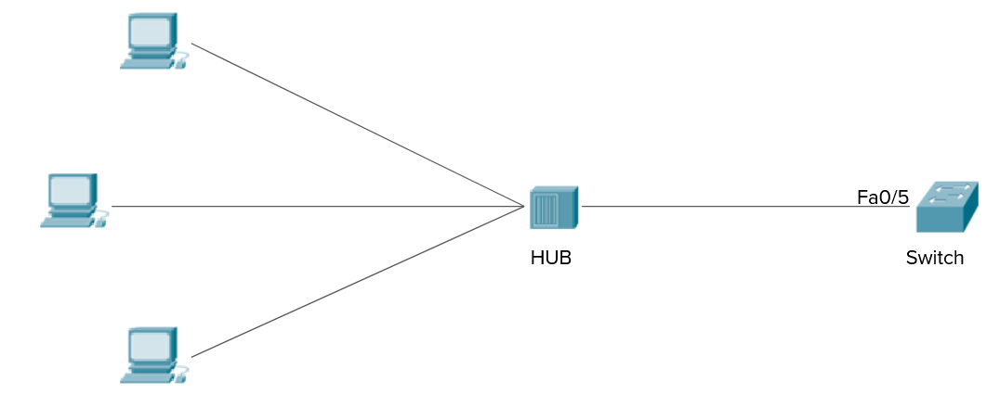
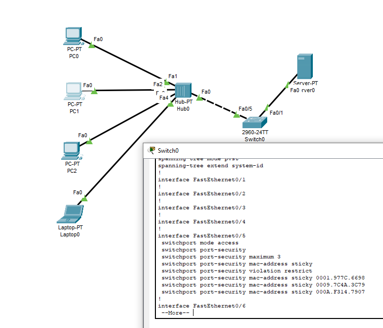
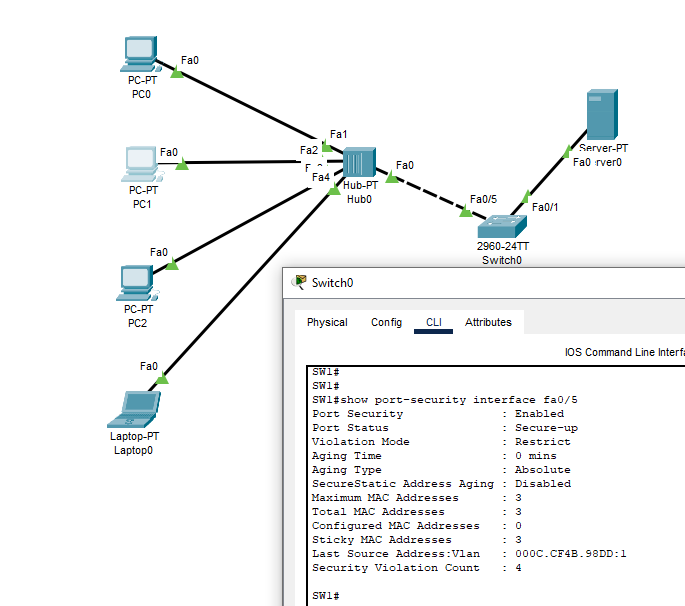
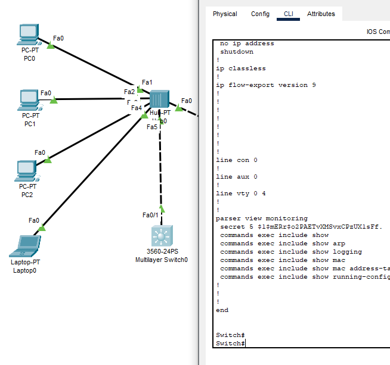

### Задание 1.
> На картинке изображена схема подключения хаба к свитчу. К хабу одновременно может подключаться не более 3 трех устройств. Если будет обнаружено, что подключено более 3 устройств, то необходимо запретить трафик с дополнительных устройств и отправить уведомление о нарушении.
>    
> 
> Как необходимо настроить порт Fa0/5 на свитче?
> *Отправьте список команд.*

*Ответ:*  
Для настройки порта fa0/5 на коммутаторе используются следующие команды:
```sh
SW1(config-if)#switchport mode access
SW1(config-if)#switchport port-security
SW1(config-if)#switchport port-security maximum 3
SW1(config-if)#switchport port-security mac-address sticky
SW1(config-if)#switchport port-security violation restrict
```

  

  
### Задание 2.
> Для отдела мониторинга необходимо настроить view monitoring, в котором можно будет делать следующие операции:
> - Смотреть логи устройства
> - Смотреть таблицу MAC адресов
> - Смотреть таблицу arp
> - Смотреть полную конфигурацию свитча
> *Отправьте конфигурацию parser view monitoring.*

*Ответ:*  
Для настройки параметров view monitoring используются следующие команды:  
```sh
Switch(config)#enable password cisco

Switch#enable view
Switch#conf t
Switch(config)#parser view monitoring
Switch(config-view)#secret pass123123
Switch(config-view)#commands exec include show logging
Switch(config-view)#commands exec include show mac address-table
Switch(config-view)#commands exec include show arp
Switch(config-view)#commands exec include show running-config
```

