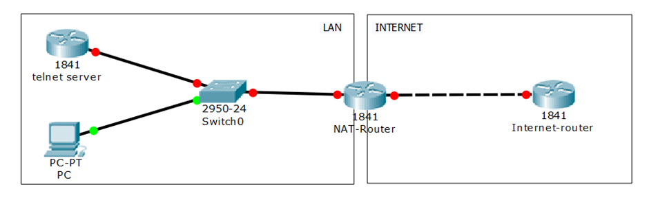
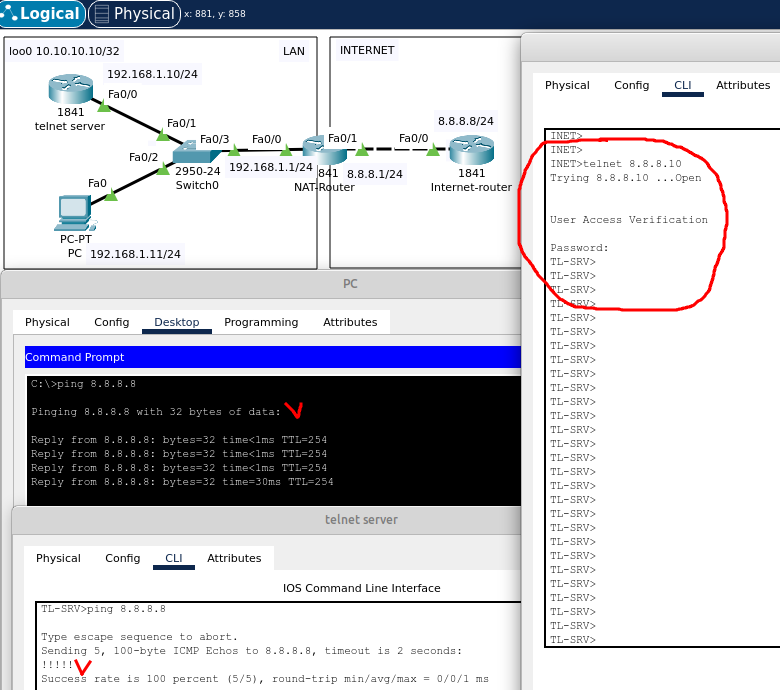

# 05.04. Преобразование сетевых адресов (NAT) - Лебедев Д.С.
## Лабораторная работа "Настройка статического NAT и PAT overload"
> Схема сети  
>   
> 
> Настройки оборудования:**

```sh
1841 telnet server
loopback0 10.10.10.10/32
Fastethernet0/0 192.168.1.10/24
ip route 0.0.0.0 0.0.0.0 192.168.1.1
 
PC
Fastethernet0 192.168.1.11/24
ip route 0.0.0.0 0.0.0.0 192.168.1.1
 
NAT-Router
Fastethernet0/0 192.168.1.1/24
Fastethernet0/1 8.8.8.1/24
 
Internet-router
Fastethernet0/0 8.8.8.8/24
```

> Перенесите топологию в PT, настройте оборудование по предложенным данным.  
> **Важно!**  
> На маршрутизаторе Internet-router для нужной работы сети роутинг настраивать не нужно.

### Задание 1.
> Настроить PAT overload для всех внутренних хостов LAN через внешний интерфейс маршрутизатора NAT-Router. С хостов должен пинговаться 8.8.8.8.  
> *В качестве ответа приложите вывод команды "sh run" с маршрутизатора NAT-Router.*

*Ответ:*  
<details>
<summary>Начальная настройка сети</summary>

```bash
---telnet-server---
TL-SRV(config)#int loo0
TL-SRV(config-if)#ip addr 10.10.10.10 255.255.255.255

TL-SRV(config-if)#int fa0/0
TL-SRV(config-if)#ip addr 192.168.1.10 255.255.255.0
TL-SRV(config-if)#no sh

TL-SRV(config-if)#exi
TL-SRV(config)#ip route 0.0.0.0 0.0.0.0 192.168.1.1

---- Настройка сервера Telnet ---
TL-SRV(config)#line vty 0 4
TL-SRV(config-line)#login
TL-SRV(config-line)#password cisco
TL-SRV(config-line)#service password-encryption


---NAT-Router---
NAT(config)#int fa0/0
NAT(config-if)#ip addr 192.168.1.1 255.255.255.0
NAT(config-if)#no sh

NAT(config)#int fa0/1
NAT(config-if)#ip addr 8.8.8.1 255.255.255.0
NAT(config-if)#no sh

NAT(config-if)#exi
NAT(config)#ip route 0.0.0.0 0.0.0.0 8.8.8.8
NAT(config)#ip route 10.10.10.10 255.255.255.255 fa0/0

---Internet-Router---
INET(config)#int fa0/0
INET(config-if)#ip addr 8.8.8.8 255.255.255.0
INET(config-if)#no sh
```
</details>

Команды настройки `PAT overload` для всех внутренних хостов:  
```sh
NAT(config)#access-list 100 permit ip 192.168.1.0 0.0.0.255 any
NAT(config)#ip nat inside source list 100 interface fa0/1 overload
```

Результат:  
  

<details>
<summary>Вывод команды просмотра конфигурации</summary>

```bash
NAT#sh run
Building configuration...

Current configuration : 808 bytes
!
version 12.4
no service timestamps log datetime msec
no service timestamps debug datetime msec
no service password-encryption
!
hostname NAT
!
!
!
!
!
!
!
!
ip cef
no ipv6 cef
!
!
!
!
!
!
!
!
!
!
!
!
spanning-tree mode pvst
!
!
!
!
!
!
interface FastEthernet0/0
 ip address 192.168.1.1 255.255.255.0
 ip nat inside
 duplex auto
 speed auto
!
interface FastEthernet0/1
 ip address 8.8.8.1 255.255.255.0
 ip nat outside
 duplex auto
 speed auto
!
interface Vlan1
 no ip address
 shutdown
!
ip nat inside source list 100 interface FastEthernet0/1 overload
ip classless
ip route 0.0.0.0 0.0.0.0 8.8.8.8 
ip route 10.10.10.10 255.255.255.255 FastEthernet0/0 
!
ip flow-export version 9
!
!
access-list 100 permit ip 192.168.1.0 0.0.0.255 any
!
!
!
!
!
!
line con 0
!
line aux 0
!
line vty 0 4
 login
!
!
!
end
```
</details>

### Задание 2.
> Обеспечьте доступ с Internet-router к telnet-server(10.10.10.10) по протоколу telnet, не настраивая маршрутизацию на Internet-router. Доступ из LAN к 8.8.8.8 должен сохраниться.  
> *В качестве ответа приложите вывод команды "sh run" с маршрутизатора NAT-Router.*

*Ответ:*  
Для выполнения задания необходимо настроить проброс порта `Telnet` из внешней сети в локальную. В качестве `inside global` взят адрес, отличный от адреса интерфейса маршрутизатора:  
```sh
NAT(config)#ip nat inside source static tcp 10.10.10.10 23 8.8.8.10 23
```

В результате появляется возможность организовать сеанс `Telnet` из внешней сети:  
  

<details>
<summary>Вывод конфигурации</summary>

```bash
NAT#sh run
Building configuration...

Current configuration : 868 bytes
!
version 12.4
no service timestamps log datetime msec
no service timestamps debug datetime msec
no service password-encryption
!
hostname NAT
!
!
!
!
!
!
!
!
ip cef
no ipv6 cef
!
!
!
!
!
!
!
!
!
!
!
!
spanning-tree mode pvst
!
!
!
!
!
!
interface FastEthernet0/0
 ip address 192.168.1.1 255.255.255.0
 ip nat inside
 duplex auto
 speed auto
!
interface FastEthernet0/1
 ip address 8.8.8.1 255.255.255.0
 ip nat outside
 duplex auto
 speed auto
!
interface Vlan1
 no ip address
 shutdown
!
ip nat inside source list 100 interface FastEthernet0/1 overload
ip nat inside source static tcp 10.10.10.10 23 8.8.8.10 23 
ip classless
ip route 0.0.0.0 0.0.0.0 8.8.8.8 
ip route 10.10.10.10 255.255.255.255 FastEthernet0/0 
!
ip flow-export version 9
!
!
access-list 100 permit ip 192.168.1.0 0.0.0.255 any
!
!
!
!
!
!
line con 0
!
line aux 0
!
line vty 0 4
 login
!
!
!
end
```
</details>

> Единственное. что я бы поправил:
> ip route 10.10.10.10 255.255.255.255 fa0/0
> В сетях ethernet лучше указывать в качестве next-hop ip-адрес, а не имя интерфейса.