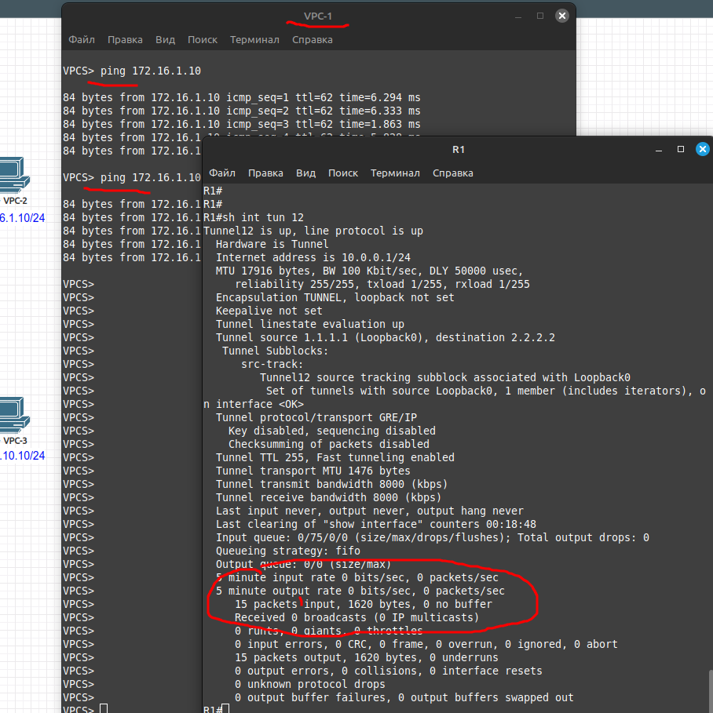

# 05.05. Построение виртуальных частных сетей. Протоколы обеспечения защиты передаваемых данных - Лебедев Д.С.
### Задание 1.
> На картинке изображена схема сети, состоящих из трех офисов.
> Необходимо создать туннели между каждым офисом.
>    
> Между R1-R2 создать ВПН канал и обеспечить связность между клиентами маршрутизаторов по зашифрованному каналу со следующими настройками:
> 
> ISAKMP(Ikev1) Phase 1 протоколы:
> - шифрование 3des
> - хеширование md5
> - аутентификация pre-share
> - Диффи-Хелманн группа: 2
> - время жизни 3600 секунд
> 
> IPSEC Transform-set:
> - ESP: esp-3des
> - AH: ah-md5-hmac
> - Mode: Tunnel
> 
> Между R1-R3 создать ВПН канал и обеспечить связность между клиентами маршрутизаторов по зашифрованному каналу со следующими настройками:
> - ISAKMP(Ikev1) Phase 1 протоколы:
> - шифрование aes 256
> - хеширование sha512
> - аутентификация pre-share
> - Диффи-Хелманн группа: 5
> - время жизни 3600 секунд
> 
> IPSEC Transform-set:
> - ESP: esp-aes 256
> - ESP-AH: esp-sha512-hmac
> - AH: ah-sha256-hmac
> - Mode: Tunnel
> 
> Между R2-R3 создать ВПН канал и обеспечить связность между клиентами маршрутизаторов по зашифрованному каналу со следующими настройками:
> 
> ISAKMP(Ikev1) Phase 1 протоколы:
> - шифрование aes 256
> - хеширование sha512
> - аутентификация pre-share
> - Диффи-Хелманн группа: 5
> - время жизни 3600 секунд
> 
> IPSEC Transform-set:
> - ESP: esp-aes 256
> - ESP-AH: esp-sha256-hmac
> - AH: ah-sha-hmac
> - Mode: Tunnel
> 
> *Отправьте полный список конфигураций и политик. Требуется, чтоб все три туннеля могли работать одновременно.*

*Ответ:*  
Для выполнения задания в симуляторе eve-ng собрана схема:


<details>
<summary>Начальная конфигурация маршрутизаторов</summary>

```bash
--R1--
R1(config)#int e0/0
R1(config-if)#ip addr 100.0.0.1 255.255.255.0
R1(config-if)#no sh

R1(config)#int e0/1                       
R1(config-if)#ip addr 192.168.5.1 255.255.255.0
R1(config-if)#no sh

R1(config)#ip route 172.16.1.0 255.255.255.0 100.0.0.2
R1(config)#ip route 10.10.10.0 255.255.255.0 100.0.0.3


--R2--
R2(config)#int e0/0
R2(config-if)#ip addr 100.0.0.2 255.255.255.0
R2(config-if)#no sh

R2(config-if)#int e0/1
R2(config-if)#ip addr 172.16.1.1 255.255.255.0
R2(config-if)#no sh

R2(config)#ip route 192.168.5.0 255.255.255.0 100.0.0.1
R2(config)#ip route 10.10.10.0 255.255.255.0 100.0.0.3


--R3--
R3(config)#int e0/0
R3(config-if)#ip addr 100.0.0.3 255.255.255.0
R3(config-if)#no sh

R3(config-if)#int e0/1
R3(config-if)#ip addr 10.10.10.1 255.255.255.0
R3(config-if)#no sh

R3(config)#ip route 192.168.5.0 255.255.255.0 100.0.0.1
R3(config)#ip route 172.16.1.0 255.255.255.0 100.0.0.2
```
</details>

Для получения результата в соответствии с заданием необходимо выполнить следующие настройки:

```sh

==== R1 ====

R1(config)#crypto isakmp policy 20 // политики для туннеля к 172.16.1.0/24
R1(config-isakmp)#encryption 3des
R1(config-isakmp)#hash md5
R1(config-isakmp)#authentication pre-share
R1(config-isakmp)#group 2
R1(config-isakmp)#lifetime 3600
--
R1(config)#crypto isakmp policy 30 // политики для туннеля к 10.10.10.0/24
R1(config-isakmp)#encryption aes 256
R1(config-isakmp)#hash sha512
R1(config-isakmp)#authentication pre-share
R1(config-isakmp)#group 5
R1(config-isakmp)#lifetime 3600


R1(config)#crypto isakmp key CISCO address 100.0.0.2 // пароль для пира R2
R1(config)#crypto isakmp key CISCO address 100.0.0.3 // пароль для пира R3

R1(config)#crypto ipsec transform-set TSET20 ah-md5-hmac esp-3des // вторая фаза шифрования для туннеля к 172.16.1.0/24
R1(cfg-crypto-trans)# mode tunnel

R1(config)#crypto ipsec transform-set TSET30 ah-sha256-hmac esp-aes 256  // вторая фаза шифрования для туннеля к 10.10.10.0/24
R1(cfg-crypto-trans)#mode tunnel

R1(config)#ip access-list extended VPN
R1(config-ext-nacl)#permit ip 192.168.5.0 0.0.0.255 172.16.1.0 0.0.0.255 // ACL для туннеля к 172.16.1.0/24, трафик

R1(config)#ip access-list extended VPN30
R1(config-ext-nacl)#permit ip 192.168.5.0 0.0.0.255 10.10.10.0 0.0.0.255 // ACL для туннеля к 10.10.10.0/24, трафик


R1(config)#crypto map CMAP 20 ipsec-isakmp // криптомап (трафик + пир R2 + шифрование)
R1(config-crypto-map)#match address VPN
R1(config-crypto-map)#set transform-set TSET20
R1(config-crypto-map)#set peer 100.0.0.2
--
R1(config)#crypto map CMAP 30 ipsec-isakmp // криптомап (трафик + пир R3 + шифрование)
R1(config-crypto-map)#match address VPN30
R1(config-crypto-map)#set transform-set TSET30
R1(config-crypto-map)#set peer 100.0.0.3

R1(config)#int e0/0
R1(config-if)#crypto map CMAP // применяем криптомап к интерфейсу


==== R2 ====

R2(config)#crypto isakmp policy 10
R2(config-isakmp)#encryption 3des
R2(config-isakmp)#hash md5
R2(config-isakmp)#authentication pre-share
R2(config-isakmp)#group 2
R2(config-isakmp)#lifetime 3600

--
R2(config)#crypto isakmp policy 30
R2(config-isakmp)#encryption aes 256
R2(config-isakmp)#hash sha512
R2(config-isakmp)#authentication pre-share
R2(config-isakmp)#group 5
R2(config-isakmp)#lifetime 3600


R2(config)#crypto isakmp key CISCO address 100.0.0.1
R2(config)#crypto isakmp key CISCO address 100.0.0.3


R2(config)#crypto ipsec transform-set TSET10 ah-md5-hmac esp-3des
R2(cfg-crypto-trans)#mode tunnel
--
R2(config)#crypto ipsec transform-set TSET30 ah-sha-hmac esp-aes 256
R2(cfg-crypto-trans)#mode tunnel


R2(config)#ip access-list extended VPN
R2(config-ext-nacl)#permit ip 172.16.1.0 0.0.0.255 192.168.5.0 0.0.0.255
--
R2(config)#ip access-list extended VPN30
R2(config-ext-nacl)#permit ip 172.16.1.0 0.0.0.255 10.10.10.0 0.0.0.255


R2(config)#crypto map CMAP 10 ipsec-isakmp
R2(config-crypto-map)#match address VPN
R2(config-crypto-map)#set transform-set TSET10
R2(config-crypto-map)#set peer 100.0.0.1
--
R2(config)#crypto map CMAP 30 ipsec-isakmp
R2(config-crypto-map)#match address VPN30
R2(config-crypto-map)#set transform-set TSET30
R2(config-crypto-map)#set peer 100.0.0.3

R2(config)#int e0/0
R2(config-if)#crypto map CMAP


==== R3 ====

R3(config)#crypto isakmp policy 10
R3(config-isakmp)#encryption aes 256
R3(config-isakmp)#hash sha512
R3(config-isakmp)#authentication pre-share
R3(config-isakmp)#group 5
R3(config-isakmp)#lifetime 3600
--
R3(config)#crypto isakmp policy 20
R3(config-isakmp)#encryption aes 256
R3(config-isakmp)#hash sha512
R3(config-isakmp)#authentication pre-share
R3(config-isakmp)#group 5
R3(config-isakmp)#lifetime 3600

R3(config)#crypto isakmp key CISCO address 100.0.0.1
--
R3(config)#crypto isakmp key CISCO address 100.0.0.2


R3(config)#crypto ipsec transform-set TSET10 ah-sha-hmac esp-aes esp-sha-hmac
R3(cfg-crypto-trans)#mode tunnel
--
R3(config)#crypto ipsec transform-set TSET20 ah-sha-hmac esp-aes 256
R3(cfg-crypto-trans)#mode tunnel


R3(config)#ip access-list extended VPN
R3(config-ext-nacl)#permit ip 10.10.10.0 0.0.0.255 192.168.5.0 0.0.0.255
--
R3(config)#ip access-list extended VPN20
R3(config-ext-nacl)#permit ip 10.10.10.0 0.0.0.255 172.16.1.0 0.0.0.255


R3(config)#crypto map CMAP 10 ipsec-isakmp
R3(config-crypto-map)#match address VPN
R3(config-crypto-map)#set transform-set TSET10
R3(config-crypto-map)#set peer 100.0.0.1
--
R3(config)#crypto map CMAP 20 ipsec-isakmp
R3(config-crypto-map)#match address VPN20
R3(config-crypto-map)#set transform-set TSET20
R3(config-crypto-map)#set peer 100.0.0.2

R3(config)#int e0/0
R3(config-if)#crypto map CMAP
```

Результат настройки маршрутизаторов:


### Задание 2.
> По топологии из задания 1 построить туннели инкапсуляции между маршрутизаторами.
> 1. Пакеты в инкапсуляции должны использовать адреса Loopback1 интерфейсов в качестве source и destination.
> 2. Трафик между клиентами надо инкапсулировать в данные туннели.
> *Отправьте список маршрутизаторов со списком команд, необходимых для выполнения.*

*Ответ:*  
Для выполнения работы в CPT собрана схема:



На маршрутизаторах выполнены следующие настройки:

```sh

==== R1 ====
R1(config)#int tunnel 12
R1(config-if)#ip addr 10.0.0.1 255.255.255.0
R1(config-if)#tunnel source Loopback 0
R1(config-if)#tunnel destination 2.2.2.2
--
R1(config)#int tunnel 13
R1(config-if)#ip addr 10.0.1.1 255.255.255.0
R1(config-if)#tunnel source Loopback 0
R1(config-if)#tunnel destination 3.3.3.3

== Маршрутизация ==
R1(config)#ip route 2.2.2.2 255.255.255.255 100.0.0.2
R1(config)#ip route 172.16.1.0 255.255.255.0 2.2.2.2
--
R1(config)#ip route 3.3.3.3 255.255.255.255 100.0.0.3
R1(config)#ip route 10.10.10.0 255.255.255.0 3.3.3.3


==== R2 ====
R2(config)#int tunnel 21
R2(config-if)#ip addr 10.0.0.2 255.255.255.0
R2(config-if)#tunnel source Loopback 0
R2(config-if)#tunnel destination 1.1.1.1
--
R2(config)#int tunnel 23
R2(config-if)#ip addr 10.0.1.2 255.255.255.0
R2(config-if)#tunnel source Loopback 0
R2(config-if)#tunnel destination 3.3.3.3

== Маршрутизация ==
R2(config)#ip route 1.1.1.1 255.255.255.255 100.0.0.1
R2(config)#ip route 192.168.5.0 255.255.255.0 1.1.1.1
--
R2(config)#ip route 3.3.3.3 255.255.255.255 100.0.0.3
R2(config)#ip route 10.10.10.0 255.255.255.0 3.3.3.3


==== R3 ====
R3(config)#int tunnel 31
R3(config-if)#ip addr 10.0.0.3 255.255.255.0
R3(config-if)#tunnel source Loopback 0
R3(config-if)#tunnel destination 1.1.1.1
--
R3(config)#int tunnel 32
R3(config-if)#ip addr 10.0.1.3 255.255.255.0
R3(config-if)#tunnel source Loopback 0
R3(config-if)#tunnel destination 2.2.2.2

== Маршрутизация ==
R3(config)#ip route 1.1.1.1 255.255.255.255 100.0.0.1
R3(config)#ip route 192.168.5.0 255.255.255.0 1.1.1.1
--
R3(config)#ip route 2.2.2.2 255.255.255.255 100.0.0.2
R3(config)#ip route 172.16.1.0 255.255.255.0 2.2.2.2
```
