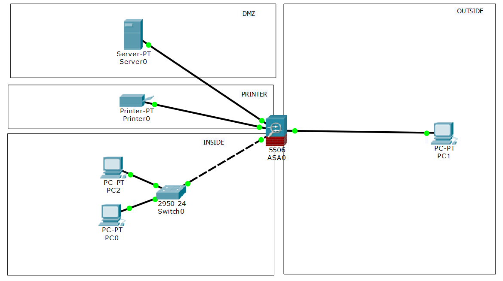
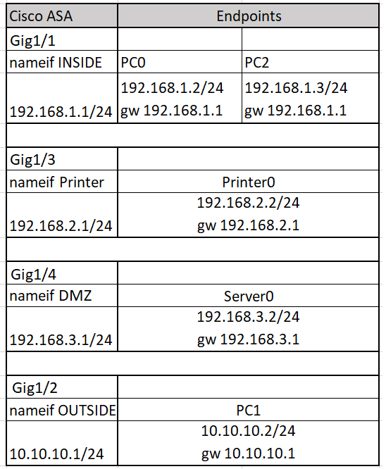
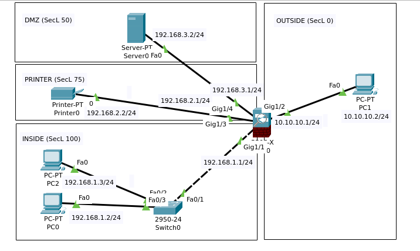

# 05.06. Межсетевое экранирование на основе зон, statefull/stateless packet inspection - Лебедев Д.С.

## Лабораторная работа "Межсетевое экранирование на основе зон, stateful/stateless packet inspection"

> Лабораторная работа заключается в настройке МСЭ компании. ЛВС логически разделена на пользовательскую подсеть, подсеть принтеров и подсеть с сервером DMZ. Для каждой из этих зон расписаны правила доступа в соседние. Схема сети 
>  
> 
> Настройки оборудования:
> 
> 
> Перенесите топологию в PT, настройте оборудование по предложенным данным.
> 
> **Задание**
> От службы безопасности были переданы требования для ограничения сетевого доступа между различными подсетями:
> 
> 1. Разрешить прохождение только ICMP трафика из INSIDE в OUTSIDE, в обратную сторону разрешить ответный трафик;
> 2. Разрешить прохождение только HTTP-трафика из INSIDE в DMZ, в обратную сторону разрешить ответный трафик;
> 3. Разрешить прохождение только ICMP-трафика из INSIDE в PRINTER, в обратную сторону разрешить ответный трафик;
> 4. Из OUTSIDE разрешить инициировать сессии в DMZ по 80 TCP порту, в INSIDE и PRINTER разрешить только ответные пакеты;
> 5. Из PRINTER запретить инициировать трафик во все остальные зоны;
> 6. Из DMZ разрешить инициировать трафик в OUTSIDE по ICMP, в INSIDE и PRINTER разрешить только ответные пакеты.
> 
> Необходимо, используя полученные знания о межсетевом экранировании на основе зон, stateful и stateless инспекции, сконфигурировать эти правила на МСЭ и выполнить проверку средствами Packet tracer.
> 
> <sub>Cisco PT имеет баг в части настройки МСЭ: политику по-умолчанию нельзя редактировать. Поэтому чтобы инспекция icmp нормально работала, удалите политику по умолчанию и создайте новую: no service-policy global_policy global policy-map test class inspection_default inspect http inspect icmp service-policy test global</sub>
> 
> *В качестве ответа приложите вывод команды "sh run" с МСЭ*

*Ответ:*  

В симуляторе CPT настроена схема:



Создание и применение своей политики инспектирования:

```sh
ciscoasa(config)#policy-map test
ciscoasa(config-pmap)#class inspection_default
ciscoasa(config-pmap-c)#inspect http
ciscoasa(config-pmap-c)#inspect icmp
ciscoasa(config-pmap-c)#service-policy test global
```

Настройка интерфейсов с соответствующими `security-level`

```sh
ciscoasa(config)#int gi1/1
ciscoasa(config-if)#nameif INSIDE
ciscoasa(config-if)#security-level 100
ciscoasa(config-if)#ip address 192.168.1.1 255.255.255.0
ciscoasa(config-if)#no sh

ciscoasa(config-if)#int gi1/2
ciscoasa(config-if)#nameif OUTSIDE
ciscoasa(config-if)#ip address 10.10.10.1 255.255.255.0
ciscoasa(config-if)#no sh

ciscoasa(config-if)#int gi1/3
ciscoasa(config-if)#nameif PRINTER
ciscoasa(config-if)#security-level 75
ciscoasa(config-if)#ip address 192.168.2.1 255.255.255.0
ciscoasa(config-if)#no sh

ciscoasa(config-if)#int gi1/4
ciscoasa(config-if)#nameif DMZ
ciscoasa(config-if)#security-level 50
ciscoasa(config-if)#ip address 192.168.3.1 255.255.255.0
ciscoasa(config-if)#no sh
```

Настройка ACL

```sh
-- 1. PING из INSIDE в OUTSIDE
ciscoasa(config)#access-list INSIDE extended permit icmp 192.168.1.0 255.255.255.0 10.10.10.0 255.255.255.0

-- 2. HTTP из INSIDE в DMZ
ciscoasa(config)#access-list INSIDE extended permit tcp 192.168.1.0 255.255.255.0 192.168.3.0 255.255.255.0 eq www

-- 3. PING из INSIDE в PRINTER
ciscoasa(config)#access-list INSIDE extended permit icmp 192.168.1.0 255.255.255.0 192.168.2.0 255.255.255.0

-- 4. HTTP из OUTSIDE в DMZ
ciscoasa(config)#access-list OUTSIDE extended permit tcp 10.10.10.0 255.255.255.0 192.168.3.0 255.255.255.0 eq www

-- 5. Запрет трафика от PRINTER во все зоны --
ciscoasa(config)#access-list PRINTER extended deny ip any any

-- 6. PING из DMZ в OUTSIDE
ciscoasa(config)#access-list DMZ extended permit icmp 192.168.3.0 255.255.255.0 10.10.10.0 255.255.255.0

---
ciscoasa(config)#access-group INSIDE in interface INSIDE
ciscoasa(config)#access-group OUTSIDE in interface OUTSIDE
ciscoasa(config)#access-group PRINTER in interface PRINTER
ciscoasa(config)#access-group DMZ in interface DMZ
```

<details>
<summary>Конфигурация ASA</summary>

```sh
ASA Version 9.6(1)
!
hostname ciscoasa
domain-name wr
names
!
interface GigabitEthernet1/1
 nameif INSIDE
 security-level 100
 ip address 192.168.1.1 255.255.255.0
!
interface GigabitEthernet1/2
 nameif OUTSIDE
 security-level 0
 ip address 10.10.10.1 255.255.255.0
!
interface GigabitEthernet1/3
 nameif PRINTER
 security-level 75
 ip address 192.168.2.1 255.255.255.0
!
interface GigabitEthernet1/4
 nameif DMZ
 security-level 50
 ip address 192.168.3.1 255.255.255.0
!
interface GigabitEthernet1/5
 no nameif
 no security-level
 no ip address
 shutdown
!
interface GigabitEthernet1/6
 no nameif
 no security-level
 no ip address
 shutdown
!
interface GigabitEthernet1/7
 no nameif
 no security-level
 no ip address
 shutdown
!
interface GigabitEthernet1/8
 no nameif
 no security-level
 no ip address
 shutdown
!
interface Management1/1
 management-only
 no nameif
 no security-level
 no ip address
 shutdown
!
!
!
access-list OUTSIDE extended permit tcp 10.10.10.0 255.255.255.0 192.168.3.0 255.255.255.0 eq www
access-list PRINTER extended deny ip any any
access-list INSIDE extended permit icmp 192.168.1.0 255.255.255.0 10.10.10.0 255.255.255.0
access-list INSIDE extended permit icmp 192.168.1.0 255.255.255.0 192.168.2.0 255.255.255.0
access-list INSIDE extended permit tcp 192.168.1.0 255.255.255.0 192.168.3.0 255.255.255.0 eq www
access-list DMZ extended permit icmp 192.168.3.0 255.255.255.0 10.10.10.0 255.255.255.0
!
!
access-group OUTSIDE in interface OUTSIDE
access-group PRINTER in interface PRINTER
access-group INSIDE in interface INSIDE
access-group DMZ in interface DMZ
!
!
class-map inspection_default
 match default-inspection-traffic
!
policy-map type inspect dns preset_dns_map
 parameters
  message-length maximum 512
policy-map global_policy
 class inspection_default
  inspect dns preset_dns_map
  inspect ftp 
  inspect tftp 
policy-map test
 class inspection_default
  inspect http 
  inspect icmp 
!
service-policy test global
!
telnet timeout 5
ssh timeout 5
```
</details>

Не учтенные в настройках ACL правила прохождения трафика (по заданию) должны регламентироваться правилами инспекции ICMP и HTTP в политике по умолчанию и настройкой `security-level` соответствующих интерфейсов.