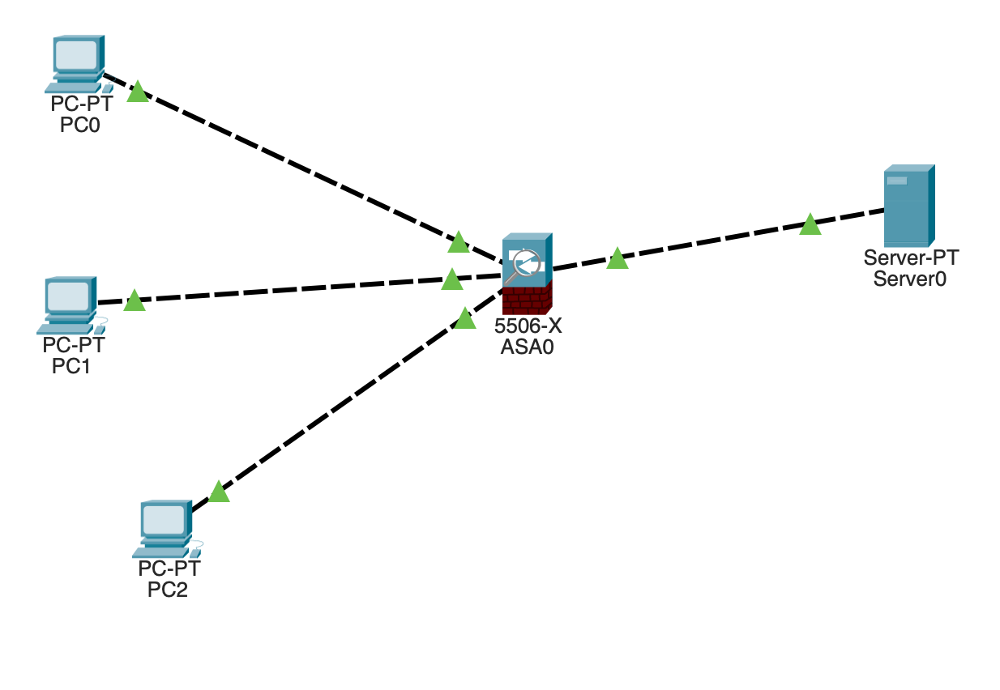

# 05.07. Основные возможности NGFW - Лебедев Д.С.
## Лабораторная работа №1 "Настройка расширенных листов контроля доступа"
> Лабораторная работа заключается в настройке сервисов и межсетевого экранирования для разграничения таргетированного трафика между сетями.
> 
> Этапы выполнения:
> 
> 1. Соберите сеть, предложенную на схеме.
> 
> 
> 
> 2. Настройте правила фильтрации на ASA 5506-X, используя таблицу ниже. Все действия с трафиком, в том числе запрещающие, должны быть явно описаны в ACL.
> 
> 
> 
> *В качестве решения пришлите pkt файл проекта.*

*Ответ:*  
В рамках выполнения лабораторной работы в симуляторе CPT построена схема:


<details>
<summary>Первоначальная настройка ASA0</summary>

```sh
ciscoasa(config)#int gi1/1
ciscoasa(config-if)#nameif PC0
ciscoasa(config-if)#ip addr 192.168.0.1 255.255.255.0
ciscoasa(config-if)#no sh

ciscoasa(config-if)#int gi1/2
ciscoasa(config-if)#nameif PC1
ciscoasa(config-if)#ip addr 192.168.10.1 255.255.255.0
ciscoasa(config-if)#no sh

ciscoasa(config-if)#int gi1/3
ciscoasa(config-if)#nameif PC2
ciscoasa(config-if)#ip addr 192.168.20.1 255.255.255.0
ciscoasa(config-if)#no sh

ciscoasa(config-if)#int gi1/4
ciscoasa(config-if)#nameif SRV0
ciscoasa(config-if)#ip addr 192.168.30.1 255.255.255.0
ciscoasa(config-if)#no sh

---статические маршруты---
ciscoasa(config)#route SRV0 0.0.0.0 0.0.0.0 192.168.30.10
ciscoasa(config)#route PC0 192.168.0.0 255.255.255.0 192.168.0.10
ciscoasa(config)#route PC1 192.168.10.0 255.255.255.0 192.168.10.10
ciscoasa(config)#route PC2 192.168.20.0 255.255.255.0 192.168.20.10
```
</details>

Для настройки фильтрации трафика в соответствии с заданием выполнены команды:

```sh
---настройка правил для PC0---
ciscoasa(config)#access-list from_pc0 extended deny tcp 192.168.0.0 255.255.255.0 host 192.168.30.10 eq www
ciscoasa(config)#access-list from_pc0 extended deny udp 192.168.0.0 255.255.255.0 host 192.168.30.10 eq domain
ciscoasa(config)#access-list from_pc0 extended permit tcp 192.168.0.0 255.255.255.0 host 192.168.30.10 eq ftp
ciscoasa(config)#access-group from_pc0 in interface PC0

---настройка правил для PC1---
ciscoasa(config)#access-list from_pc1 extended deny tcp 192.168.10.0 255.255.255.0 host 192.168.30.10 eq ftp
ciscoasa(config)#access-list from_pc1 extended deny udp 192.168.10.0 255.255.255.0 host 192.168.30.10 eq domain
ciscoasa(config)#access-list from_pc1 extended permit tcp 192.168.10.0 255.255.255.0 host 192.168.30.10 eq www
ciscoasa(config)#access-group from_pc1 in interface PC1

---настройка правил для PC2---
ciscoasa(config)#access-list from_pc2 extended deny tcp 192.168.20.0 255.255.255.0 host 192.168.30.10 eq ftp
ciscoasa(config)#access-list from_pc2 extended deny tcp 192.168.20.0 255.255.255.0 host 192.168.30.10 eq www
ciscoasa(config)#access-list from_pc2 extended permit udp 192.168.20.0 255.255.255.0 host 192.168.30.10 eq domain
ciscoasa(config)#access-group from_pc2 in interface PC2

---настройка правил для SRV0---
ciscoasa(config)#access-list from_srv0 extended permit udp 192.168.30.0 255.255.255.0 any eq domain
ciscoasa(config)#access-list from_srv0 extended permit tcp 192.168.30.0 255.255.255.0 any eq www
ciscoasa(config)#access-list from_srv0 extended permit tcp 192.168.30.0 255.255.255.0 any eq ftp
ciscoasa(config)#access-list from_srv0 extended permit icmp any any
ciscoasa(config)#access-group from_srv0 in interface SRV0
```

[Файл .PKT](_attachments/0507-00-01.pkt)
## Лабораторная работа №2 "Настройка инспектирования трафика"
> Лабораторная работа заключается в настройкe правил инспектирования сетевого трафика на прикладном уровне.
> 
> Ваша задача – используя созданные в лабораторной работе №1 ACL, создать отдельные классы с описанием трафика для PC0, PC1, PC2 и применить к ним инспектирование разрешенных протоколов.
> 
> Пример:
> 
> ```sh
> class-map PC0      
>  match access-list PC0_ACL      
> policy-map global_policy      
>  class PC0      
>   inspect ftp
> ```
> 
> *В качестве решения пришлите скриншот конфига, содержащего описание классов и политики.*

*Ответ:*  
Выполнены следующие настройки:

```sh
--- Отменить анализ трафика в дефолтных настройках --- 
ciscoasa(config)#policy-map global_policy
ciscoasa(config-pmap)#class inspection_default
ciscoasa(config-pmap-c)#no inspect dns preset_dns_map
ciscoasa(config-pmap-c)#no inspect ftp
ciscoasa(config-pmap-c)#no inspect tftp

--- инспекция разрешенного FTP от PC0 ---
ciscoasa(config)#class-map MAP_PC0
ciscoasa(config-cmap)#match access-list from_pc0
ciscoasa(config-cmap)#policy-map global_policy
ciscoasa(config-pmap)#class MAP_PC0
ciscoasa(config-pmap-c)#inspect ftp

--- инспекция разрешенного HTTP от PC1 ---
ciscoasa(config)#class-map MAP_PC1
ciscoasa(config-cmap)#match access-list from_pc1
ciscoasa(config-cmap)#policy-map global_policy
ciscoasa(config-pmap)#class MAP_PC1
ciscoasa(config-pmap-c)#inspect http

--- инспекция разрешенного DNS от PC2 ---
ciscoasa(config)#class-map MAP_PC2
ciscoasa(config-cmap)#match access-list from_pc2
ciscoasa(config-cmap)#policy-map global_policy
ciscoasa(config-pmap)#class MAP_PC2
ciscoasa(config-pmap-c)#inspect dns
```

Результат - настроено отслеживание трафика по атрибутам прикладных протоколов в соответствии с заданием:


