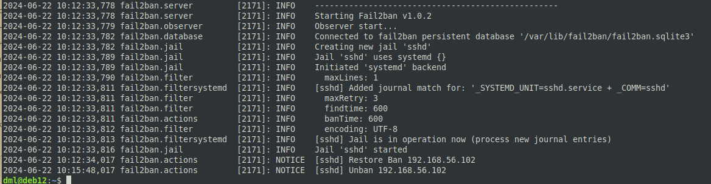

# 05.08. Обзор средств информационной безопасности - Лебедев Д.С.

### Подготовка к выполнению заданий
> 1. Подготовка "защищаемой" системы:
> - Установите Suricata;
> - Установите Fail2Ban.
> 2. Подготовка системы злоумышленника: установите nmap и THC-Hydra либо скачайте и установите Kali Linux.
> 
> Обе системы должны находится в одной подсети.
### Задание 1.
> Проведите разведку системы и определите, какие сетевые службы запущены на "защищаемой" системе:
> 
> ```sh
> sudo nmap -sA < ip-адрес >
> sudo nmap -sT < ip-адрес >
> sudo nmap -sS < ip-адрес >
> sudo nmap -sV < ip-адрес >
> ```
> 
> (По желанию можете поэкспериментировать с опциями: https://nmap.org/man/ru/man-briefoptions.html )
> 
> *В качестве ответа пришлите события, которые попали в логи Suricata и Fail2Ban, прокомментируйте результат.*

*Выполнение:*  

Сетевым сканером nmap с различными параметрами идентифицированы доступные порты и службы на атакуемой машине.
- nmap -sT 192.168.56.103 - проверка портов TCP-пакетом с установленным флагом SYN, после получения пакета SYN/ACK обратно отправляется TCP-пакет с установленным флагом ACK, завершается процедура трехстороннего рукопожатия TCP;
- nmap -sS 192.168.56.103 - сканирование SYN "Half-open", скрытое сканирование, после получения пакета SYN/ACK отправляем RST-пакет;
- nmap -sV 192.168.56.103 - исследуются открытые порты для определения информации о службе/версии

По результатам выполнения команд выявлено, что на атакуемом хосте запущена служба SSH.


### Задание 2.
> Проведите атаку на подбор пароля для службы SSH:
> ```
> hydra -L users.txt -P pass.txt < ip-адрес > ssh
> ```
> 
> 1. Настройка hydra:
> - создайте два файла: users.txt и pass.txt;
> - в каждой строчке первого файла должны быть имена пользователей, второго - пароли (в нашем случае это могут быть случайные строки, но ради эксперимента можете добавить имя и пароль существующего пользователя).
> 
> Дополнительная информация по hydra: https://kali.tools/?p=1847
> 
> 2. Включение защиты SSH для Fail2Ban:
> - Открыть файл /etc/fail2ban/jail.conf;
> - Найти секцию ssh;
> - Установить enabled в true.
> 
> Дополнительная информация по Fail2Ban:https://putty.org.ru/articles/fail2ban-ssh.html
> 
> *В качестве ответа пришлите события, которые попали в логи Suricata и Fail2Ban, прокомментируйте результат.*

*Выполнение:*  
1. Успешная попытка подбора пароля к службе SSH на атакуемой машине, в логах suricata записи о сканировании:


2. Установка и настройка сервиса `Fail2Ban`, повторная попытка сканирования 22 порта завершена сбросом соединения:


Лог `fail2ban` подтверждает сброс соединения:


