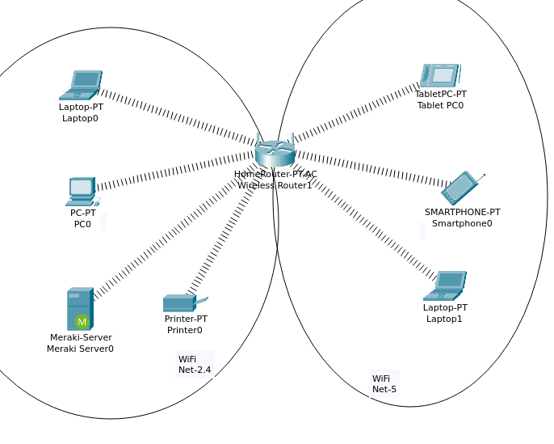
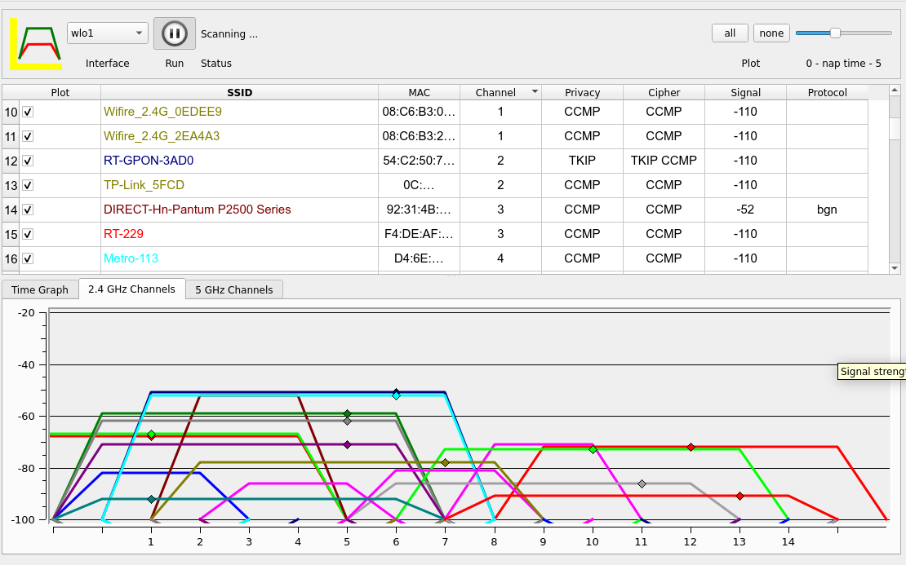
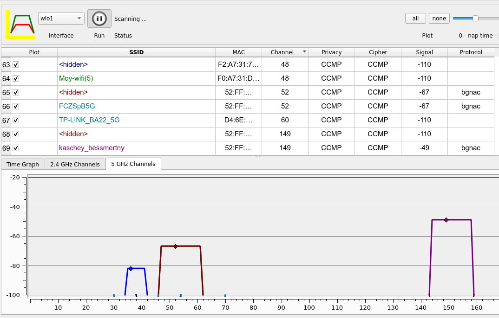

# 06.01. Беспроводная среда передачи данных - Лебедев Д.С.

### Задание 1. Лабораторная работа "Построение беспроводной сети и подключение устройств".
> В Cisco Packet Tracer создайте 2 беспроводные сети на разных частотах. Подключите 3 разных устройства к одной сети и 3 разных устройства к другой сети.
> 
> *Пришлите pkt файл.*

*Ответ:*  
Результат выполнения:

[PKT - файл задания](_att/0601-01-01.pkt)
### Задание 2*
> Проведите сканирование вашей беспроводной сети с помощью любого подходящего ПО (например "Wi-Fi Analyzer"). Какие беспроводные сети настроены не оптимально и "мешают" друг другу?
> 
> *Приведите скриншоты с устройства и ответ в свободной форме*

*Ответ:*  
Анализ проводился с помощью утилиты LinSSID.

Диапазон 2,4 ГГц - не подлежит оптимизации, не осталось ни одного канала, на котором не работает две и больше пересекающихся и мешающих друг другу сети. В такой ситуации нет разницы, на каком канале настраивать работу своей точки доступа.

В диапазоне 5 ГГц ситуация намного лучше, причем моя точка доступа в более выгодной ситуации, так как может работать на каналах больше 100, а именно на 149 канале.

