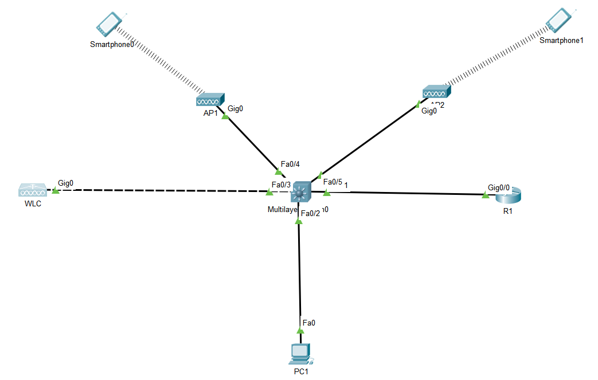
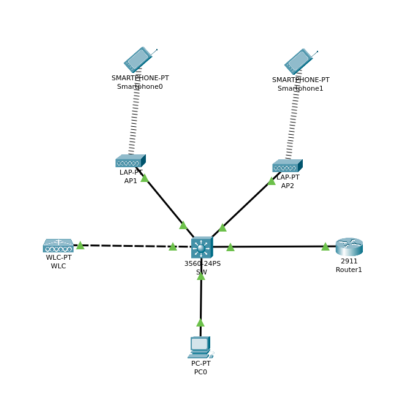
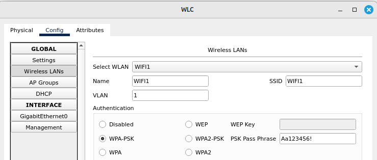
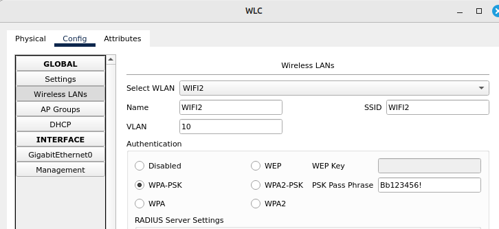
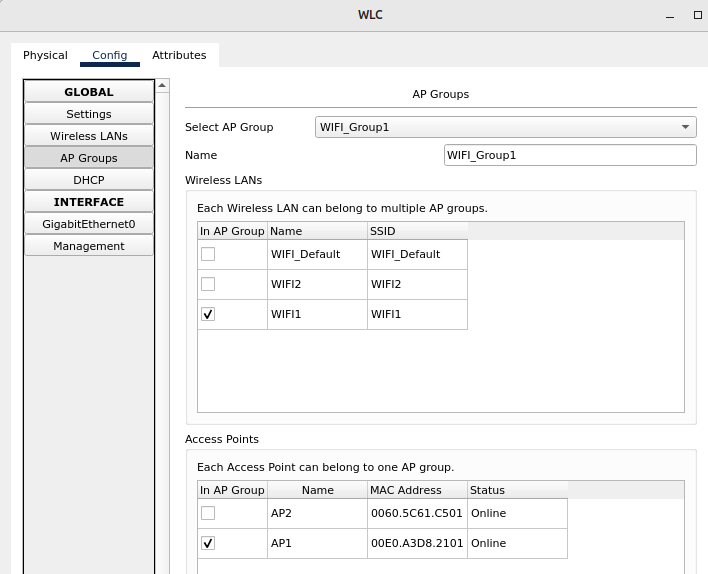
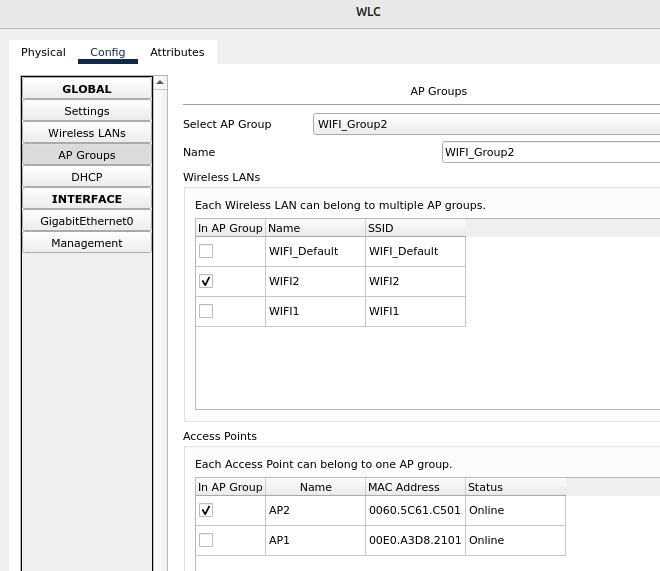

# 06.02. Элементы БЛВС. Точки доступа, контроллеры, антенны - Лебедев Д.С.

## Лабораторная работа "Конфигурация AP Group, WLANs на Cisco WLC"
> 
> 
> 
> Соберите аналогичную топологию в Cisco Packet Tracer.
> 
> Критерии выполнения:
> 1. На WLC необходимо создать дополнительную AP Group. AP1 должен быть в группе default-group, AP2 в группе WIFI_Group2.
> 2. Должны быть созданы два Wireless Lans: WIFI_Default и WIFI2. Оба WLAN должны имет протокол аутентификации - WPA_PSK.
> 3. На AP1 должен раздавать только WIFI_Default, на AP2 - только WIFI2.
> 4. Один smartphone должен подключаться к WIFI_Default, другой к WIFI2.
> 
> Замечение: не забывайте про конфигурацию DHCP сервера на маршрутизаторе для раздачи адресов.
> 
> *Отправьте готовый файл pkt*

*Выполнение:*  

В моём случае симуляции в CPT default-group не корректно настраивалась, не сохраняла изменения. Поэтому была создана группа WIFI_Group1.

Результат выполнения:

Настройки Wireless LANs:

Настройки AR Groups:

[PKT - файл задания](_att/0602-01-01.pkt)
