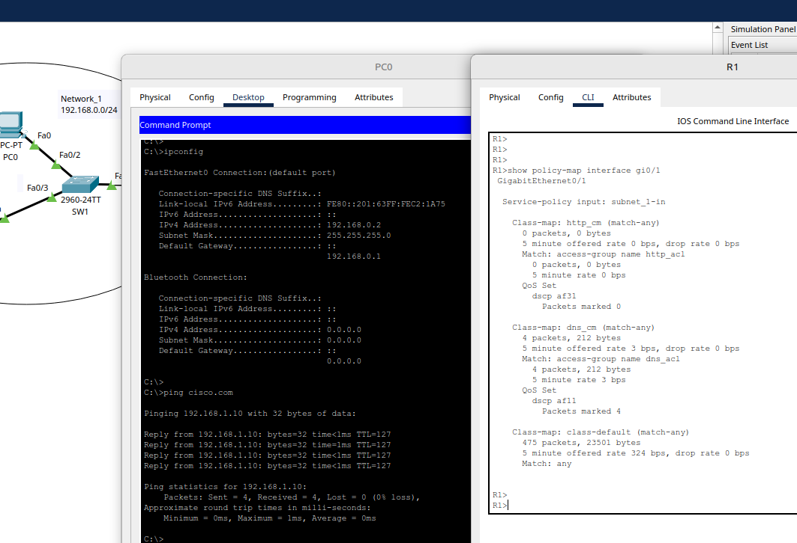

# 07.01. Качество обслуживания в сетях Ethernet. Модели QOS - Лебедев Д.С.

### Задание 1.
> На компьютере PC0 необходимо выполнить следующие действия:
> 1. Проверить, получен ли ip адрес от dhcp сервера.
> 2. В режиме симуляции PT, в Command Prompt выполнить ICMP запрос до ресурса cisco.com.
> 3. В режиме симуляции PT, на маршрутизаторе R1 раскрыть пакет ICMP запроса и оценить, применены ли какие либо метки DSCP.
> 4. Выбрать ниже из списка верное значение DSCP (вариантов может быть более одного):
> 
> а. AF31
> б. CS6
> в. 0х1а
> г. AF11
> д. 0x0a
> е. Не применяется, т.е. 0х00
> 
> *В ответе приведите номера выбранных пунктов. Вариантов может быть более одного.*

*Ответ:*  

```
запускаем на PC0 в командной строке команду ipconfig
убеждаемся, что получили адрес от dhcp
IPv4 Address....................: 192.168.0.2
   Subnet Mask.....................: 255.255.255.0
   Default Gateway.................: ::
                                     192.168.0.1

потом запускаем команду ping cisco.com
открываем консоль на R1 бахаем show policy-map interface gi0/1
видим, что смаркировало 2 пакета http_acl с qos внутри dscp af11, следовательно варинт  г. AF11
```


Вариант `г. AF11`, промаркировано 4 пакета http_acl с qos внутри dscp af11

  

### Задание 2.
> На компьютере PC0 необходимо выполнить следующие действия:
> 1. Проверить, получен ли ip адрес от dhcp сервера.
> 2. В режиме симуляции PT, в Web Browser выполнить WEB запрос до ресурса cisco.com.
> 3. В режиме симуляции PT, на маршрутизаторе R1 раскрыть пакет WEB запроса и оценить, применены ли какие либо метки DSCP.
> 4. Выбрать ниже из списка верное значение DSCP (вариантов может быть более одного):
> 
> а. AF31
> б. CS6
> в. 0х1а
> г. AF11
> д. 0x0a
> е. Не применяется, т.е. 0х00
> 
> *В ответе приведите номера выбранных пунктов. Вариантов может быть более одного.*

*Ответ:*  

```
запускаем на PC0 Web Browser пишем в окно cisco.com и жмём Go
открываем консоль на R1 бахаем show policy-map interface gi0/1
видим, что смаркировало 5 пакетов dscp af31, следовательно вариант а. AF31 
```


### Задание 3.
> На компьютере PC0 необходимо выполнить следующие действия:
> 1. Проверить, получен ли ip адрес от dhcp сервера.
> 2. В режиме симуляции PT, в Command Prompt выполнить команду nslookup ya.ru.
> 3. В режиме симуляции PT, на маршрутизаторе R1 раскрыть пакет DNS запроса и оценить, применены ли какие либо метки DSCP.
> 4. Выбрать ниже из списка верное значение DSCP (вариантов может быть более одного):
> 
> а. AF31
> б. CS6
> в. 0х1а
> г. AF11
> д. 0x0a
> е. Не применяется, т.е. 0х00
> 
> *В ответе приведите номера выбранных пунктов. Вариантов может быть более одного.*

*Ответ:*  


```
запускаем на PC0 в командной строке nslookup ya.ru
в симуляции при открытии DNS пакета пишется DSCP:0x0a , но при этом , если на R1 бахнуть show policy-map interface gi0/1, то видно, что
смаркировался один пакет dns acl с dscp af11, эта панель симуляции для меня вообще не информативна, но вариант аф11 уже был использован с пингом, поэтому я бахну ответ д. 0x0a 
```


### Задание 4.
> Подключиться к R1 и в режиме User Exec Mode(">") просмотреть статистику с интерфейсов маршрутизатора. Необходимо определить, на каком из интерфесов выполняется установка меток DSCP (show policy map ....), выбрать верный вариант из списка:
> 
> а. Gig0/1
> б. Gig0/0
> 
> *В ответе приведите номера выбранных пунктов.*

*Ответ:*  

```
R1>show policy interface gigabitEthernet0/1
 GigabitEthernet0/1

  Service-policy input: subnet_1-in

    Class-map: http_cm (match-any)
      2 packets, 84 bytes
      5 minute offered rate 4 bps, drop rate 0 bps
      Match: access-group name http_acl
        2 packets, 84 bytes
        5 minute rate 4 bps
      QoS Set
        dscp af31
          Packets marked 2

    Class-map: dns_cm (match-any)
      12 packets, 632 bytes
      5 minute offered rate 22 bps, drop rate 0 bps
      Match: access-group name dns_acl
        12 packets, 632 bytes
        5 minute rate 22 bps
      QoS Set
        dscp af11
          Packets marked 12

    Class-map: class-default (match-any)
      194 packets, 9194 bytes
      5 minute offered rate 192 bps, drop rate 0 bps
      Match: any
```