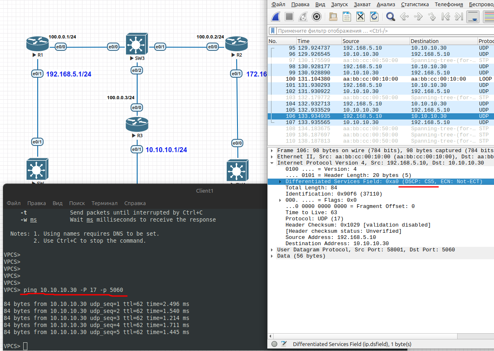
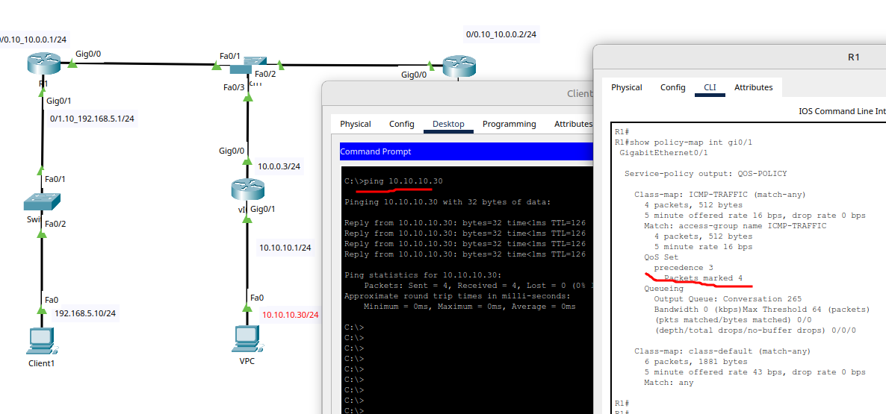
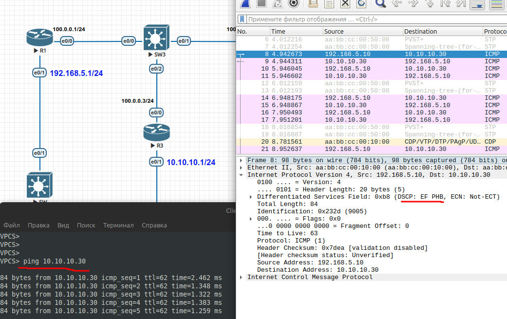

# 07.02. Классификация и маркировка трафика - Лебедев Д.С.
## Лабораторная работа "Классификация и маркировка трафика"
### Задание 1.
> На картинке изображена схема сети с тремя маршрутизаторами.
> 
> 
> 
> Необходимо классифицировать и маркировать трафик следующим образом:
> 
> 1. TCP трафик с destination порт 80/443 установить DSCP AF43 между всеми клиентами.
> 2. UDP трафик с destination порт 5060-5061 установить CS5 между всеми клиентами.
> 3. Для ICMP трафика значение COS установить 3 между всеми клиентами.
> 4. Трафик от клиента Client2, Client3 до Client1 должен маркироваться EF.
> 
> *Отправьте полный список конфигураций: class-map, policy-map service-policy.*
 
 *Выполнение работы:*  
1. TCP трафик с destination порт 80/443 установить DSCP AF43 между всеми клиентами.

Настройки производятся на всех роутерах, пример для R1:

```sh
R1(config)#ip access-list extended TCP-TRAFFIC
R1(config-ext-nacl)#permit tcp any any eq 80
R1(config-ext-nacl)#permit tcp any any eq 443
--
R1(config)#class-map match-any TCP-TRAFFIC
R1(config-cmap)#match access-group name TCP-TRAFFIC
--
R1(config)#policy-map QOS-POLICY
R1(config-pmap)#class TCP-TRAFFIC
R1(config-pmap-c)#set dscp af43
--
R1(config)#int e0/1
R1(config-if)#service-policy input QOS-POLICY
```

В результате трафик приобретает необходимую маркировку:


2. UDP трафик с destination порт 5060-5061 установить CS5 между всеми клиентами.

Настройки производятся на всех роутерах, пример для R1:

```sh
R1(config)#ip access-list extended UDP-TRAFFIC
R1(config-ext-nacl)#permit udp any any range 5060 5061
--
R1(config)#class-map match-any UDP-TRAFFIC
R1(config-cmap)#match access-group name UDP-TRAFFIC
--
R1(config)#policy-map QOS-POLICY
R1(config-pmap)#class UDP-TRAFFIC
R1(config-pmap-c)#set dscp cs5
```

К интерфейсу e0/1 правило уже применяется (п.1)

В результате трафик приобретает необходимую маркировку:



3. Для ICMP трафика значение COS установить 3 между всеми клиентами.

COS применим только на уровне L2. Для выполнения задания схема собрана в CPT, на роутерах настроены сабинтерфейсы, на нужных портах коммутаторов установлен trunk и access режим с соответствующим vlan.

[PKT - файл задания](_att/0702-03-00.pkt)

Команды настройки роутера R1:

```sh
R1(config)#ip access-list extended ICMP-TRAFFIC
R1(config-ext-nacl)#permit icmp any any
--
R1(config)#class-map match-any ICMP-TRAFFIC
R1(config-cmap)#match access-group name ICMP-TRAFFIC
--
R1(config)#policy-map QOS-POLICY
R1(config-pmap)#class ICMP-TRAFFIC
R1(config-pmap-c)#set precedence 3
--
R1(config)#int gi 0/1
R1(config-if)#service-policy output QOS-POLICY
```

В результате трафик приобретает необходимую маркировку:



4. Трафик от клиента Client2, Client3 до Client1 должен маркироваться EF.

Настройки производятся на всех роутерах, пример для R1:

```sh
R1(config)#ip access-list extended CLIENT-TRAFFIC
R1(config-ext-nacl)#permit ip host 192.168.5.10 host 10.10.10.30
R1(config-ext-nacl)#permit ip host 192.168.5.10 host 172.16.1.20
--
R1(config)#class-map match-any CLIENT-TRAFFIC
R1(config-cmap)#match access-group name CLIENT-TRAFFIC
R1(config-cmap)#policy-map QOS-POLICY
--
R1(config-pmap)#class CLIENT-TRAFFIC
R1(config-pmap-c)#set dscp ef
```

К интерфейсу e0/1 правило уже применяется (п.1)

В результате трафик приобретает необходимую маркировку:


