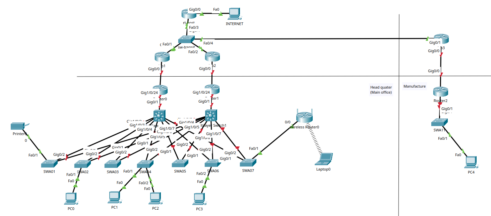

# Курсовой проект "Проектирование корпоративной сети"

---
https://github.com/netology-code/crpnt-diplom

- [Задание на проектирование](08.CRPNT.DIP.00.md)
- [Результаты тестирования](08.CRPNT.DIP.02.md)

---
## Пояснительная записка

[Схема сети](_att/dip01-01.pkt)

