# Курсовой проект "Проектирование корпоративной сети"

## Результаты тестирования
### 1. Проверка доступа
#### 1.1. ПК сегмента производственного отдела, гостевого Wi-Fi имеют доступ в сеть интернет

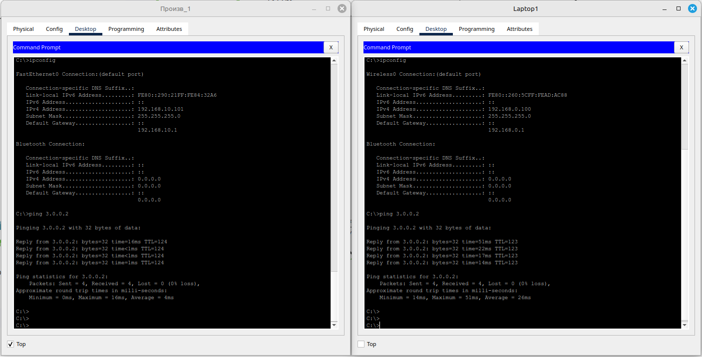

#### 1.2. ПК на производстве имеет доступ в интернет и выходит в него через ISP3

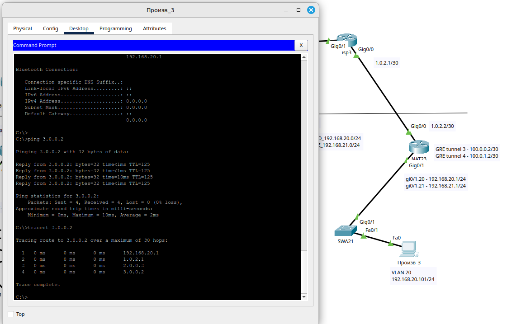

#### 1.3. ПК на производстве имеет доступ к принтерам центрального офиса и сети производства центрального офиса, однако не имеют доступа к сегменту бухгалтерии.

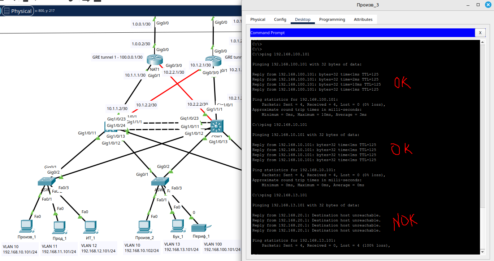

#### 1.4. ПК в сегменте гостевого Wi-Fi не имеет доступа к сегменту производственного отдела.

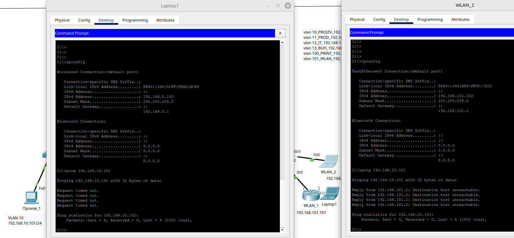

#### 1.5. ПК в сегменте бухгалтерии имеют доступ к принтерам

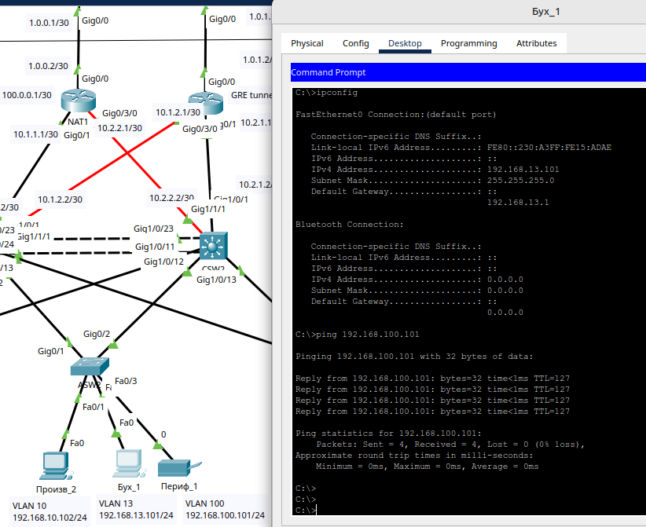

#### 1.6. ПК производственного отдела не может взаимодействовать с ПК из отдела продаж, ИТ отдела и бухгалтерии.

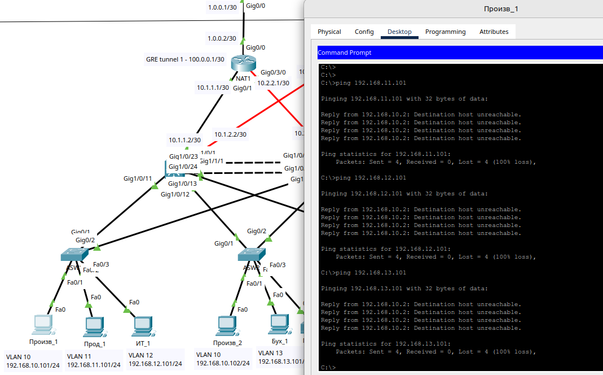

#### 1.7. ПК, подключенное в сегмент периферийных устройств, не имеет доступа в интернет

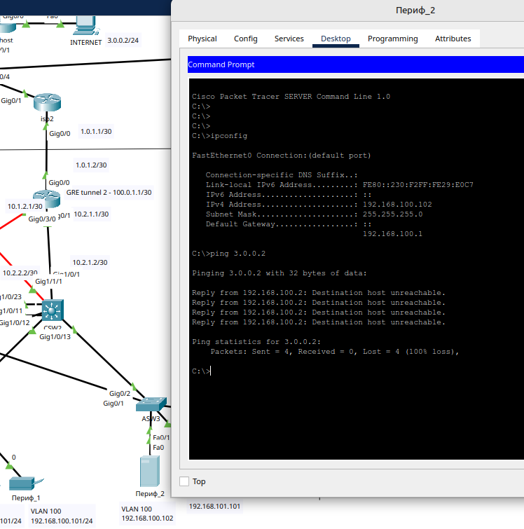

### 2. Тестирование используемых механизмов обеспечения отказоустойчивости
#### 2.1. Точка А – ПК в бухгалтерии, точка Б – интернет (3.0.0.2). Отключение ISP1, проверка, что центральный офис перешел на ISP2

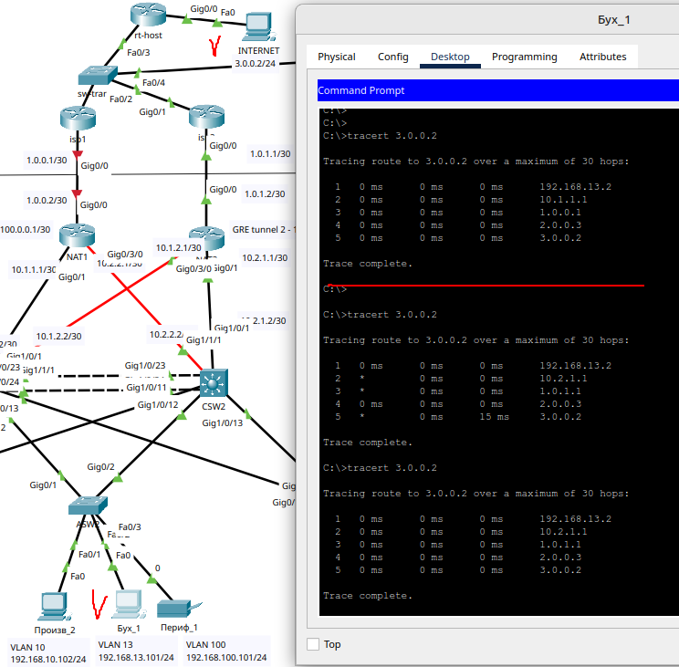

#### 2.2. Точка А – ПК в производственном отделе, точка Б – пользователь на производстве. Отключение ISP1, проверка, что связь между офисом и производством не прервалась

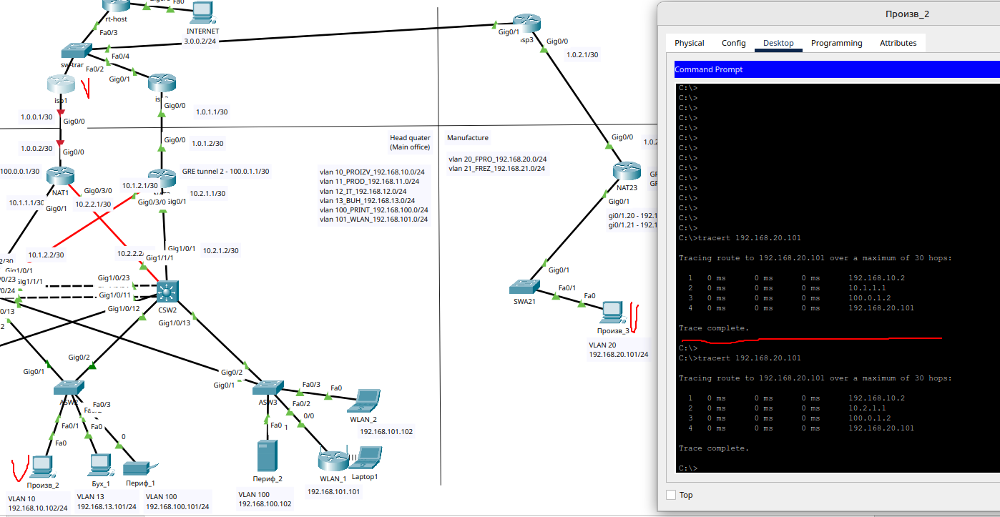

#### 2.3. Точка А – ПК в отделе продаж, точка Б – интернет (3.0.0.2). Полное отключение маршрутизатора, к которому подключен ISP1, проверка того, что центральный офис перешел на второй маршрутизатор

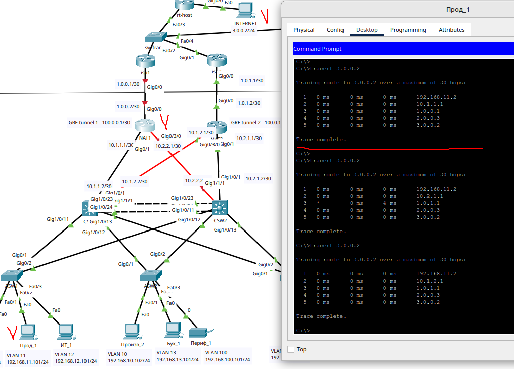

#### 2.4. Точка А – ПК в производственном отделе, точка Б – пользователь на производстве. Полное отключение маршрутизатора, к которому подключен ISP1, проверка того, что связь до производства перешла на второй маршрутизатор

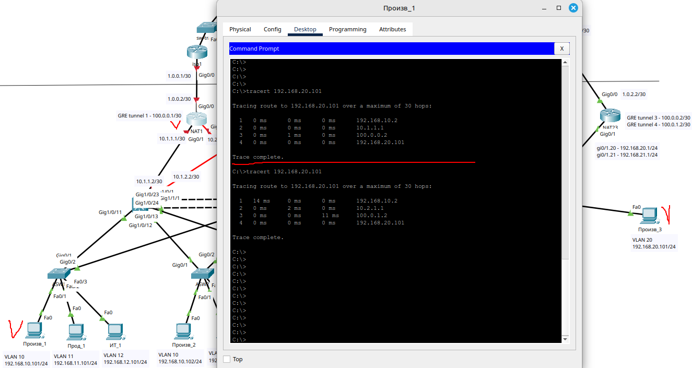

#### 2.5. Точка А – ПК в бухгалтерии, точка Б – интернет (3.0.0.2). Отключение устройства, на котором расположены адреса шлюзов по умолчанию для внутренних сетей в центральном офисе. Проверка того, что адрес шлюза стал доступен через резервное устройство

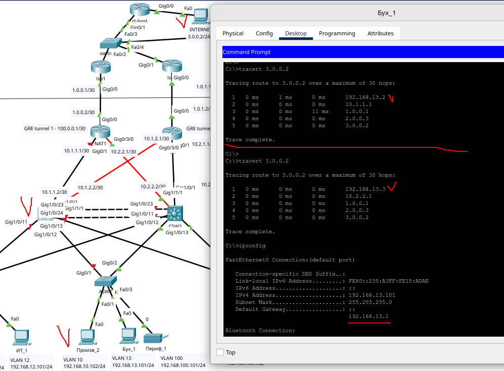

#### 2.6. Точка А – ПК в бухгалтерии, точка Б – интернет (3.0.0.2). Поочередное отключение каждого из линков, подключенных к коммутатору доступа, где расположена точка А. Проверка того, что выход из строя одного из линков не нарушает связность

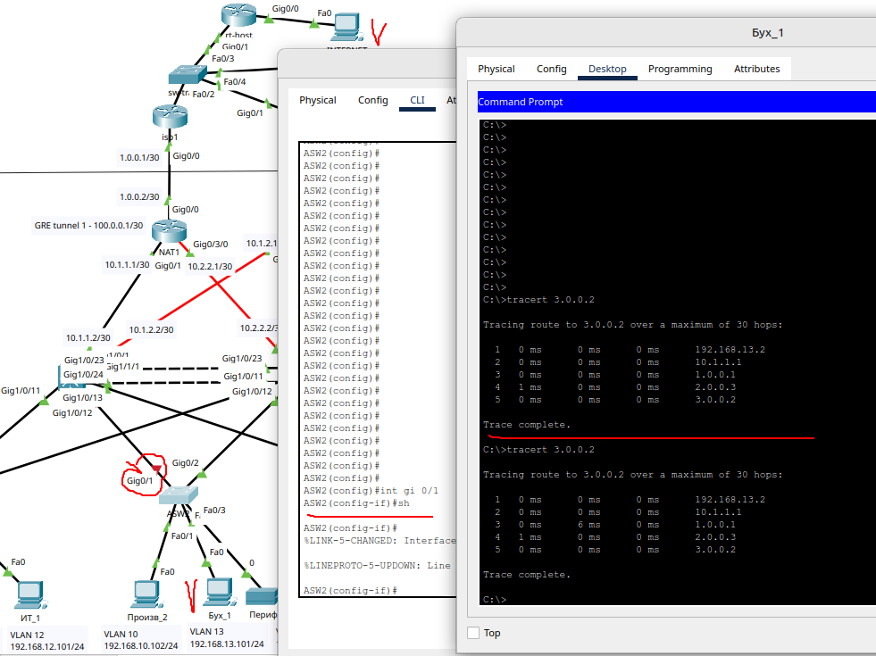

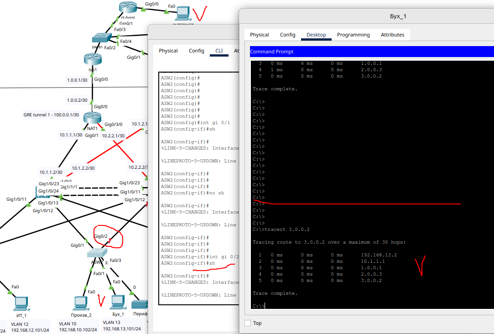
