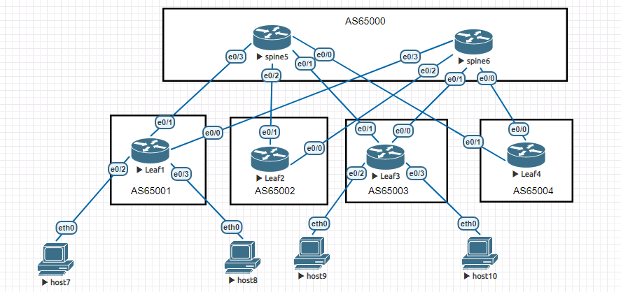

# 08.02. Построение сетей дата-центра - Лебедев Д.С.
## Лабораторная работа "Построение сетей Дата Центра"
### Задание 1.
>   
> 
> Для указанной топологии необходимо настроить маршрутизацию eBGP для underlay сети DC.
> 
> Номера AS используйте из топологии. Адресацию стыковочных линков и импортируемых сетей выберите на свое усмотрение.
> !!! Важно, чтобы в сети были доступны по BGP 2 разных маршрута до каждой клиентской сети через разные spine.
> Количество подключенных конечных хостов можно не соблюдать, достаточно двух.
> 
> *Отправьте полный список конфигураций: каждого leaf и spine маршрутизаторов.*

*Ответ:*  

### Задание 2*.
> Настройте ECMP для балансировки трафика в Underlay сети по линкам до разных spine
> 
> *Отправьте полный список конфигураций, где для соответствующей AF включена балансировка.*

*Ответ:*  

