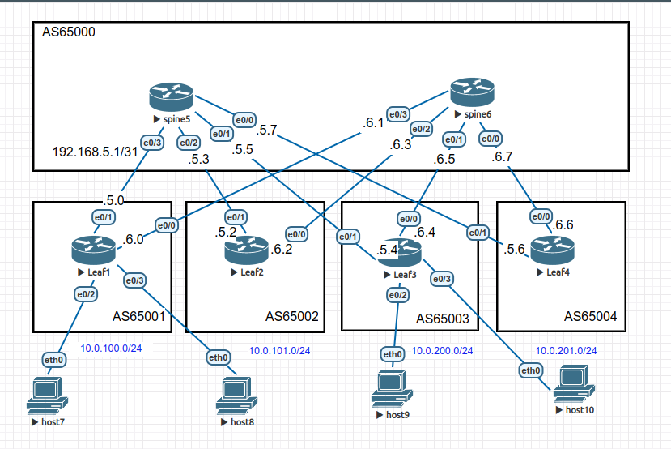

# 08.02. Построение сетей дата-центра - Лебедев Д.С.
## Лабораторная работа "Построение сетей Дата Центра"
### Задание 1.
>   
> 
> Для указанной топологии необходимо настроить маршрутизацию eBGP для underlay сети DC.
> 
> Номера AS используйте из топологии. Адресацию стыковочных линков и импортируемых сетей выберите на свое усмотрение.
> !!! Важно, чтобы в сети были доступны по BGP 2 разных маршрута до каждой клиентской сети через разные spine.
> Количество подключенных конечных хостов можно не соблюдать, достаточно двух.
> 
> *Отправьте полный список конфигураций: каждого leaf и spine маршрутизаторов.*

*Ответ:*  
В симуляторе EVE-NG создана следующая топология:



В рамках задания настроена фильтрация стыковочных сетей и loopback, а так же настроена фильтрация маршрутов для запрета реанонсов сетей.

<details>
<summary>Команды настройки spine</summary>

```sh
=== spine5 ===
Router(config)#host spine5
spine5(config)#int loo0
spine5(config-if)#ip addr 5.5.5.5 255.255.255.255
--
spine5(config-if)#int e0/3                       
spine5(config-if)#ip addr 192.168.5.1 255.255.255.254
spine5(config-if)#no sh
--
spine5(config-if)#int e0/2                           
spine5(config-if)#ip addr 192.168.5.3 255.255.255.254
spine5(config-if)#no sh                              
--
spine5(config-if)#int e0/1                           
spine5(config-if)#ip addr 192.168.5.5 255.255.255.254
spine5(config-if)#no sh                              
--
spine5(config-if)#int e0/0                           
spine5(config-if)#ip addr 192.168.5.7 255.255.255.254
spine5(config-if)#no sh                              
--
spine5(config)#router bgp 65000
spine5(config-router)#bgp router-id 5.5.5.5
spine5(config-router)#neighbor 192.168.5.0 remote-as 65001
spine5(config-router)#neighbor 192.168.5.2 remote-as 65002
spine5(config-router)#neighbor 192.168.5.4 remote-as 65003
spine5(config-router)#neighbor 192.168.5.6 remote-as 65004

=== spine6 ===
Router(config)#host spine6
spine6(config)#int loo0
spine6(config-if)#ip addr 6.6.6.6 255.255.255.255
--
spine6(config-if)#int e0/3 
spine6(config-if)#ip addr 192.168.6.1 255.255.255.254
spine6(config-if)#no sh
--
spine6(config-if)#int e0/2                           
spine6(config-if)#ip addr 192.168.6.3 255.255.255.254
spine6(config-if)#no sh                              
--
spine6(config-if)#int e0/1                           
spine6(config-if)#ip addr 192.168.6.5 255.255.255.254
spine6(config-if)#no sh                              
--
spine6(config-if)#int e0/0                           
spine6(config-if)#ip addr 192.168.6.7 255.255.255.254
spine6(config-if)#no sh                              
--
spine6(config)#router bgp 65000
spine6(config-router)#bgp router-id 6.6.6.6
spine6(config-router)#neighbor 192.168.6.0 remote-as 65001
spine6(config-router)#neighbor 192.168.6.2 remote-as 65002
spine6(config-router)#neighbor 192.168.6.4 remote-as 65003
spine6(config-router)#neighbor 192.168.6.6 remote-as 65004
```
</details>

<details>
<summary>Команды настройки leaf1</summary>

```sh
=== leaf1 ===
Router(config)#host leaf1
leaf1(config)#int loo0
leaf1(config-if)#ip addr 1.1.1.1 255.255.255.255
--
leaf1(config-if)#int e0/1
leaf1(config-if)#ip addr 192.168.5.0 255.255.255.254
leaf1(config-if)#no sh
--
leaf1(config-if)#int e0/0
leaf1(config-if)#ip addr 192.168.6.0 255.255.255.254
leaf1(config-if)#no sh                              
--
leaf1(config-if)#int e0/3
leaf1(config-if)#ip addr 10.0.101.1 255.255.255.0   
leaf1(config-if)#no sh                           
--
leaf1(config-if)#int e0/2
leaf1(config-if)#ip addr 10.0.100.1 255.255.255.0
leaf1(config-if)#no sh                           
--
leaf1(config)#ip prefix-list underlay_import permit 0.0.0.0/0 le 30
leaf1(config)#route-map underlay_import
leaf1(config-route-map)#match ip address prefix-list underlay_import
--
leaf1(config)#route-map from_spine
leaf1(config-route-map)#set community 65535:100 additive
--
leaf1(config)#route-map to_spine deny 10
leaf1(config-route-map)#match community to_spine
leaf1(config-route-map)#route-map to_spine permit 20
--
leaf1(config)#ip bgp-community new-format
leaf1(config)#ip community-list standard to_spine permit 65535:100
--
leaf1(config)#router bgp 65001
leaf1(config-router)#bgp router-id 1.1.1.1
leaf1(config-router)#redistribute connected route-map underlay_import
--
leaf1(config-router)#neighbor 192.168.5.1 remote-as 65000
leaf1(config-router)#neighbor 192.168.5.1 route-map from_spine in
leaf1(config-router)#neighbor 192.168.5.1 route-map to_spine out
--
leaf1(config-router)#neighbor 192.168.6.1 remote-as 65000
leaf1(config-router)#neighbor 192.168.6.1 route-map from_spine in
leaf1(config-router)#neighbor 192.168.6.1 route-map to_spine out
```
</details>

<details>
<summary>Команды настройки leaf2</summary>

```sh
=== leaf2 ===
Router(config)#host leaf2 
leaf2(config)#int loo0
leaf2(config-if)#ip addr 2.2.2.2 255.255.255.255
--
leaf2(config-if)#int e0/1
leaf2(config-if)#ip addr 192.168.5.2 255.255.255.254
leaf2(config-if)#no sh
--
leaf2(config-if)#int e0/0                           
leaf2(config-if)#ip addr 192.168.6.2 255.255.255.254
leaf2(config-if)#no sh                              
--
leaf2(config)#ip prefix-list underlay_import permit 0.0.0.0/0 le 30
leaf2(config)#route-map underlay_import
leaf2(config-route-map)#match ip address prefix-list underlay_import
--
leaf2(config)#route-map from_spine
leaf2(config-route-map)#set community 65535:100 additive
--
leaf2(config)#route-map to_spine deny 10
leaf2(config-route-map)#match community to_spine
leaf2(config-route-map)#route-map to_spine permit 20
--
leaf2(config)#ip bgp-community new-format
leaf2(config)#ip community-list standard to_spine permit 65535:100
--
leaf2(config)#router bgp 65002
leaf2(config-router)#bgp router-id 2.2.2.2
leaf2(config-router)#redistribute connected route-map underlay_import
--
leaf2(config-router)#neighbor 192.168.5.3 remote-as 65000
leaf2(config-router)#neighbor 192.168.5.3 route-map from_spine in
leaf2(config-router)#neighbor 192.168.5.3 route-map to_spine out
--
leaf2(config-router)#neighbor 192.168.6.3 remote-as 65000
leaf2(config-router)#neighbor 192.168.6.3 route-map from_spine in
leaf2(config-router)#neighbor 192.168.6.3 route-map to_spine out
```
</details>

<details>
<summary>Команды настройки leaf3</summary>

```sh
=== leaf3 ===
Router(config)#host leaf3
leaf3(config)#int loo0
leaf3(config-if)#ip addr 3.3.3.3 255.255.255.255
--
leaf3(config-if)#int e0/1
leaf3(config-if)#ip addr 192.168.5.4 255.255.255.254
leaf3(config-if)#no sh
--
leaf3(config-if)#int e0/0
leaf3(config-if)#ip addr 192.168.6.4 255.255.255.254
leaf3(config-if)#no sh                              
--
leaf3(config-if)#int e0/3
leaf3(config-if)#ip addr 10.0.201.1 255.255.255.0
leaf3(config-if)#no sh                           
--
leaf3(config-if)#int e0/2
leaf3(config-if)#ip addr 10.0.200.1 255.255.255.0
leaf3(config-if)#no sh                           
--
leaf3(config)#ip prefix-list underlay_import permit 0.0.0.0/0 le 30
leaf3(config)#route-map underlay_import
leaf3(config-route-map)#match ip address prefix-list underlay_import
--
leaf3(config)#route-map from_spine
leaf3(config-route-map)#set community 65535:100 additive
--
leaf3(config)#route-map to_spine deny 10
leaf3(config-route-map)#match community to_spine
leaf3(config-route-map)#route-map to_spine permit 20
--
leaf3(config)#ip bgp-community new-format
leaf3(config)#ip community-list standard to_spine permit 65535:100
--
leaf3(config)#router bgp 65003
leaf3(config-router)#bgp router-id 3.3.3.3
leaf3(config-router)#redistribute connected route-map underlay_import
leaf3(config-router)#neighbor 192.168.5.5 remote-as 65000
--
leaf3(config-router)#neighbor 192.168.5.5 route-map from_spine in
leaf3(config-router)#neighbor 192.168.5.5 route-map to_spine out
leaf3(config-router)#neighbor 192.168.6.5 remote-as 65000
--
leaf3(config-router)#neighbor 192.168.6.5 route-map from_spine in
leaf3(config-router)#neighbor 192.168.6.5 route-map to_spine out
```
</details>

<details>
<summary>Команды настройки leaf4</summary>

```sh
=== leaf4 ===
Router(config)#host leaf4
leaf4(config)#int loo0
leaf4(config-if)#ip addr 4.4.4.4 255.255.255.255
--
leaf4(config-if)#int e0/1
leaf4(config-if)#ip addr 192.168.5.6 255.255.255.254
leaf4(config-if)#no sh
--
leaf4(config-if)#int e0/0
leaf4(config-if)#ip addr 192.168.6.6 255.255.255.254
leaf4(config-if)#no sh                              
--
leaf4(config)#ip prefix-list underlay_import permit 0.0.0.0/0 le 30
leaf4(config)#route-map underlay_import
leaf4(config-route-map)#match ip address prefix-list underlay_import
--
leaf4(config)#route-map from_spine
leaf4(config-route-map)#set community 65535:100 additive
--
leaf4(config)#route-map to_spine deny 10
leaf4(config-route-map)#match community to_spine
leaf4(config-route-map)#route-map to_spine permit 20
--
leaf4(config)#ip bgp-community new-format
leaf4(config)#ip community-list standard to_spine permit 65535:100
--
leaf4(config)#router bgp 65004
leaf4(config-router)#bgp router-id 4.4.4.4
leaf4(config-router)#redistribute connected route-map underlay_import
--
leaf4(config-router)#neighbor 192.168.5.7 remote-as 65000
leaf4(config-router)#neighbor 192.168.5.7 route-map from_spine in
leaf4(config-router)#neighbor 192.168.5.7 route-map to_spine out
--
leaf4(config-router)#neighbor 192.168.6.7 remote-as 65000
leaf4(config-router)#neighbor 192.168.6.7 route-map from_spine in
leaf4(config-router)#neighbor 192.168.6.7 route-map to_spine out
```
</details>

### Задание 2*.
> Настройте ECMP для балансировки трафика в Underlay сети по линкам до разных spine
> 
> *Отправьте полный список конфигураций, где для соответствующей AF включена балансировка.*

*Ответ:*  
Для настройки ECMP балансировки на leaf 1-4 выполняются следующие команды:

```sh
leaf1(config)#router bgp 65001
leaf1(config-router)#maximum-paths 2
--
leaf2(config)#router bgp 65002
leaf2(config-router)#maximum-paths 2
--
leaf3(config)#router bgp 65003
leaf3(config-router)#maximum-paths 2
--
leaf4(config)#router bgp 65004
leaf4(config-router)#maximum-paths 2
```

---
Итоговая конфигурация маршрутизаторов:

[leaf1](_att/0802-leaf1.txt)

[leaf2](_att/0802-leaf2.txt)

[leaf3](_att/0802-leaf3.txt)

[leaf4](_att/0802-leaf4.txt)

[spine5](_att/0802-spine5.txt)

[spine6](_att/0802-spine6.txt)
