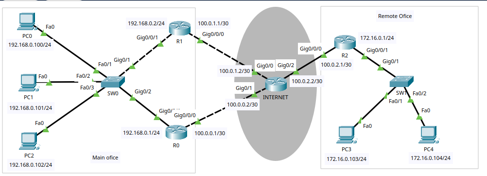
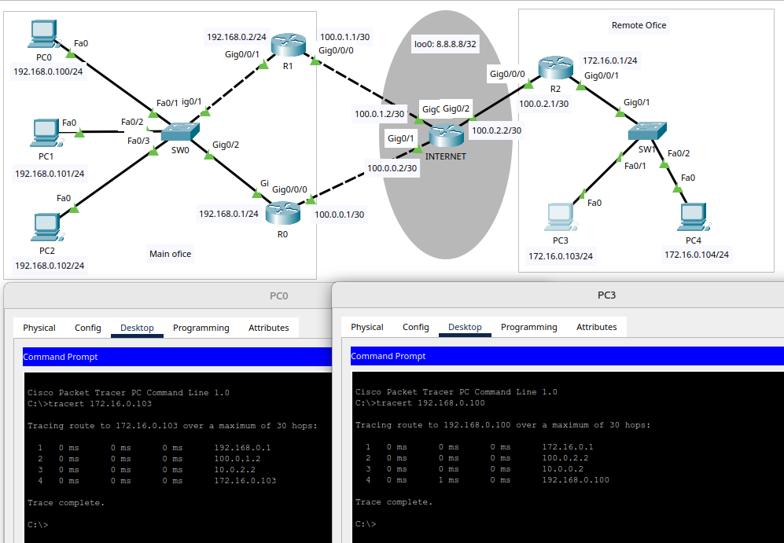

# 08.03. Проектирование WAN сегмента - Лебедев Д.С.
## Лабораторная работа "Построение корпоративной сети с использованием технологии GRE"

Топология сети для выполнения лабораторной работы представлена на картинке ниже:


Описание: есть центральный офис с маршрутизаторами, на каждом из которых настроен выход в интернет. Есть удаленный офис со своим выходом в интернет. Необходимо объединить корпоративную сеть посредством GRE туннеля и динамической маршрутизации.

### Задание 1.
> Разработать план IP-адресов для схемы сети выше.
> 
> *Приведите ответ в свободной форме*

*Ответ:*  

#### Стыковочные сети (INTERNET)

| Маршрутизатор              | Интерфейс | Адрес        | --> | Маршрутизатор | Интерфейс | Адрес       |
| -------------------------- | --------- | ------------ | --- | ------------- | --------- | ----------- |
| INTERNET (loo0 8.8.8.8/32) | Gig0/0    | 100.0.1.2/30 |     | R1 (main)     | Gig0/0/0  | 10.0.1.1/30 |
|                            | Gig0/1    | 100.0.0.2/30 |     | R0 (main)     | Gig0/0/0  | 10.0.0.1/30 |
|                            | Gig0/2    | 100.0.2.2/30 |     | R2 (remote)   | Gig0/0/0  | 10.0.2.1/30 |
#### Сеть главного офиса

| 192.168.0.0/24           |          |                  |                 |
| ------------------------ | -------- | ---------------- | --------------- |
| R0 (loo0 10.10.10.10/32) | Gig0/0/1 | 192.168.0.1/24   |                 |
| R1 (loo0 10.10.10.11/32) | Gig0/0/1 | 192.168.0.2/24   |                 |
| PC0                      |          | 192.168.0.100/24 | GW 192.168.0.10 |
| PC1                      |          | 192.168.0.101/24 | GW 192.168.0.10 |
| PC2                      |          | 192.168.0.102/24 | GW 192.168.0.10 |
#### Сеть удаленного офиса

| 172.16.0.0/24            |          |                 |               |
| ------------------------ | -------- | --------------- | ------------- |
| R2 (loo0 10.10.10.12/32) | Gig0/0/1 | 172.16.0.1/24   |               |
| PC3                      |          | 172.16.0.103/24 | GW 172.16.0.1 |
| PC4                      |          | 172.16.0.104/24 | GW 172.16.0.1 |
### Задание 2.
> Настроить протокол FHRP для резервирования default gateway.
> 
> *Пришлите pkt-файл*

*Ответ:*  
В рамках задания для резервирования настраивается протокол HSRP (проприетарный Cisco). Протокол HSRP рассчитан на 2 роутера. Путь по умолчанию - через роутер R0, при пропадании внешнего линка маршрут перестраивается на R1.

Команды настройки маршрутизаторов:

```sh
-- Настройка R0 --
R0(config)#int gi0/0/1
R0(config-if)#standby 1 ip 192.168.0.10
R0(config-if)#standby version 2
R0(config-if)#standby 1 priority 105
R0(config-if)#standby 1 track gi0/0/0
R0(config-if)#standby 1 preempt

-- Настройка R1 --
R1(config)#int gi0/0/1
R1(config-if)#standby 1 ip 192.168.0.10
R1(config-if)#standby version 2
R1(config-if)#standby 1 priority 100
R1(config-if)#standby 1 preempt
```

[PKT-файл задания 2](_att/0803-02-01.pkt)
### Задание 3.
> Поднять туннели GRE, используя все каналы выхода в интернет.
> 
> *Пришлите pkt-файл*

*Ответ:*  
Команды настройки туннелей между парами маршрутизаторов:

```sh
--- R0 - INTERNET - R0 ---
INTERNET(config)#int tunnel 0
INTERNET(config-if)#ip address 10.0.0.1 255.255.255.0
INTERNET(config-if)#tunnel source gi0/1
INTERNET(config-if)#tunnel destination 100.0.0.1

R0(config)#int tunnel 0
R0(config-if)#ip address 10.0.0.2 255.255.255.0
R0(config-if)#tunnel source gi0/0/0
R0(config-if)#tunnel destination 100.0.0.2

--- R1 - INTERNET - R1 ---
INTERNET(config)#int tunnel 1
INTERNET(config-if)#ip address 10.0.1.1 255.255.255.0
INTERNET(config-if)#tunnel source gi0/0
INTERNET(config-if)#tunnel destination 100.0.1.1

R1(config)#int tunnel 1
R1(config-if)#ip address 10.0.1.2 255.255.255.0
R1(config-if)#tunnel source gi0/0/0
R1(config-if)#tunnel destination 100.0.1.2

--- R2 - INTERNET - R2 ---
INTERNET(config)#int tunnel 2
INTERNET(config-if)#ip address 10.0.2.1 255.255.255.0
INTERNET(config-if)#tunnel source gi0/2
INTERNET(config-if)#tunnel destination 100.0.2.1

R2(config)#int tunnel 2
R2(config-if)#ip address 10.0.2.2 255.255.255.0
R2(config-if)#tunnel source gi0/0/0
R2(config-if)#tunnel destination 100.0.2.2
```

[PKT-файл задания 3](_att/0803-03-01.pkt)
### Задание 4.
> Настроить динамическую маршрутизацию для работы GRE туннелей.
> 
> *Пришлите pkt-файл и приложите краткое описание используемых решений*

*Ответ:*  
Для организации динамической маршрутизации в данной топологии выбран протокол OSPF.

Команды настройки динамической маршрутизации:

```sh
--- INTERNET ---
INTERNET(config)#router ospf 1
INTERNET(config-router)#network 0.0.0.0 255.255.255.255 area 0

--- R0 ---
R0(config)#router ospf 1
R0(config-router)#network 0.0.0.0 255.255.255.255 area 0
-
R0(config)#ip route 172.16.0.0 255.255.255.0 10.0.0.1

--- R1 ---
R1(config)#router ospf 1
R1(config-router)#network 0.0.0.0 255.255.255.255 area 0
--
R1(config)#ip route 172.16.0.0 255.255.255.0 10.0.1.1

--- R2 ---
R2(config)#router ospf 1
R2(config-router)#network 0.0.0.0 255.255.255.255 area 0
--
R2(config)#ip route 192.168.0.0 255.255.255.0 10.0.2.1
```

Результат прохождения трафика через тоннели GRE:



[PKT-файл задания 4](_att/0803-04-01_ospf.pkt)
