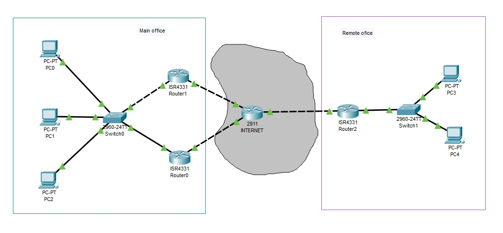

# 08.03. Проектирование WAN сегмента - Лебедев Д.С.
## Лабораторная работа "Построение корпоративной сети с использованием технологии GRE"

Топология сети для выполнения лабораторной работы представлена на картинке ниже:

Описание: есть центральный офис с маршрутизаторами, на каждом из которых настроен выход в интернет. Есть удаленный офис со своим выходом в интернет. Необходимо объединить корпоративную сеть посредством GRE туннеля и динамической маршрутизации.

### Задание 1.
> Разработать план IP-адресов для схемы сети выше.
> 
> *Приведите ответ в свободной форме*

*Ответ:*  

### Задание 2.
> Настроить протокол FHRP для резервирования default gateway.
> 
> *Пришлите pkt-файл*

*Ответ:*  

### Задание 3.
> Поднять туннели GRE, используя все каналы выхода в интернет.
> 
> *Пришлите pkt-файл*

*Ответ:*  

### Задание 4.
> Настроить динамическую маршрутизацию для работы GRE туннелей.
> 
> *Пришлите pkt-файл и приложите краткое описание используемых решений*

*Ответ:*  

