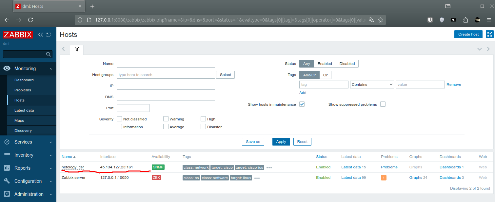
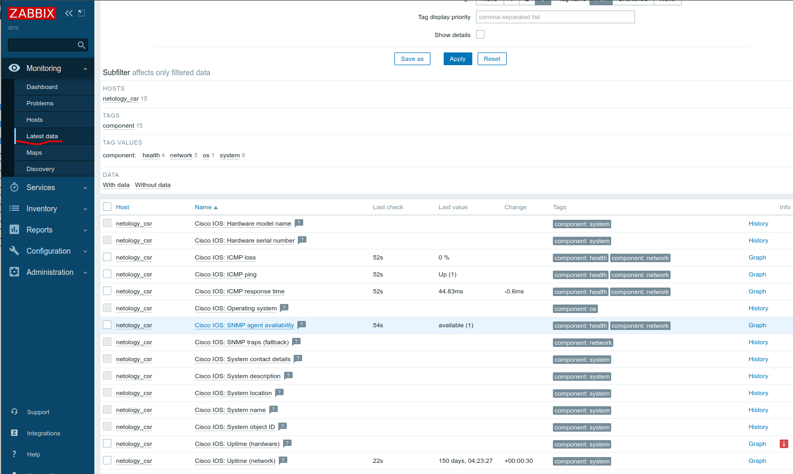
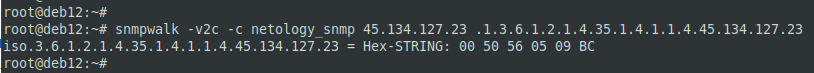
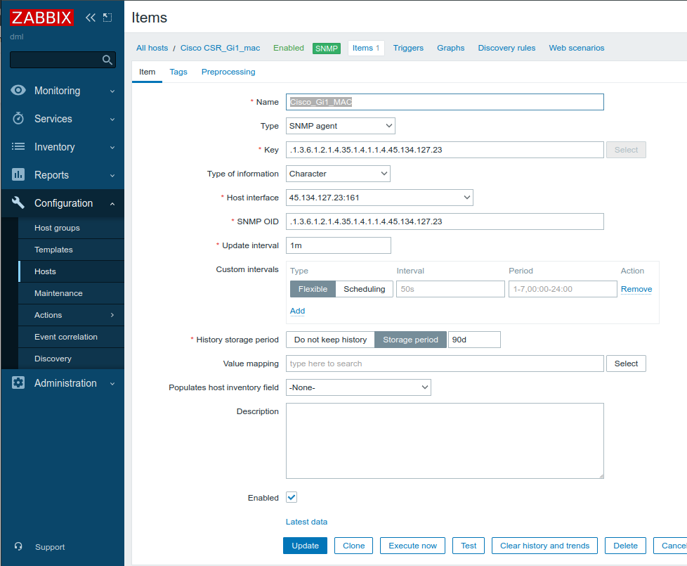
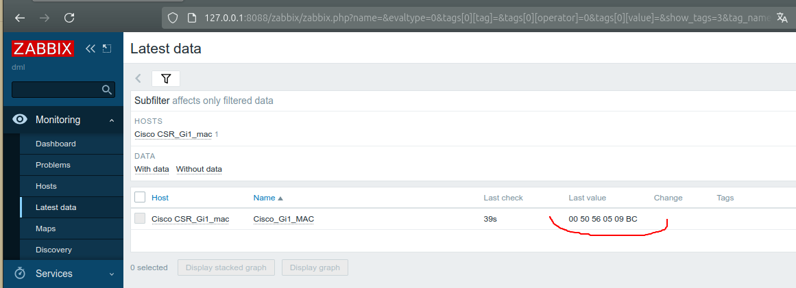
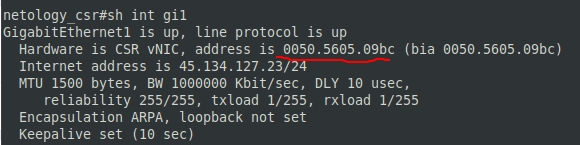

# 09.02. Мониторинг сетевых устройств - Лебедев Д.С.
### Инструменты/ дополнительные материалы, которые пригодятся для выполнения задания
> Доступ к виртуальному маршрутизатору Cisco CSR по ssh:
> IP: 45.134.127.23
> Логин: netology_student
> Пароль: iamanetworkengineer!23

---
### Задание 1
> 1. Установите программу iReasoning MIB Browser (или аналогичную) на свой ПК.
> 2. С помощью snmpwalk запросите все доступные данные у хоста:
>     - IP: 45.134.127.23
>     - SNMP READ Community: netology_snmp
> 
> *Решение отправьте в виде скриншота, где будет видна часть полученных данных от опрашиваемого хоста*

*Выполнение работы:*

### Задание 2

> 1. Установите Zabbix на виртуальную машину.
> 2. Добавьте хост для мониторинга со следующими параметрами:
>     - Имя: netology_csr
>     - Адрес SNMP: 45.134.127.23
>     - SNMP Community: netology_snmp
> 3. Прикрепите к хосту встроенный в заббикс шаблон `Cisco IOS versions 12.0._3_T-12.2_3.5 by SNMP`.
> 4. Подождите 2 минуты и перейдите в Latest data по хосту netology_csr.
> 
> *Решение отправьте в виде скриншота, где будут видны полученные данные от netology_csr*

*Выполнение работы:*

В VirtualBox установлен Debian 12, развернут сервер zabbix. Для взаимодействия в ВМ проброшены порты ssh и http.

### Задание 3*
> 1. Найдите у производителя или через парсинг вывода snmpwalk OID у Cisco CSR, который отображает MAC-адрес интерфейса GigabitEthernet1.
> 2. Добавьте этот OID как опрашиваемый в Заббикс. Дождитесь получения ответа.
> 
> *Решение отправьте в виде скриншота, где будет виден MAC-адрес хоста в заббиксе*

*Выполнение работы:*

1. В MIB Brouser есть строка с OID нужного интерфейса. Проверка snmpwalk:

2. Настройка данного OID в items Zabbix сервера:

3. Результат:

4. Проверка непосредственно на оборудовании:

