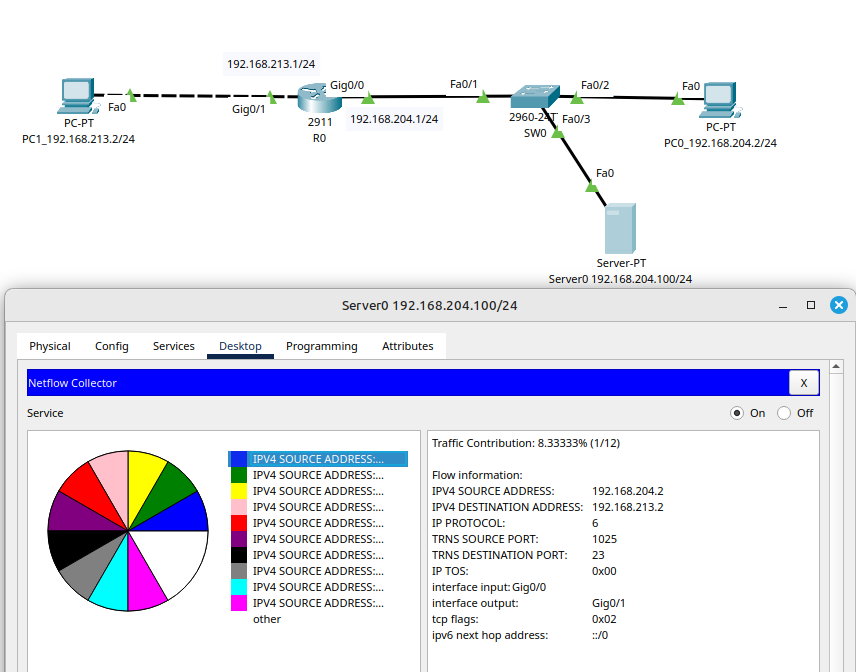
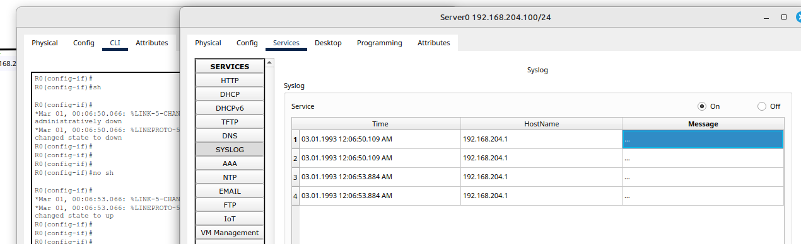
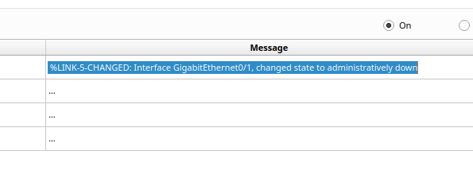

# 09.03. Сбор и учет данных - Лебедев Д.С.


### Задание 1.
> Сконфигурировать NetFlow на маршрутизаторе для отправки данных на сервер.
> 
> NetFlow должен собирать следующие параметры из трафика:
> - Source/Destination IP
> - ToS byte, tcp flags
> - next-hop
> 
> IP адресация произвольная.
> 
> Запустите пинги и телнеты на разные порты между двумя компьютерами.
> 
> *Пришлите конфигурацию маршрутизатора и скрины NetFlow коллектора*

*Выполнение работы:*

Команды настройки маршрутизатора R0:

```sh
R0(config)#flow record NETFLOW-R
R0(config-flow-record)#match ipv4 source address
R0(config-flow-record)#match ipv4 destination address
R0(config-flow-record)#match ipv4 protocol
R0(config-flow-record)#match transport source-port
R0(config-flow-record)#match transport destination-port
R0(config-flow-record)#match ipv4 tos
R0(config-flow-record)#collect interface input
R0(config-flow-record)#collect interface output
R0(config-flow-record)#collect transport tcp flags
R0(config-flow-record)#collect routing next-hop address ipv4

R0(config)#flow exporter NETFLOW-E
R0(config-flow-exporter)#destination 192.168.204.100
R0(config-flow-exporter)#transport udp 9996
R0(config-flow-exporter)#source gi 0/0

R0(config)#flow monitor NETFLOW-M
R0(config-flow-monitor)#record NETFLOW-R
R0(config-flow-monitor)#exporter NETFLOW-E
```

<details>
<summary>Конфигурация маршрутизатора R0</summary>

```sh
R0(config)#do sh run
Building configuration...

Current configuration : 1251 bytes
!
version 15.1
no service timestamps log datetime msec
no service timestamps debug datetime msec
no service password-encryption
!
hostname R0
!
!
!
!
!
!
!
!
ip cef
no ipv6 cef
!
!
!
!
!
flow exporter NETFLOW-E
 destination 192.168.204.100
 source GigabitEthernet0/0
 transport udp 9996
!
flow record NETFLOW-R
 match ipv4 source address
 match ipv4 destination address
 match ipv4 protocol
 match transport source-port
 match transport destination-port
 match ipv4 tos
 collect interface input
 collect interface output
 collect transport tcp flags
 collect routing next-hop address ipv6
!
flow monitor NETFLOW-M
 record NETFLOW-R
 exporter NETFLOW-E
!
license udi pid CISCO2911/K9 sn FTX15247YZJ-
!
!
!
!
!
!
!
!
!
!
!
spanning-tree mode pvst
!
!
!
!
!
!
interface GigabitEthernet0/0
 ip flow monitor NETFLOW-M output
 ip flow monitor NETFLOW-M input
 ip address 192.168.204.1 255.255.255.0
 duplex auto
 speed auto
!
interface GigabitEthernet0/1
 ip address 192.168.213.1 255.255.255.0
 duplex auto
 speed auto
!
interface GigabitEthernet0/2
 no ip address
 duplex auto
 speed auto
 shutdown
!
interface Vlan1
 no ip address
 shutdown
!
ip classless
!
ip flow-export version 9
!
!
!
!
!
!
!
line con 0
!
line aux 0
!
line vty 0 4
 login
!
!
!
end
```
</details>

Информация в коллекторе NeFlow:



### Задание 2.
> Сконфигурировать Syslog на маршрутизаторе для отправки данных на сервер.
> 
> Выключите gi0/1 на интерфейсе маршрутизатора и получите syslog сообщение на сервере.
> 
> *Пришлите конфигурацию маршрутизатора и скрины полученных логов*

*Выполнение работы:*

Команды настройки маршрутизатора R0:

```sh
R0(config)#logging host 192.168.204.100
R0(config)#logging trap debugging
R0(config)#service timestamps log datetime msec
```

[Конфигурация маршрутизатора R0](_att/0903-02-01.R0_conf.txt)

Отображение сообщений маршрутизатора на syslog-сервере (видимо, глюк CPT, отображает, только если выделить сообщение)



