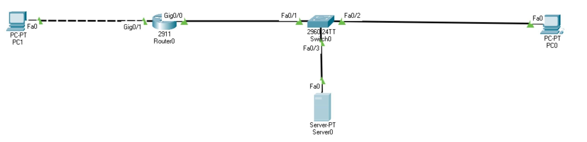

# 09.03. Сбор и учет данных - Лебедев Д.С.

### Задание 1.
> Сконфигурировать NetFlow на маршрутизаторе для отправки данных на сервер.
> 
> NetFlow должен собирать следующие параметры из трафика:
> - Source/Destination IP
> - ToS byte, tcp flags
> - next-hop
> 
> IP адресация произвольная.
> 
> Запустите пинги и телнеты на разные порты между двумя компьютерами.
> 
> *Пришлите конфигурацию маршрутизатора и скрины NetFlow коллектора*

*Выполнение работы:*

### Задание 2.
> Сконфигурировать Syslog на маршрутизаторе для отправки данных на сервер.
> 
> Выключите gi0/1 на интерфейсе маршрутизатора и получите syslog сообщение на сервере.
> 
> *Пришлите конфигурацию маршрутизатора и скрины полученных логов*

*Выполнение работы:*