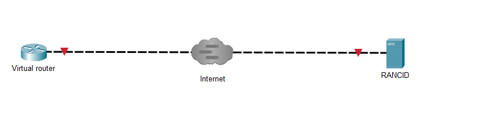
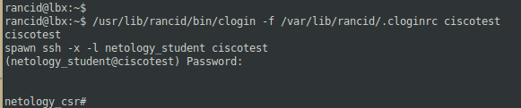
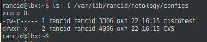
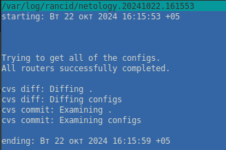
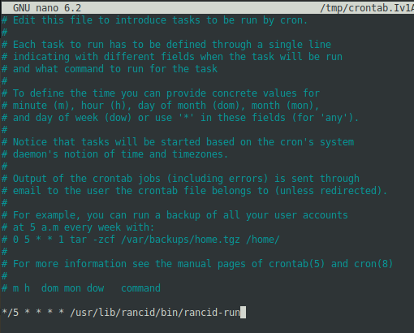
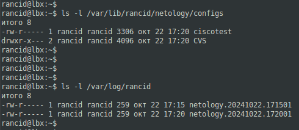

# 09.04. Сбор конфигураций, анализ конфигурационных изменений - Лебедев Д.С.
## Лабораторная работа "Бэкап и восстановление конфигурации АСО"

### Инструкция к выполнению
1. Установите ПО Rancid на виртуальной машине, следуя шагам на слайдах
2. Проверьте, создался ли пользователь rancid. Если нет, создайте его, установите пароль и дайте права к папкам из инструкции
3. Создайте запись в hosts для тестового маршрутизатора. Назовите его netology-router
4. Проверьте доступ по ssh к виртуальному маршрутизатору
5. Выполните базовые настройки Rancid
### Инструменты/ дополнительные материалы, которые пригодятся для выполнения задания
Доступ к виртуальному маршрутизатору Cisco CSR по ssh:
- IP: 45.134.127.23
- Логин: netology_student
- Пароль: iamanetworkengineer!23

---
### Задание 1
> 1. Вместо команды show running-config настройте выполнение команды sh startup-config.
> 2. Все остальные команды сбора статистики и логов закомментируйте. Должна остаться только команда сбора конфигурации.
> 3. Запустите процесс сбора данных rancid.
> 4. Убедитесь, что диагностические команды выполнены и сохранены в файл.
> 
> *В качестве ответа приложите файл, созданный rancid и файл конфигурации, в который вносились изменения по заданию*

*Выполнение работы:*

Проверка доступа по SSH:

[Созданный RANCID файл:](_att/0904-01-01_ciscotest.txt)

Логфайл события:

[Файл конфигугации с изменениями, работает только в таком виде (Linux Mint)](_att/0904-01-02_rancid.types.base.txt)
### Задание 2
> 1. Удалите созданный rancid файл конфигураций тестового роутера.
> 2. Настройте cron на запуск rancid раз в 5 минут.
> 3. Подождите 10 минут.
> 4. Убедитесь, что диагностические команды выполнены. И сохранены в файл.
> 
> *В качестве ответа приложите настройку cron*
> 

*Выполнение работы:*

Скриншот выполнения по расписанию, с созданные логи:

