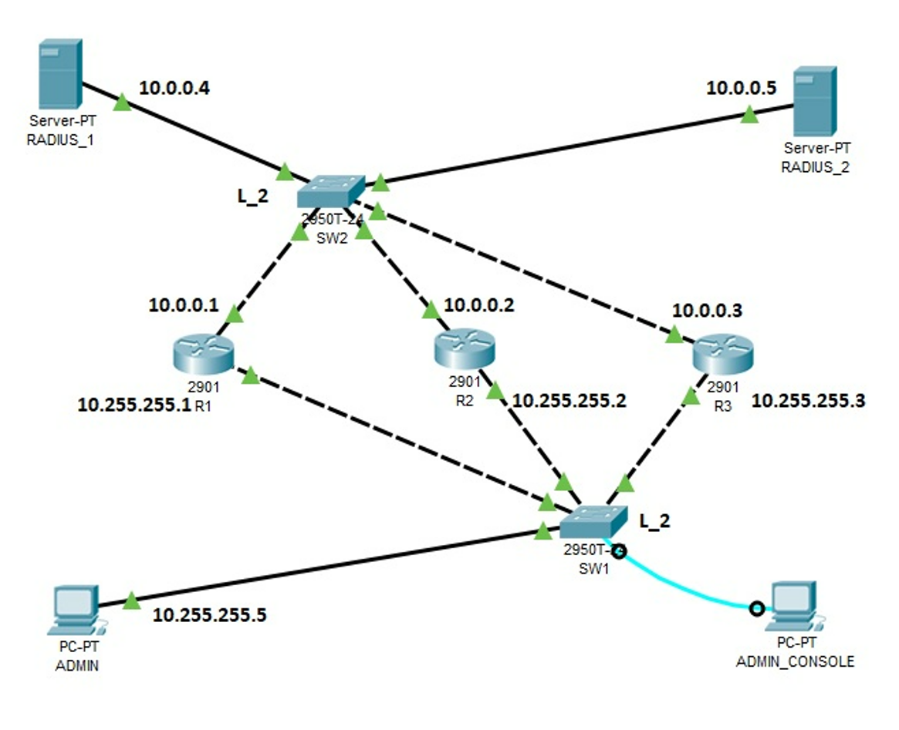

# 09.05. Средства и протоколы для аутентификации, авторизации и аккаунтинга сетевых устройств - Лебедев Д.С.

### [Сетевая топология](_att/0905_new_ini_9.5_lab_AAA.pkt)

---
### Задание 1. Выполняется на R1
> 1. Создать локального пользователя admin1 и пароль к нему admin1
> 2. Войти по telnet с терминала
> 3. Войти в привелигированный режим enable
> 4. Сохранить конфигурацию
> 5. Убедиться, что пароль сохранен в зашифрованном виде
> 6. Ответьте на вопрос: были ли проблемы при входе в привелигированный режим enable или другие проблемы, если были, то как решили? Если проблем не было, то какие могли бы быть?
> 
> *Ответ на задание представить в виде вывода команды show run с R1 в файле .txt, файл назвать 9.5_ЗАДАНИЕ_1, ответ на вопрос так же можно предстваить в начале файла в свободной форме.*

*Выполнение работы:*

### Задание 2. Выполняется на R2 и RADIUS_1
> 1. Создать следующие настройки AAA на R2:
>   - aaa new-model
>   - aaa authentication login default group radius
>   - radius-server host 10.0.0.4 auth-port 1645 key 123qwe
> 2. Создать на RADIUS_1 клиента R2 10.0.0.2 с ключом 123qwe
> 3. Создать на RADIUS_1 пользователя user1 с паролем user1
> 4. Войти на R2 в режим enable
> 5. Выключить сервер RADUIS_1
> 6. Войти на R2 по telnet
> 7. Ответить на вопрос: были ли проблемы при выполнении пунктов 4 и 6? Если были, то как решили? Если проблем не было, то какие могли бы быть?
> 
> *Ответ на задание представить в виде вывода команды show run с R2 в файле .txt и скриншот настроек RADIUS_1 Файл назвать 9.5_ЗАДАНИЕ_2, ответ на вопрос так же можно предстваить в начале файла в свободной форме.*

*Выполнение работы:*

### Задание 3. Выполняется на R3 и RADIUS_1 и RADIUS_2.
> 1. Выполнить на R3 все настройки из задания 1 и 2 (локальный пользователь и клиент серверов R3)
> 2. Создать конфигурацию AAA с резервированием серверов RADIUS
> 3. Проверить доступность R3 по telnet с поочередным отключением серверов 1 и 2
> 
> *Ответ на задание представить в виде вывода команды show run с R3 в файле .txt и скриншот настроек RADIUS_1 и 2. Файл назвать 9.5_ЗАДАНИЕ_3.*

*Выполнение работы:*

