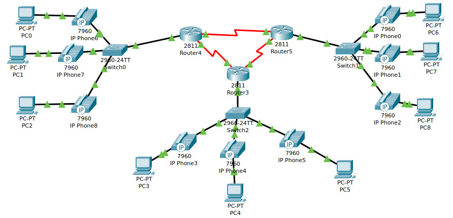
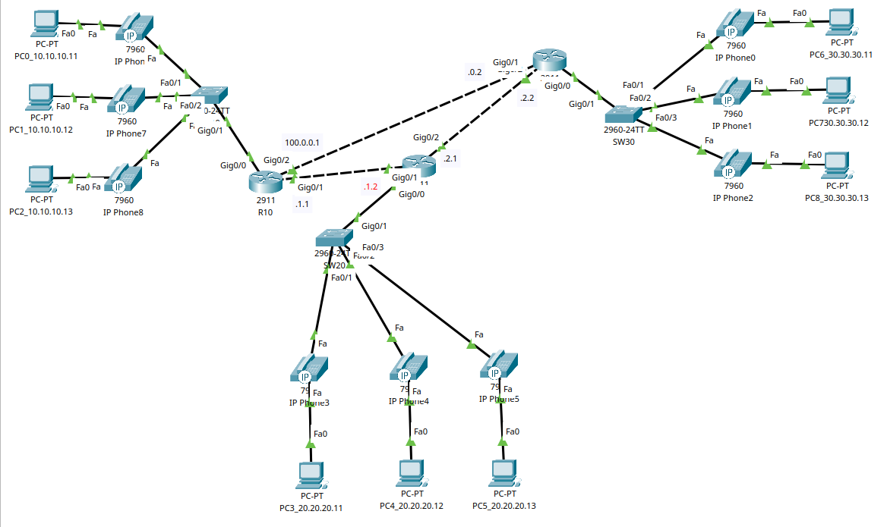
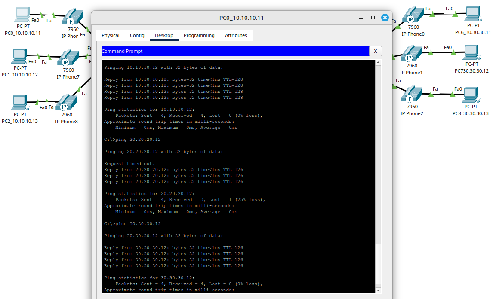
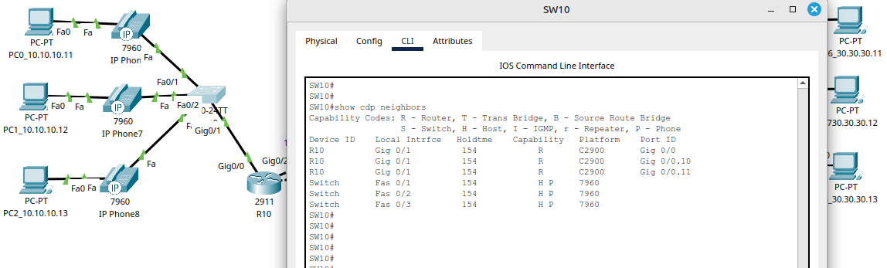

# 10.02. Основы IP-телефонии. Протоколы сигнализации и передачи голосового трафика - Лебедев Д.С.
### Задание 1. Лабораторная работа «Настройка IP-телефонии в сети простой конфигурации»
> 1. Соберите сеть в Cisco Packet Tracer согласно топологии, которая представлена на картинке ниже:
> 
> 
> 
> 2. Для левой части сети все компьютеры поместите в vlan 10, подсеть 10.10.10.0/24.
> 3. Для левой части сети все телефоны поместите в vlan 11, подсеть 10.10.11.0/24.
> 4. Для центральной части сети все компьютеры поместите в vlan 20, подсеть 20.20.20.0/24.
> 5. Для центральной части сети все телефоны поместите в vlan 21, подсеть 20.20.21.0/24.
> 6. Для правой части сети все компьютеры поместите в vlan 30, подсеть 30.30.30.0/24.
> 7. Для правой части сети все телефоны поместите в vlan 31, подсеть 30.30.31.0/24.
> 8. На маршрутизаторах включить настроить OSPF так, чтобы все обеспечить полную связь между всеми частями сети (все компьютеры должны пинговать друг друга).
> 
> Примечание: 4 октет на всех устройствах произвольный. Обязательно используйте CDP для передачи voice vlan.
> 
> *В качестве ответа приложите файл .pkt*

*Ответ:* 

[PKT файл задания](_att/1002-01-01.pkt)

Схема сети:

Результат выполнения:

Конфигурационные файлы:

- [SW10](_att/1002-01-01_SW10.txt)
- [SW20](_att/1002-01-01_SW20.txt)
- [SW30](_att/1002-01-01_SW30.txt)

- [R10](_att/1002-01-01_R10.txt)
- [R20](_att/1002-01-01_R20.txt)
- [R30](_att/1002-01-01_R30.txt)

### Задание 2
> Опишите преимущества использования Voice vlan по сравнению с инфраструктурой, где голосовой и прочий пользовательский трафик находятся в одном и том же VLAN.
> 
> *Приведите ответ в свободной форме*

*Ответ:* 

Основные преимущества:
- Возможность применять политику качества обслуживания (QoS) для голосового трафика;
- Разделение голосового и пользовательского трафика на разные VLAN повышает безопасность сети;
- Проще управлять сетью, масштабировать, диагностировать и находить проблемы;
- Возможность изолировать голосовой трафик от других типов данных, это снижает вероятность конфликтов и перегрузок;
- Оптимизация использования полосы пропускания за счет приоритизации голосового трафика.