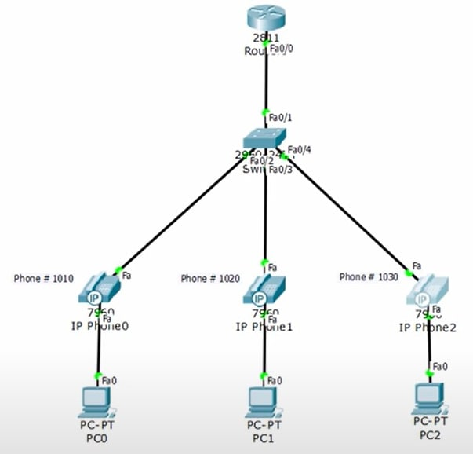
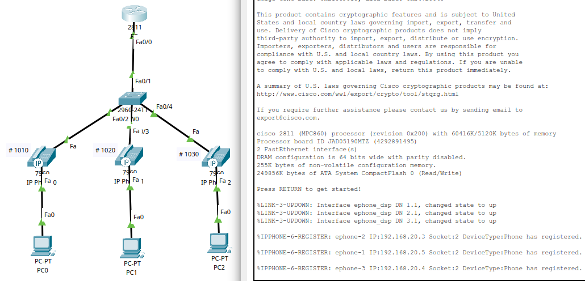
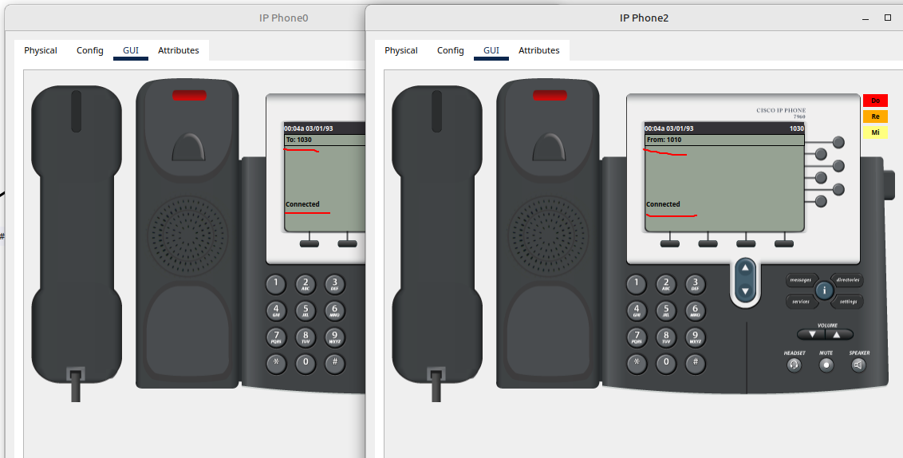
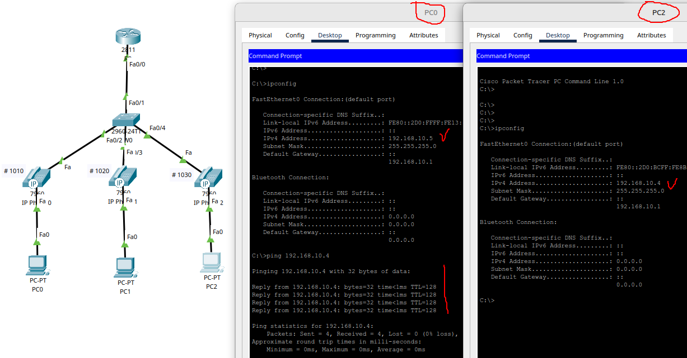
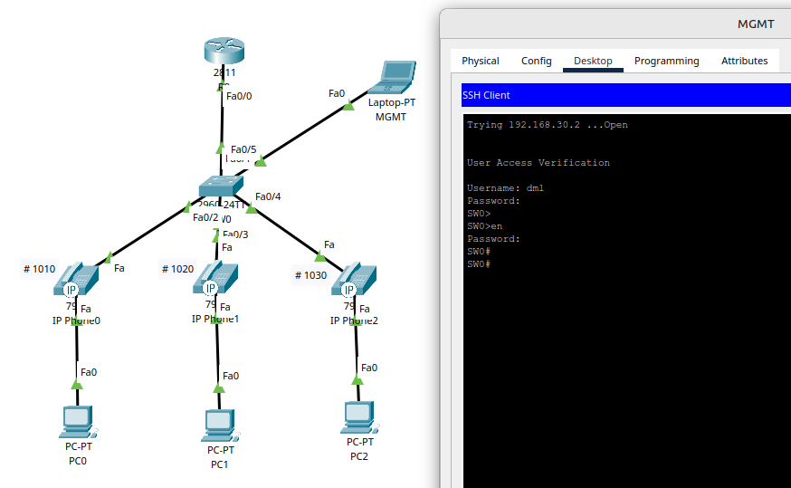

# 10.03. Основы работы с телефонией Cisco - Лебедев Д.С.
### Задание 1. Лабораторная работа "Настройка IP-телефонии в сети простой конфигурации"
> 1. В Cisco Packet Tracer собрать сеть согласно топологии на картинке ниже.
> 
> 
> 
> 2. Список VLAN:
> - VLAN 10 - DATA
> - VLAN 20 - VOICE
> - VLAN 30 - MANAGEMENT
> 
> 3. Настроить коммутатор:
> - Добавить VLAN'ы
> - Прописать IP для управления - 192.168.30.2/24
> - Порт Fa0/1 - trunk, Fa0/2-Fa0/4 - access vlan 10 + voice vlan 20
> 
> 4. Настроить маршрутизатор на работу по протоколу SCCP:
> - Использовать сабинтерфейсы в соответствующих VLAN'ах. IP-адреса - 192.168.10.1/24, 192.168.20.1/24, 192.168.30.1/24
> - Поднять DHCP серверы в vlan 10 и 20. DHCP во vlan 20 использует option 150, который указывает на себя же (192.168.20.1)
> - В разделе telephony-service указать source (192.168.20.1)
> - Создать номера 1010, 1020, 1030
> - Прописать номера на соответствующих аппаратах
> 
> 5. Провести тестовый звонок с телефона 1010 на 1030, убедиться что всё работает.
> 
> 6. Провести ping с компьютера PC0 на PC2
> 
> *В качестве ответа приложите файл .pkt и скриншоты ping'а из п.6*

 *Выполнение работы:*

[PKT файл задания](_att/1003-01-01.pkt)

[Конфигурация коммутатора](_att/1003-01-SW0.txt)

[Конфигурация маршрутизатора](_att/1003-01-R0.txt)

Результат выполнения работы:

Проверка работы сети управления MANAGEMENT:

### Задание 2
> Как вы думаете, для чего нужен Voice VLAN и что будет, если его не использовать?  
> *Приведите ответ в свободной форме*

*Ответ:*

Voice VLAN специально разработан для передачи голосового трафика. При настройке Voice VLAN и включении портов с VoIP оборудованием в этот VLAN, появляется возможность конфигурировать параметры качества сервиса (QoS) для голосовых данных и увеличивать приоритет передачи голосового трафика, тем самым улучшая качество звонков.

Если не использовать QoS, то при недостаточной полосе пропускания будет происходить потеря пакетов голосового трафика, что приведет к ухудшению качества связи.